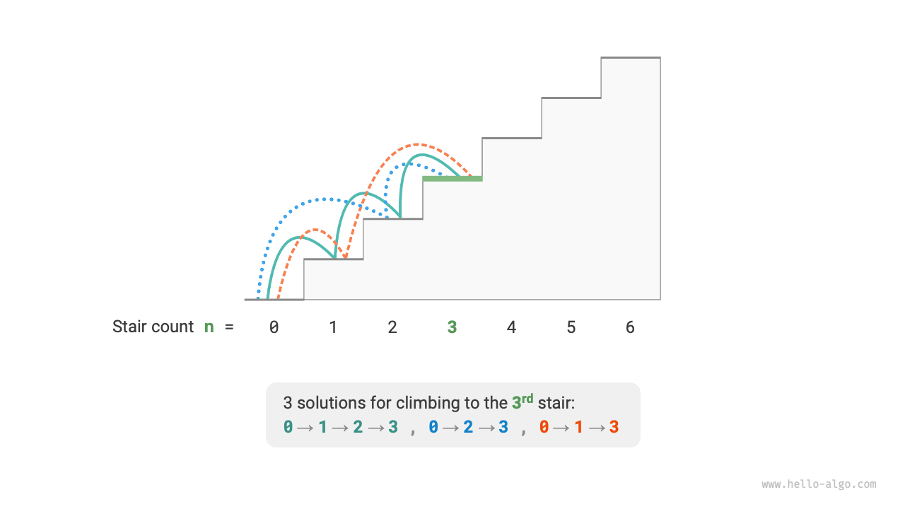
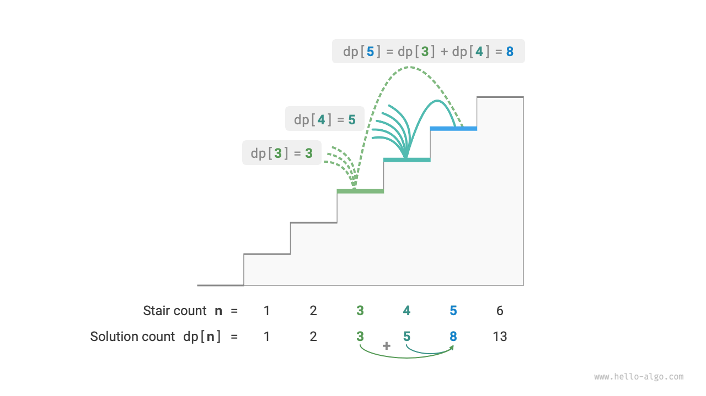
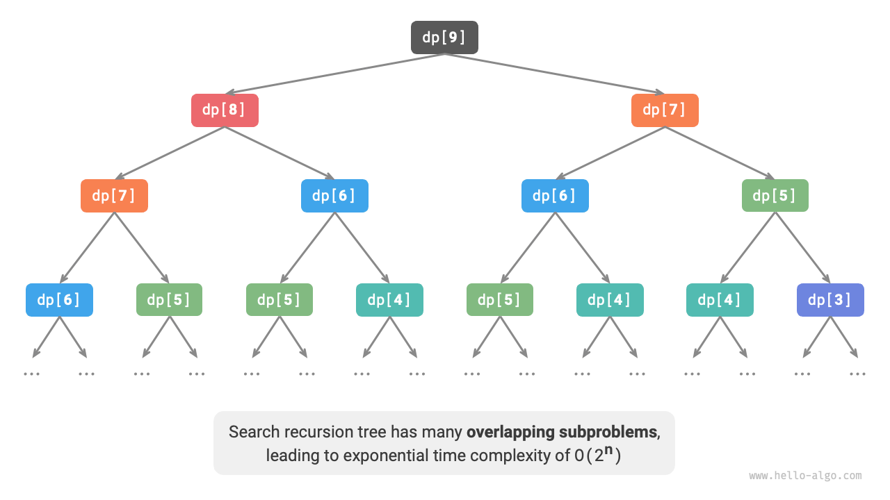

# Climbing Stairs Problem

There are many beautiful ideas in algorithms. We plan to use a classic problem to demonstrate them and show how to optimize the code using different ideas.

!!! question "Climbing stairs"

    Given a staircase with $n$steps, where you can climb $1$or $2$steps at a time, how many different ways are there to reach the top?

As shown in the figure below, there are $3$ways to reach the top of a $3$-step staircase.



## Method 1: Deep first search


We can try to analyze this problem from the perspective of decomposition. Let $dp[i]$be the number of ways to reach the $i^{th}$step, then $dp[i]$is the original problem, and its subproblems include:

$$
dp[i-1], dp[i-2], \dots, dp[2], dp[1]
$$

Since each round can only advance $1$or $2$steps, when we stand on the $i^{th}$step, the previous round must have been either on the $i-1^{th}$or the $i-2^{th}$step. In other words, we can only step from the $i-1^{th}$or the $i-2^{th}$step to the $i^{th}$step.

This leads to an important conclusion: **the number of ways to reach the $i-1^{th}$step plus the number of ways to reach the $i-2^{th}$step equals the number of ways to reach the $i^{th}$step**. The formula is as follows:

$$
dp[i] = dp[i-1] + dp[i-2]
$$

This means that in the stair climbing problem, there is a recursive relationship between the subproblems, **the solution to the original problem can be constructed from the solutions to the subproblems**. The figure below shows this recursive relationship.



We can obtain the brute force search solution according to the recursive formula. Starting with $dp[n]$, **recursively decompose a larger problem into the sum of two smaller problems**, until reaching the smallest subproblems $dp[1]$and $dp[2]$where the solutions are known, with $dp[1] = 1$and $dp[2] = 2$, representing $1$and $2$ways to climb to the first and second steps, respectively.

The following code implements the <u>depth-first search</u>:

```python
def dfs(i: int) -> int:
    """Search"""
    # Known dp[1] and dp[2], return them
    if i == 1 or i == 2:
        return i
    # dp[i] = dp[i-1] + dp[i-2]
    count = dfs(i - 1) + dfs(i - 2)
    return count

def climbing_stairs_dfs(n: int) -> int:
    """Climbing stairs: Search"""
    return dfs(n)
```

The figure below shows the recursive tree formed by brute force search. For the problem $dp[n]$, the depth of its recursive tree is $n$, with a time complexity of $O(2^n)$. Exponential order represents explosive growth, and entering a long wait if a relatively large $n$is input.



Observing the figure above, **the exponential time complexity is caused by 'overlapping subproblems'**. For example, $dp[9]$is decomposed into $dp[8]$and $dp[7]$, $dp[8]$into $dp[7]$and $dp[6]$, both containing the subproblem $dp[7]$.

Thus, subproblems include even smaller overlapping subproblems, endlessly. A vast majority of computational resources are wasted on these overlapping subproblems.

## Method 2: Memoized search

To enhance algorithm efficiency, **we hope that all overlapping subproblems are calculated only once**. For this purpose, we declare an array `mem` to record the solution of each subproblem, and prune overlapping subproblems during the search process.

1. When $dp[i]$is calculated for the first time, we record it in `mem[i]` for later use.
2. When $dp[i]$needs to be calculated again, we can directly retrieve the result from `mem[i]`, thus avoiding redundant calculations of that subproblem.

The code is as follows:

```python
def dfs(i: int, mem: list[int]) -> int:
    """Memoized search"""
    # Known dp[1] and dp[2], return them
    if i == 1 or i == 2:
        return i
    # If there is a record for dp[i], return it
    if mem[i] != -1:
        return mem[i]
    # dp[i] = dp[i-1] + dp[i-2]
    count = dfs(i - 1, mem) + dfs(i - 2, mem)
    # Record dp[i]
    mem[i] = count
    return count

def climbing_stairs_dfs_mem(n: int) -> int:
    """Climbing stairs: Memoized search"""
    # mem[i] records the total number of solutions for climbing to the ith step, -1 means no record
    mem = [-1] * (n + 1)
    return dfs(n, mem)
```

Observe the figure below, **after memoization, all overlapping subproblems need to be calculated only once, optimizing the time complexity to $O(n)$**, which is a significant leap.


## Method 3: Dynamic programming

**Memoized search is a 'top-down' method**: we start with the original problem (root node), recursively decompose larger subproblems into smaller ones until the solutions to the smallest known subproblems (leaf nodes) are reached. Subsequently, by backtracking, we collect the solutions of the subproblems, constructing the solution to the original problem.

On the contrary, **dynamic programming is a 'bottom-up' method**: starting with the solutions to the smallest subproblems, iteratively construct the solutions to larger subproblems until the original problem is solved.

Since dynamic programming does not include a backtracking process, it only requires looping iteration to implement, without needing recursion. In the following code, we initialize an array `dp` to store the solutions to the subproblems, serving the same recording function as the array `mem` in memoized search:

```python
def climbing_stairs_dp(n: int) -> int:
    """Climbing stairs: Dynamic programming"""
    if n == 1 or n == 2:
        return n
    # Initialize dp table, used to store subproblem solutions
    dp = [0] * (n + 1)
    # Initial state: preset the smallest subproblem solution
    dp[1], dp[2] = 1, 2
    # State transition: gradually solve larger subproblems from smaller ones
    for i in range(3, n + 1):
        dp[i] = dp[i - 1] + dp[i - 2]
    return dp[n]
```

The figure below simulates the execution process of the above code.


Like the backtracking algorithm, dynamic programming also uses the concept of "states" to represent specific stages in problem solving, each state corresponding to a subproblem and its local optimal solution. For example, the state of the climbing stairs problem is defined as the current step number $i$.

Based on the above content, we can summarize the commonly used terminology in dynamic programming.

- The array `dp` is referred to as the <u>DP table</u>, with $dp[i]$representing the solution to the subproblem corresponding to state $i$.
- The states corresponding to the smallest subproblems (steps $1$and $2$) are called <u>initial states</u>.
- The recursive formula $dp[i] = dp[i-1] + dp[i-2]$is called the <u>state transition equation</u>.

### Space optimization

Observant readers may have noticed that **since $dp[i]$is only related to $dp[i-1]$and $dp[i-2]$, we do not need to use an array `dp` to store the solutions to all subproblems**, but can simply use two variables to progress iteratively. The code is as follows:

```python
def climbing_stairs_dp_comp(n: int) -> int:
    """Climbing stairs: Space-optimized dynamic programming"""
    if n == 1 or n == 2:
        return n
    a, b = 1, 2
    for _ in range(3, n + 1):
        a, b = b, a + b
    return b
```

Observing the above code, since the space occupied by the array `dp` is eliminated, the space complexity is reduced from $O(n)$to $O(1)$.

In dynamic programming problems, the current state is often only related to a limited number of previous states, allowing us to retain only the necessary states and save memory space by "dimension reduction". **This space optimization technique is known as 'rolling variable' or 'rolling array'**.

## Method 4: Closed Form Solution

We can derive the closed form of $dp[n]$.
The recurrence relation for the climbing stairs problem is:

$$dp[i] = dp[i-1] + dp[i-2] $$

This can be expressed in matrix form as:

$$
\begin{bmatrix}
dp[i] \\
dp[i-1]
\end{bmatrix}
=
\begin{bmatrix}
1 & 1 \\
1 & 0
\end{bmatrix}
\begin{bmatrix}
dp[i-1] \\
dp[i-2]
\end{bmatrix}
$$

Let $A$ be the transformation matrix:

$$
A = 
\begin{bmatrix}
1 & 1 \\
1 & 0
\end{bmatrix}
$$

Then, the state vector at step $i$ can be expressed as:

$$
\begin{bmatrix}
dp[i] \\
dp[i-1]
\end{bmatrix}
=
A
\begin{bmatrix}
dp[i-1] \\
dp[i-2]
\end{bmatrix}
$$

By applying this transformation iteratively, we can express the state vector at step $n $as:

$$
\begin{bmatrix}
dp[n] \\
dp[n-1]
\end{bmatrix}
=
A^{n-1}
\begin{bmatrix}
dp[1] \\
dp[0]
\end{bmatrix}
$$

Given the initial conditions $dp[1] = 1$ and $dp[0] = 1$, the initial state vector is $[1,1]^\top$:


To further find a closed form for $dp[n]$, we perform eigen decomposition on matrix $A$. Solve the characteristic equation $\det(A - \lambda I) = 0$.

$$
   \det
   \begin{bmatrix}
   1-\lambda & 1 \\
   1 & -\lambda
   \end{bmatrix}
   = (1-\lambda)(-\lambda) - 1 = \lambda^2 - \lambda - 1 = 0
   $$

   The roots of this equation are the eigenvalues:

   $$
   \lambda_1 = \frac{1 + \sqrt{5}}{2}, \quad \lambda_2 = \frac{1 - \sqrt{5}}{2}
   $$

Whence we have the eigenvalues of $A$, we can express $A$ as $PDP^{-1}$, where $D$ is the diagonal matrix of eigenvalues and $P$ is the matrix of eigenvectors. Actually, we do not really need to compute $P$ but we just write both $P$ and $D$ here:
   $$
   P = \begin{bmatrix} \lambda_1 & \lambda_2 \\ 1 & 1 \end{bmatrix}, \quad D = \begin{bmatrix} \lambda_1 & 0 \\ 0 & \lambda_2 \end{bmatrix}
   $$
It is easy to compute see that $A^{n-1} = PD^{n-1}P^{-1}$ and 
$$
\begin{bmatrix}
dp[n] \\
dp[n-1]
\end{bmatrix}
=
P D^{n-1} P^{-1}
\begin{bmatrix}
dp[1] \\
dp[0]
\end{bmatrix}
$$

Even if we do not compute $P$ and $P^{-1}$, we can see that the closed form for $dp[n]$ is given by:

   $$
   dp[n] = c_1 \lambda_1^n + c_2 \lambda_2^n
   $$

   where $c_1$and $c_2$ are constants determined by the initial conditions. Solving for these constants using the initial conditions $dp[1] = 1$ and $dp[0] = 1$, we find:

   $$
   c_1 = \frac{1}{\sqrt{5}}\left(\frac{1 + \sqrt{5}}{2}\right), \quad c_2 = -\frac{1}{\sqrt{5}}\left(\frac{1 - \sqrt{5}}{2}\right)
   $$

   Thus, the closed form of $dp[n]$ is:
   $$
   dp[n] = \frac{1}{\sqrt{5}} \left( \left(\frac{1 + \sqrt{5}}{2}\right)^{n+1} - \left(\frac{1 - \sqrt{5}}{2}\right)^{n+1} \right)
   $$

Here is the code to compute the closed form:

```python
def climbing_stairs_closed_form(n: int) -> int:
    """Climbing stairs: Closed form solution"""
    sqrt_5 = math.sqrt(5)
    return int((((1 + sqrt_5) / 2) ** (n + 1) - ((1 - sqrt_5) / 2) ** (n + 1)) / sqrt_5)
```


## Method 5: Divide and Conquer

While the closed form solution provides a direct computation of the number of ways to climb the stairs, it involves floating-point arithmetic, which can lead to precision issues for very large values of $n$. Additionally, it requires the computation of powers of irrational numbers, which can be computationally expensive. Last but not least, the "human computation complexity" of computing the matrix eigenvalues and deriving the closed form might be far beyond the worst algorithm.

To address the limitations of the closed form method, we want to get one step back to the matrix multiplication:
$$
\begin{bmatrix}
dp[n] \\
dp[n-1]
\end{bmatrix}
=
A^{n-1}
\begin{bmatrix}
dp[1] \\
dp[0]
\end{bmatrix}
$$
As $A$ is an integer matrix, this will not involve any floating-point arithmetic. However, the computation complexity of computing the $n$th power of a $d$-by-$d$ matrix $A$ is $O(d^3n)$. 

!!! note "A trick of matrix multiplication"
    Notice that the complexity of the original climbing stairs problem can be reduced to $O(d^2n)$ by computing $A(A(\cdots(A(Av)))\cdots)$ instead of $(A\cdots A)v$.

Is there a way to further reduce the time complexity? We want to introduce a new algorithm idea: **Divide and Conquer**.


To compute $A^{n}$ efficiently, we can apply the divide-and-conquer strategy and it is called **binary exponentiation** when applied to power computation. Here are the key steps of binary exponentiation:

- If the exponent is zero: Return the identity matrix, as any matrix raised to the power of zero is the identity matrix.
- If the exponent is even: Compute $A^{n/2}$ recursively, then square the result to obtain $A^n$.
- If the exponent is odd: Compute $A^{(n-1)/2}$ recursively, square the result, and then multiply by $A$ once more to obtain $A^n$.

Here is the code to compute the power of a matrix using binary exponentiation:


```python
import numpy as np

def binpow(A: np.ndarray, n: int) -> np.ndarray:
    """Calculate the power of matrix A to the n using binary exponentiation."""
    if n == 0:
        # Return the identity matrix of the same size as A
        return np.eye(A.shape[0], dtype=int)
    res = binpow(A, n // 2)
    if n % 2 == 0:
        return res @ res
    else:
        return res @ res @ A

# Applied to the climbing stairs problem
def climbing_stairs_binpow(n: int) -> int:
    A = np.array([[1, 1], [1, 0]], dtype=int)
    return binpow(A, n)[0][0]
```

Recall the [time complexity anlysis](../chapter_computational_complexity/time_complexity.md#logarithmic-time) for logrithmic complexity, logarithmic order reflects situations where "the size is halved each round." In the case of binary exponentiation, the size of the problem is halved each round, so the time complexity is $O(d^3\log n)$.


## Summary 

The Climbing Stairs Problem explores elegant algorithmic ideas for optimization and problem-solving. Here is a concise overview of the methods analyzed:

1. **Depth-First Search (DFS)**  
      - **Approach**: Recursively solve the problem by breaking it into subproblems.
      - **Time Complexity**: $O(2^n)$ due to overlapping subproblems.
      - **Drawback**: Computational inefficiency from redundant calculations.

2. **Memoized Search**  
      - **Approach**: Uses an array to store previously computed results, avoiding recomputation of overlapping subproblems.
      - **Time Complexity**: $O(n)$, with significant improvement over DFS.
      - **Space Complexity**: $O(n)$ for the memoization array.

3. **Dynamic Programming (DP)**  
      - **Approach**: Computes in a bottom-up manner.
      - **Time Complexity**: $O(n)$.
      - **Space Optimization**: By using rolling variables, space complexity is reduced from $O(n)$ to $O(1)$.

4. **Closed Form Solution**  
      - **Approach**: Derives a mathematical formula for $dp[n]$ using eigenvalues of the transformation matrix.
      - **Time Complexity**: $O(n)$ for power computation.
      - **Drawback**: Susceptible to floating-point precision issues for large $n$.

5. **Divide and Conquer (Binary Exponentiation)**  
      - **Approach**: Efficiently computes matrix powers using recursive halving. 
      - **Time Complexity**: $O(\log n)$.
