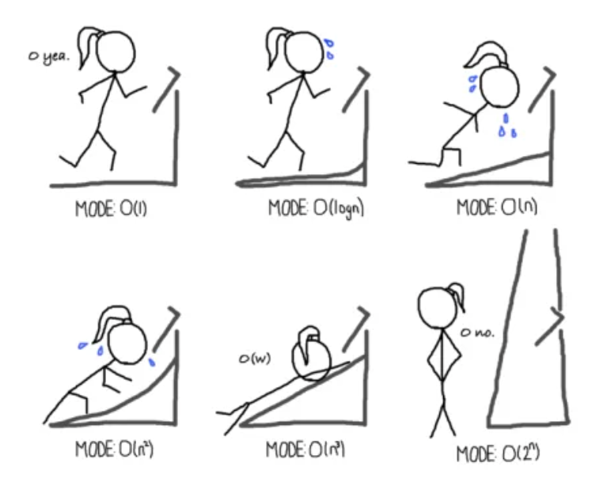

# Complexity Analysis

## Overview

  <a href="https://colab.research.google.com/github/junwei-lu/bst236/blob/main/bst236/codes/chapter03_complexity.ipynb"
     target="_blank"
     style="display: inline-flex; align-items: center; gap: 8px; padding: 10px 16px; background: linear-gradient(135deg, #2e7d32 0%, #66bb6a 100%); color: white; border-radius: 8px; text-decoration: none; font-weight: 600; box-shadow: 0 4px 15px rgba(46, 125, 50, 0.4);">
    <svg width="20" height="20" viewBox="0 0 24 24" fill="none" stroke="currentColor" stroke-width="2">
      <path d="M10 20l4-16m4 4l4 4-4 4M6 16l-4-4 4-4"/>
    </svg>
    Open Interactive Notebook in Colab
  </a>

Computational complexity is a fundamental concept in computer science that helps us understand and analyze the efficiency of algorithms. This chapter explores how we measure and analyze the performance of algorithms in terms of their time and space requirements.

## Lectures

* [Time Complexity](time_complexity.md)
* [Space Complexity](space_complexity.md)
 
