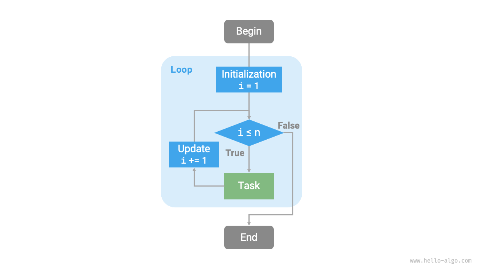
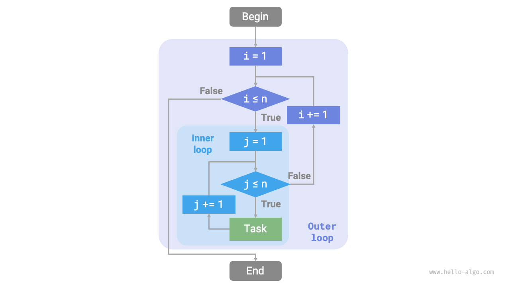

# Mastering Program Flow: Iteration and Recursion

When developing algorithms, we frequently need to perform tasks multiple times. Before we dive into analyzing how efficient our code is through complexity analysis, it's crucial to understand two fundamental approaches to handling repetitive tasks: iteration and recursion. These programming patterns form the backbone of algorithmic thinking and directly impact how we measure program efficiency.

## Understanding Iteration

<u>Iteration</u> represents a straightforward approach to repetition in programming. It involves executing a specific block of code repeatedly while a given condition remains true.

### For Loops

A `for` loop stands out as the most intuitive iterative structure, **particularly when we know exactly how many times we need to repeat an operation**.

Here's a practical example that calculates the sum of integers from 1 to n using a `for` loop. Remember that Python's `range(a, b)` generates numbers from $a$ to $b-1$ inclusive:

```python
def for_loop(n: int) -> int:
    """for loop"""
    res = 0
    # Loop sum 1, 2, ..., n-1, n
    for i in range(1, n + 1):
        res += i
    return res
```

This diagram illustrates how the summation process works:



An important observation here is that the number of steps our program takes grows directly with the input size $n$. **This linear relationship is a key concept in time complexity**, which we'll explore in detail later.

### Nested Loops

Loops can be embedded within other loops, creating more complex patterns. Consider this example:

```python
def nested_for_loop(n: int) -> str:
    """Double for loop"""
    res = ""
    # Loop i = 1, 2, ..., n-1, n
    for i in range(1, n + 1):
        # Loop j = 1, 2, ..., n-1, n
        for j in range(1, n + 1):
            res += f"({i}, {j}), "
    return res
```

Here's a visual representation of the nested loop structure:



In this case, the operation count grows with the square of the input size ($n^2$), demonstrating a quadratic relationship between input size and runtime.

Each additional level of nesting essentially adds another "dimension" to this relationship, potentially leading to cubic, quartic, or higher-order growth patterns.

## Recursion

<u>Recursion</u> offers an elegant alternative to iteration by allowing a function to solve problems by calling itself. This process involves two key phases:

1. **The Descent Phase**: The function repeatedly calls itself with progressively simpler inputs until reaching a base case.
2. **The Ascent Phase**: Once the base case is hit, the function begins returning values back up through the call chain.

Every recursive solution requires three essential components:

1. **A Base Case**: The simplest scenario that stops further recursion
2. **The Recursive Step**: Where the function calls itself with a simpler version of the problem
3. **Result Combination**: How results from recursive calls are combined

Let's see recursion in action with the same summation problem:

```python
def recur(n: int) -> int:
    """Recursion"""
    # Termination condition
    if n == 1:
        return 1
    # Recursive: recursive call
    res = recur(n - 1)
    # Return: return result
    return n + res
```

This diagram shows the recursive process in action:


While iteration and recursion can accomplish the same goals, **they represent distinct problem-solving philosophies**:

- **Iteration**: Takes a bottom-up approach, building the solution incrementally from the smallest steps
- **Recursion**: Employs a top-down strategy, breaking complex problems into smaller, similar sub-problems

Using our summation example, $f(n) = 1 + 2 + \dots + n$:

- **The Iterative Way**: Directly adds numbers from 1 to n in sequence
- **The Recursive Way**: Breaks down the problem into $f(n) = n + f(n-1)$ until reaching $f(1) = 1$

### Understanding the Call Stack

Each recursive call creates a new frame in the program's call stack, storing local variables and return information. This leads to two important implications:

- Each call consumes memory in the "stack frame space" until it returns, meaning **recursive solutions typically use more memory than iterative ones**
- The overhead of function calls makes **recursion generally slower than iteration**

As shown here, reaching the base case requires $n$ active function calls:


Most programming languages limit recursion depth to prevent stack overflow errors.

### Tail Recursion

A special form of recursion, called <u>tail recursion</u>, occurs when **the recursive call is the final operation in the function**. This pattern allows for potential optimization:

- **Standard Recursion**: Requires maintaining the call stack for pending operations
- **Tail Recursion**: Allows the last call to replace the current stack frame

Here's our sum example rewritten using tail recursion:

```python
def tail_recur(n: int, res: int) -> int:
    """Tail recursion"""
    # Termination condition
    if n == 0:
        return res
    # Tail recursive call
    return tail_recur(n - 1, res + n)
```

The execution flow differs significantly:

- **Standard Recursion**: Performs calculations during the return phase
- **Tail Recursion**: Completes calculations during the descent phase


!!! tip

    While tail recursion optimization can make recursive functions as efficient as loops, not all languages support this feature. Python, for instance, doesn't implement tail call optimization by default.

### Recursion Trees in Action

Some problems naturally lend themselves to recursive solutions, particularly in "divide and conquer" scenarios. The Fibonacci sequence provides a perfect example.

!!! question

    In the Fibonacci sequence $0, 1, 1, 2, 3, 5, 8, 13, \dots$, how do we find the $n$th number?

Let's define $f(n)$ as the $n$th Fibonacci number. We know that:

- Base cases: $f(1) = 0$ and $f(2) = 1$
- For any other n: $f(n) = f(n-1) + f(n-2)$

This naturally translates to recursive code:

```python
def fib(n: int) -> int:
    # Termination condition f(1) = 0, f(2) = 1
    if n == 1 or n == 2:
        return n - 1
    # Recursive call f(n) = f(n-1) + f(n-2)
    res = fib(n - 1) + fib(n - 2)
    # Return result f(n)
    return res
