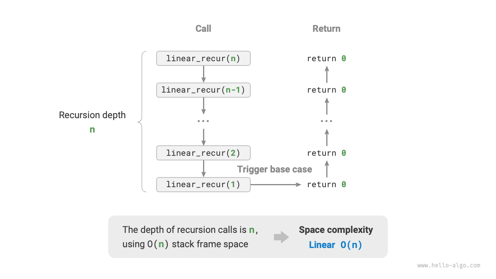

# Space Complexity

Understanding how algorithms consume memory resources is crucial in software development. <u>Space complexity</u> quantifies how memory requirements scale with input size, similar to how time complexity measures runtime scaling.

## Memory  in Algorithm Execution

When analyzing memory usage, we consider three primary components:

- **Input Storage**: Memory allocated for the algorithm's input data
- **Working Memory**: Memory used during execution for variables, objects, and function calls
- **Output Storage**: Memory needed for the algorithm's results

For space complexity analysis, we typically focus on "Working Memory" and "Output Storage".

Working memory can be further categorized into:

- **Data Storage**: Memory for variables, constants, and objects
- **Call Stack**: Memory for function execution contexts
- **Program Instructions**: Memory for compiled code (usually negligible)

In practice, space complexity analysis primarily considers **Data Storage, Call Stack, and Output Storage**, as illustrated below:


Here's an example demonstrating different memory components:

```python
class Node:
    """Classes"""
    def __init__(self, x: int):
        self.val: int = x               # node value
        self.next: Node | None = None   # reference to the next node

def function() -> int:
    """Functions"""
    # Perform certain operations...
    return 0

def algorithm(n) -> int:    # input data
    A = 0                   # temporary data (constant, usually in uppercase)
    b = 0                   # temporary data (variable)
    node = Node(0)          # temporary data (object)
    c = function()          # Stack frame space (call function)
    return A + b + c        # output data
```

## Analysis Methodology

Space complexity analysis shares principles with time complexity analysis but focuses on memory consumption patterns. Unlike time complexity, we typically concentrate on **worst-case space complexity** since memory requirements must be satisfied under all conditions.

Consider this example which demonstrates two key aspects of worst-case analysis:

1. **Input-Based Analysis**: For $n < 10$, memory usage is $O(1)$, but for $n > 10$, the `nums` array requires $O(n)$ space. Therefore, worst-case space complexity is $O(n)$.
2. **Peak Memory Analysis**: While initial memory usage is $O(1)$, array initialization peaks at $O(n)$ space, making the worst-case complexity $O(n)$.

```python
def algorithm(n: int):
    a = 0               # O(1)
    b = [0] * 10000     # O(1)
    if n > 10:
        nums = [0] * n  # O(n)
```

## Recursive Memory Considerations

Recursive functions require special attention due to stack frame accumulation. Consider these contrasting approaches:

```python
def function() -> int:
    # Perform certain operations
    return 0

def loop(n: int):
    """Loop O(1)"""
    for _ in range(n):
        function()

def recur(n: int):
    """Recursion O(n)"""
    if n == 1:
        return
    return recur(n - 1)
```

While both `loop()` and `recur()` have $O(n)$ time complexity, their space requirements differ:

- `loop()`: Maintains $O(1)$ space as each function call completes before the next
- `recur()`: Accumulates $O(n)$ space due to simultaneous stack frames

## Common Space Complexity Patterns

The hierarchy of space complexity classes, from most efficient to least demanding:

$$
\begin{aligned}
& O(1) < O(\log n) < O(n) < O(n^2) < O(2^n) \newline
& \text{Constant} < \text{Logarithmic} < \text{Linear} < \text{Quadratic} < \text{Exponential}
\end{aligned}
$$


### Constant Memory: $O(1)$

Memory usage independent of input size, typically involving fixed variables and non-accumulating loop operations:

```python
def constant():
    a = 0
    b = [0] * 10000
```

### Linear Memory: $O(n)$

Memory usage proportional to input size, common in data structures like arrays and linked lists:

```python
def linear(n):
    nums = [0] * n
```

Recursive implementations can also exhibit linear space complexity through stack frame accumulation:

```python
def linear_recur(n):
    if n == 1:
        return
    return linear_recur(n - 1)
```



### Quadratic Memory: $O(n^2)$

Memory usage grows with the square of input size, typical in matrix operations:

```python
def quadratic(n):
    matrix = [[0] * n for _ in range(n)]
```

Recursive implementations may achieve quadratic space through combined stack and data storage:

```python
def quadratic_recur(n):
    if n == 1:
        return
    nums = [0] * n
    return quadratic_recur(n - 1)
```


### Exponential Memory: $O(2^n)$

Memory usage doubles with each input increment, often seen in complete binary tree structures:

```python
def build_tree(n):
    if n == 1:
        return Node(0)
    left = build_tree(n - 1)
    right = build_tree(n - 1)
    return Node(0, left, right)
```


### Logarithmic Memory: $O(\log n)$

Memory usage grows logarithmically with input size, common in divide-and-conquer algorithms like merge sort, where recursive depth is $\log n$. Another example is number-to-string conversion, where digit count (and thus string length) is $\log_{10} n + 1$.

## Memory-Time Optimization Tradeoffs

Achieving optimal performance in both time and space simultaneously is often challenging. The relationship between these metrics typically involves tradeoffs:

- **Space-Time Tradeoff**: Using additional memory to improve execution speed
- **Time-Space Tradeoff**: Accepting longer runtime to reduce memory consumption

The choice between these approaches depends on specific application requirements and constraints.
