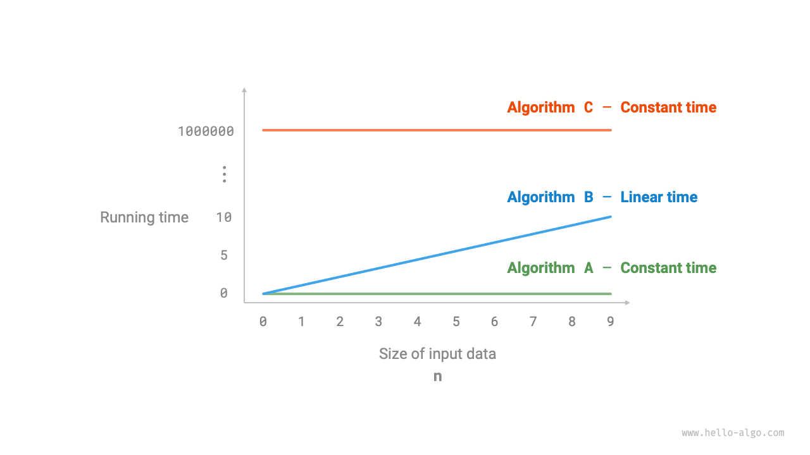
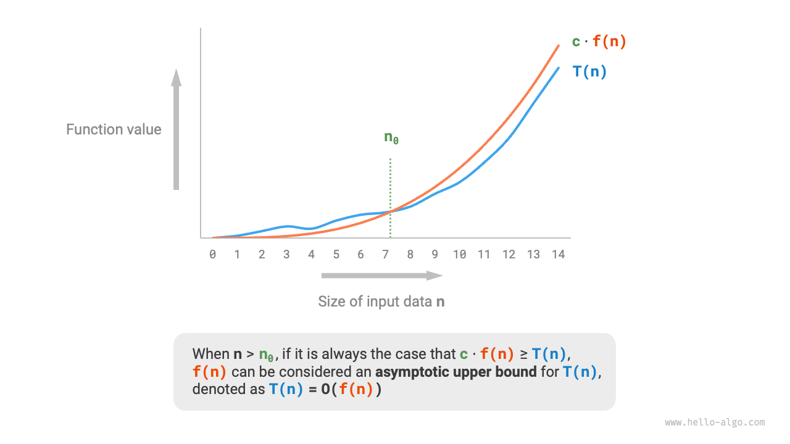
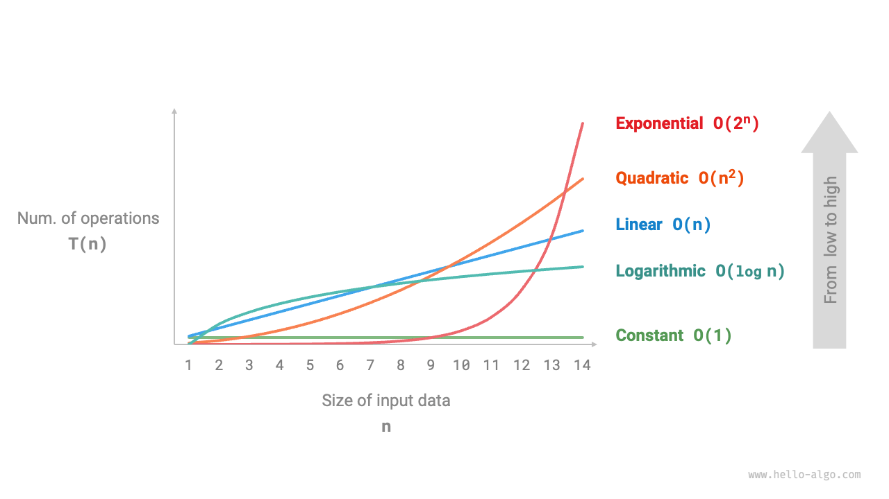
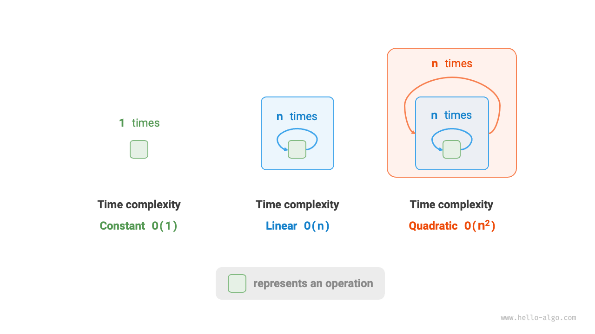
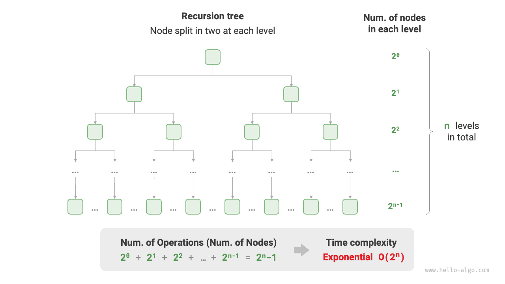
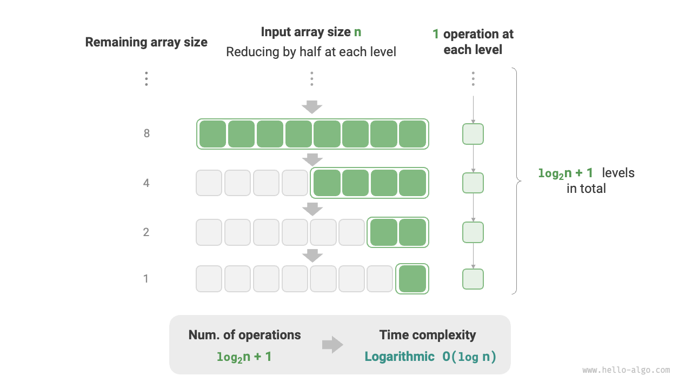

# Time Complexity

When developing software, a crucial question arises: How can we systematically evaluate an algorithm's performance? Let's explore the concept of time complexity, a fundamental tool in computational analysis.

## Performance Evaluation

Traditional approaches to measuring algorithm performance might consider:

1. **Hardware and Environment Specifications**: Including CPU speed, memory capacity, operating system, and programming language implementation
2. **Individual Operation Costs**: Such as basic arithmetic (1 ns for addition, 10 ns for multiplication) or I/O operations (5 ns for printing)
3. **Operation Count**: Tallying every computational step in the code

Consider this example with input size $n$:

```python
# Under an operating platform
def algorithm(n: int):
    a = 2      # 1 ns
    a = a + 1  # 1 ns
    a = a * 2  # 10 ns
    # Cycle n times
    for _ in range(n):  # 1 ns
        print(0)        # 5 ns
```

Using traditional timing analysis, we could calculate the total runtime as $(6n + 12)$ ns:

$$
1 + 1 + 10 + (1 + 5) \times n = 6n + 12
$$

However, this approach has significant limitations. It's impractical to:
- Account for diverse hardware environments
- Accurately measure individual operation times
- Compare algorithms across different platforms

## Growth Rate Analysis

Instead of precise timing, time complexity focuses on how an algorithm's resource requirements scale with input size. This approach provides a more meaningful and platform-independent measure of efficiency.

Let's examine three contrasting algorithms:

```python
# Time complexity of algorithm A: constant order
def algorithm_A(n: int):
    print(0)
# Time complexity of algorithm B: linear order
def algorithm_B(n: int):
    for _ in range(n):
        print(0)
# Time complexity of algorithm C: constant order
def algorithm_C(n: int):
    for _ in range(1000000):
        print(0)
```



This comparison reveals key insights about time complexity analysis:

- **Platform Independence**: The growth pattern remains consistent across different hardware
- **Simplified Analysis**: We can focus on operation counts rather than precise timing
- **Practical Limitations**: Two algorithms with the same complexity class may have significantly different actual runtimes

## Asymptotic Upper Bounds

Consider this function:

```python
def algorithm(n: int):
    a = 1      # +1
    a = a + 1  # +1
    a = a * 2  # +1
    # Cycle n times
    for i in range(n):  # +1
        print(0)        # +1
```

If we express the operation count as $T(n)$:

$$
T(n) = 3 + 2n
$$

This leads us to the concept of big-O notation, written as $O(n)$ in this case, which represents the function's asymptotic upper bound.

!!! note "Asymptotic Upper Bound"

    For a function $T(n)$, we say $T(n) = O(f(n))$ if there exist positive constants $c$ and $n_0$ such that $T(n) \leq c \cdot f(n)$ for all $n > n_0$.



## Practical Analysis Methods

### Operation Counting Principles

When analyzing algorithms, we can simplify our calculations by:

1. **Dropping Constants**: Fixed operations don't affect growth rate
2. **Eliminating Coefficients**: Whether we loop $2n$ or $5n$ times, we write $n$
3. **Multiplying Nested Operations**: For nested loops, multiply the iteration counts

Example:

```python
def algorithm(n: int):
    a = 1      # +0 (constant)
    a = a + n  # +0 (constant)
    # +n (simplified from 5n + 1)
    for i in range(5 * n + 1):
        print(0)
    # +n*n (simplified from 2n * (n+1))
    for i in range(2 * n):
        for j in range(n + 1):
            print(0)
```

The operation count can be expressed as:

$$
\begin{aligned}
T(n) & = 2n(n + 1) + (5n + 1) + 2 & \text{Full expression} \newline
& = 2n^2 + 7n + 3 \newline
T(n) & = n^2 + n & \text{Simplified form}
\end{aligned}
$$

### Determining Complexity Class

The highest-order term in $T(n)$ determines the time complexity. For example:

<p align="center"> Table: Time complexity for different operation counts </p>

| Operation Count $T(n)$ | Time Complexity $O(f(n))$ |
| ---------------------- | ------------------------- |
| $100000$               | $O(1)$                    |
| $3n + 2$               | $O(n)$                    |
| $2n^2 + 3n + 2$        | $O(n^2)$                  |
| $n^3 + 10000n^2$       | $O(n^3)$                  |
| $2^n + 10000n^{10000}$ | $O(2^n)$                  |

## Common Complexity Classes

The standard hierarchy of time complexities, from most efficient to least efficient:

$$
\begin{aligned}
& O(1) < O(\log n) < O(n) < O(n \log n) < O(n^2) < O(2^n) < O(n!) \newline
& \text{Constant} < \text{Log} < \text{Linear} < \text{Linear-Log} < \text{Quadratic} < \text{Exp} < \text{Factorial}
\end{aligned}
$$



### Constant Time: $O(1)$

Operations that execute in fixed time regardless of input size:

```python
def constant(n: int):
    size = 1000000
    print(size)
```

### Linear Time: $O(n)$

Linear order commonly appears in single-loop structures:

```python
def linear(n: int):
    for _ in range(n):
        print(0)
```


### Quadratic Time: $O(n^2)$

Quadratic order typically appears in nested loops, where both the outer and inner loops have a time complexity of $O(n)$, resulting in an overall complexity of $O(n^2)$:

```python
def quadratic(n: int):
    for i in range(n):
        for j in range(n):
            print(0)
```


### Exponential Time: $O(2^n)$

Exponential order often appears in recursive functions. For example, in the code below, it recursively splits into two halves, stopping after $n$ divisions:

```python
def exp_recur(n: int) -> int:
    """Exponential complexity (recursive implementation)"""
    if n == 1:
        return 1
    return exp_recur(n - 1) + exp_recur(n - 1) + 1
```


!!! note "P vs NP"

    A [one-million-dollar](https://www.claymath.org/millennium/p-vs-np/) question in computer science is that whether all problems can be solved in polynomial time, i.e., the P vs NP problem. Most of the computer scientists believe that $P \neq NP$, i.e., there are some problems that cannot be solved in polynomial time. Many combinatorial optimization problems are in this category. These problems are usually graph-related problems, such as the [Hamiltonian cycle problem](https://en.wikipedia.org/wiki/Hamiltonian_path), [Traveling salesman problem](https://en.wikipedia.org/wiki/Travelling_salesman_problem), etc. 


### Logarithmic Time: $O(\log n)$

Like exponential order, logarithmic order also frequently appears in recursive functions. Given an input data size $n$, since the size is halved each round, the number of iterations is $\log_2 n$, the inverse function of $2^n$.

```python
def log_recur(n: int) -> int:
    """Logarithmic complexity (recursive implementation)"""
    if n <= 1:
        return 0
    return log_recur(n / 2) + 1
```

### Linear-Logarithmic Time: $O(n \log n)$

Each level of a binary tree has $O(n)$ operations, and the tree has $\log n$ levels, resulting in a time complexity of $O(n \log n)$.


```python
def linear_log_recur(n: int) -> int:
    """Linear logarithmic complexity"""
    if n <= 1:
        return 1
    count: int = linear_log_recur(n // 2) + linear_log_recur(n // 2)
    for _ in range(n):
        count += 1
    return count
```


!!! note "Sorting complexity"
    The quick sorting algorithm has a time complexity of $O(n \log n)$. In `python`, you can use `list.sort()` to sort the  `list` in linear logarithmic time.

### Factorial Time: $O(n!)$

Factorials are typically implemented using recursion. As shown in the code, the first level splits into $O(n)$ branches, the second level into $O(n-1)$ branches, and so on, stopping after the $n$-th level:

```python
def factorial_recur(n: int) -> int:
    """Factorial complexity (recursive implementation)"""
    if n == 0:
        return 1
    count = 0
    # From 1 split into n
    for _ in range(n):
        count += factorial_recur(n - 1)
    return count
```


## Worst, Best, and Average Time Complexities

**The time efficiency of an algorithm is often not fixed but depends on the distribution of the input data**. Assume we have an array `nums` of length $n$, consisting of numbers from $1$ to $n$, each appearing only once, but in a randomly shuffled order. The task is to return the index of the element $1$. We can draw the following conclusions:

- When `nums = [?, ?, ..., 1]`, that is, when the last element is $1$, it requires a complete traversal of the array, **achieving the worst-case time complexity of $O(n)$**.
- When `nums = [1, ?, ?, ...]`, that is, when the first element is $1$, no matter the length of the array, no further traversal is needed, **achieving the best-case time complexity of $\Omega(1)$**.

The "worst-case time complexity" corresponds to the asymptotic upper bound, denoted by the big $O$ notation. Correspondingly, the "best-case time complexity" corresponds to the asymptotic lower bound, denoted by $\Omega$:

```python
def find_one(n: int):
    nums = list(range(1, n + 1))
    for i, num in enumerate(nums):
        if num == 1:
            return i
```

It's important to note that the best-case time complexity is rarely used in practice, as it is usually only achievable under very low probabilities and might be misleading. **The worst-case time complexity is more practical as it provides a safety value for efficiency**, allowing us to confidently use the algorithm.

From the above example, it's clear that both the worst-case and best-case time complexities only occur under "special data distributions," which may have a small probability of occurrence and may not accurately reflect the algorithm's run efficiency. In contrast, **the average time complexity can reflect the algorithm's efficiency under random input data**, denoted by the $\Theta$ notation.

For some algorithms, we can simply estimate the average case under a random data distribution. For example, in the aforementioned example, since the input array is shuffled, the probability of element $1$ appearing at any index is equal. Therefore, the average number of loops for the algorithm is half the length of the array $n / 2$, giving an average time complexity of $\Theta(n / 2) = \Theta(n)$.

However, calculating the average time complexity for more complex algorithms can be quite difficult, as it's challenging to analyze the overall mathematical expectation under the data distribution. In such cases, we usually use the worst-case time complexity as the standard for judging the efficiency of the algorithm.
