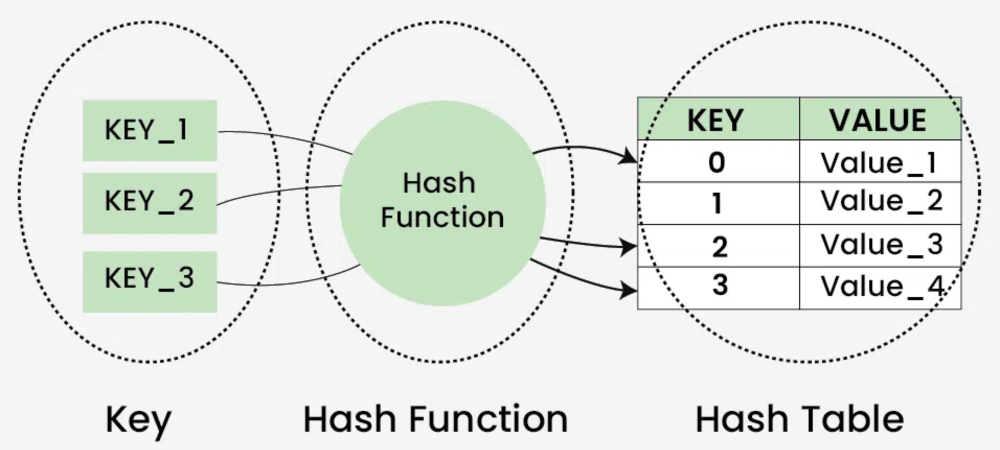

# Hash Table

A <u>hash table</u>, also known as a <u>hash map</u>, is a data structure that establishes a mapping between keys and values, enabling efficient element retrieval. Specifically, when we input a `key` into the hash table, we can retrieve the corresponding `value` in $O(1)$ time complexity.

As shown in the figure below, given $n$ keys, each key has a value. If we want to implement a query function that takes a key as input and returns the corresponding value, we can use the hash table shown in the figure below.



In addition to hash tables, arrays and linked lists can also be used to implement query functionality, but the time complexity is different. Their efficiency is compared in the table below:

- **Inserting an element**: Simply append the element to the tail of the list. The time complexity of this operation is $O(1)$.
- **Searching for an element**: As the list is unsorted, searching for an element requires traversing through all of the elements. The time complexity of this operation is $O(n)$.
- **Deleting an element**: To remove an element, we first need to locate it. Then, we delete it from the list. The time complexity of this operation is $O(n)$.

<p align="center"> Table <id> &nbsp; Comparison of time efficiency for common operations </p>

|                | List  | Hash Table |
| -------------- | ------ | ---------- |
| Search Elements   | $O(n)$ | $O(1)$     |
| Insert Elements    | $O(1)$ | $O(1)$     |
| Delete Elements | $O(n)$ | $O(1)$     |

As observed, **the time complexity for operations (insertion, deletion, searching, and modification) in a hash table is $O(1)$**, which is highly efficient.

## Common operations of hash table

Common operations of a hash table include: initialization, querying, adding key-value pairs, and deleting key-value pairs. Here is an example code:

```python
# Create a dictionary using curly braces
hmap = {}
hmap = {'apple': 5, 'banana': 3, 'orange': 2}
```

Dictionary comprehensions offer a concise way to create dictionaries:

```python
# Square values in a dictionary
squared_dict = {k: v**2 for k, v in hmap.items()}
print("Squared dictionary:", squared_dict)
```


The `defaultdict` from the `collections` module provides automatic default values for non-existent keys:

```python
from collections import defaultdict

# Create a defaultdict with default integer value (0)
counts = defaultdict(int)
counts['apple'] += 1
counts['banana'] += 1
```

### Dictionary Traversal Methods

```python
# Traverse key-value pairs
for key, value in hmap.items():
    print(f"{key} -> {value}")
# Traverse keys only
for key in hmap.keys():
    print(key)
# Traverse values only
for value in hmap.values():
    print(value)
```

## Key Performance Insights

Use Lists when:
- Order matters
- Memory efficiency is important
- You need integer indexing and slicing

Use Dictionaries when:
- You need fast lookups by key
- Order doesn't matter 
- You need to associate data with non-integer keys
- Performance is more important than memory usage

