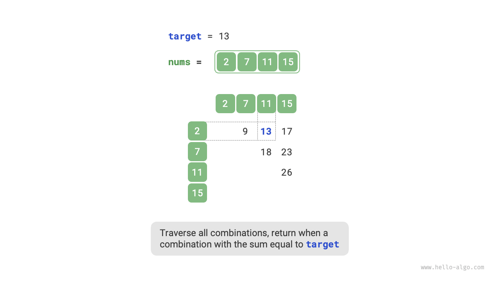
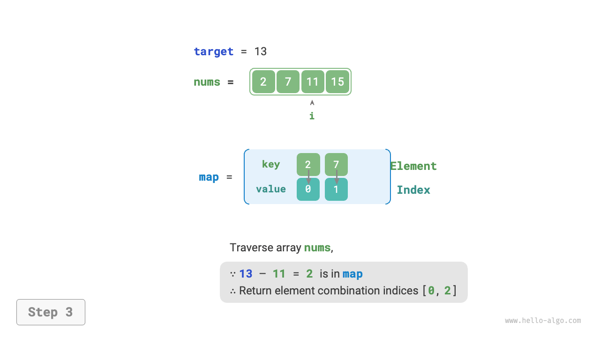

# Hash Table

A <u>hash table</u>, also known as a <u>hash map</u>, is a data structure that establishes a mapping between keys and values, enabling efficient element retrieval. Specifically, when we input a `key` into the hash table, we can retrieve the corresponding `value` in $O(1)$ time complexity.

As shown in the figure below, given $n$ keys, each key has a value. If we want to implement a query function that takes a key as input and returns the corresponding value, we can use the hash table shown in the figure below.


In addition to hash tables, arrays and linked lists can also be used to implement query functionality, but the time complexity is different. Their efficiency is compared in the table below:

- **Inserting an element**: Simply append the element to the tail of the list. The time complexity of this operation is $O(1)$.
- **Searching for an element**: As the list is unsorted, searching for an element requires traversing through all of the elements. The time complexity of this operation is $O(n)$.
- **Deleting an element**: To remove an element, we first need to locate it. Then, we delete it from the list. The time complexity of this operation is $O(n)$.

<p align="center"> Table <id> &nbsp; Comparison of time efficiency for common operations </p>

|                | List  | Hash Table |
| -------------- | ------ | ---------- |
| Search Elements   | $O(n)$ | $O(1)$     |
| Insert Elements    | $O(1)$ | $O(1)$     |
| Delete Elements | $O(n)$ | $O(1)$     |

As observed, **the time complexity for operations (insertion, deletion, searching, and modification) in a hash table is $O(1)$**, which is highly efficient.

## Common operations of hash table

Common operations of a hash table include: initialization, querying, adding key-value pairs, and deleting key-value pairs. Here is an example code:

```python
# Create a dictionary using curly braces
hmap = {}
hmap = {'apple': 5, 'banana': 3, 'orange': 2}
```

Dictionary comprehensions offer a concise way to create dictionaries:

```python
# Square values in a dictionary
squared_dict = {k: v**2 for k, v in hmap.items()}
print("Squared dictionary:", squared_dict)
```


The `defaultdict` from the `collections` module provides automatic default values for non-existent keys:

```python
from collections import defaultdict

# Create a defaultdict with default integer value (0)
counts = defaultdict(int)
counts['apple'] += 1
counts['banana'] += 1
```

### Dictionary Traversal Methods

```python
# Traverse key-value pairs
for key, value in hmap.items():
    print(f"{key} -> {value}")
# Traverse keys only
for key in hmap.keys():
    print(key)
# Traverse values only
for value in hmap.values():
    print(value)
```

## Key Performance Insights

Use Lists when:
- Order matters
- Memory efficiency is important
- You need integer indexing and slicing

Use Dictionaries when:
- You need fast lookups by key
- Order doesn't matter 
- You need to associate data with non-integer keys
- Performance is more important than memory usage

## Hash optimization strategies

In algorithm problems, **we often reduce the time complexity of algorithms by replacing linear search with hash search**. Let's use an algorithm problem to deepen understanding.

!!! question

    Given an integer array `nums` and a target element `target`, please search for two elements in the array whose "sum" equals `target`, and return their array indices. Any solution is acceptable.

### Linear search: trading time for space

Consider traversing all possible combinations directly. As shown in the figure below, we initiate a two-layer loop, and in each round, we determine whether the sum of the two integers equals `target`. If so, we return their indices.



The code is shown below:
```python
def two_sum_brute_force(nums: list[int], target: int) -> list[int]:
    """Method one: Brute force enumeration"""
    # Two-layer loop, time complexity is O(n^2)
    for i in range(len(nums) - 1):
        for j in range(i + 1, len(nums)):
            if nums[i] + nums[j] == target:
                return [i, j]
    return []
```

This method has a time complexity of $O(n^2)$ and a space complexity of $O(1)$, which is very time-consuming with large data volumes.

### Hash search: trading space for time

Consider using a hash table, with key-value pairs being the array elements and their indices, respectively. Loop through the array, performing the steps shown in the figure below each round.

1. Check if the number `target - nums[i]` is in the hash table. If so, directly return the indices of these two elements.
2. Add the key-value pair `nums[i]` and index `i` to the hash table.

=== "<1>"
    

=== "<2>"
    

=== "<3>"
    

The implementation code is shown below, requiring only a single loop:

```python
def two_sum_hash_table(nums: list[int], target: int) -> list[int]:
    """Method two: Auxiliary hash table"""
    # Auxiliary hash table, space complexity is O(n)
    dic = {}
    # Single-layer loop, time complexity is O(n)
    for i in range(len(nums)):
        if target - nums[i] in dic:
            return [dic[target - nums[i]], i]
        dic[nums[i]] = i
    return []
```

This method reduces the time complexity from $O(n^2)$ to $O(n)$ by using hash search, greatly improving the running efficiency.

As it requires maintaining an additional hash table, the space complexity is $O(n)$. **Nevertheless, this method has a more balanced time-space efficiency overall, making it the optimal solution for this problem**.

