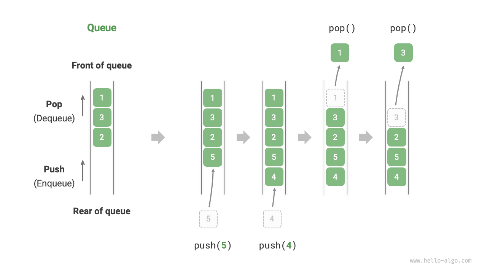

# Queue

A <u>queue</u> is a linear data structure that follows the First-In-First-Out (FIFO) rule. As the name suggests, a queue simulates the phenomenon of lining up, where newcomers join the queue at the rear, and the person at the front leaves the queue first.

As shown in the figure below, we call the front of the queue the "head" and the back the "tail." The operation of adding elements to the rear of the queue is termed "enqueue," and the operation of removing elements from the front is termed "dequeue."



## Common operations on queue

The common operations on a queue are shown in the table below. Note that method names may vary across different programming languages. Here, we use the same naming convention as that used for stacks.

<p align="center"> Table <id> &nbsp; Efficiency of queue operations </p>

| Method Name | Description                            | Time Complexity |
| ----------- | -------------------------------------- | --------------- |
| `push()`    | Enqueue an element, add it to the tail | $O(1)$          |
| `pop()`     | Dequeue the head element               | $O(1)$          |


We can directly use the ready-made queue classes in programming languages:

```python title="queue.py"
from collections import deque

# Initialize the queue
# In Python, we generally use the deque class as a queue
# Although queue.Queue() is a pure queue class, it's not very user-friendly, so it's not recommended
que: deque[int] = deque()

# Enqueue elements
que.append(1)
que.append(3)
que.append(2)
que.append(5)
que.append(4)

# Access the first element
front: int = que[0]

# Dequeue an element
pop: int = que.popleft()

# Get the length of the queue
size: int = len(que)

# Check if the queue is empty
is_empty: bool = len(que) == 0
```
