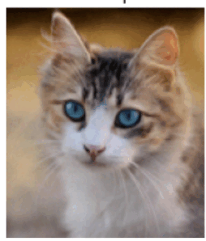
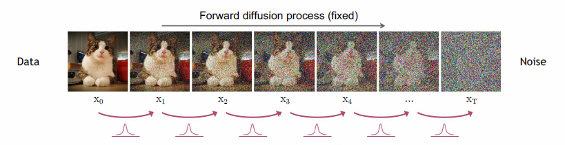
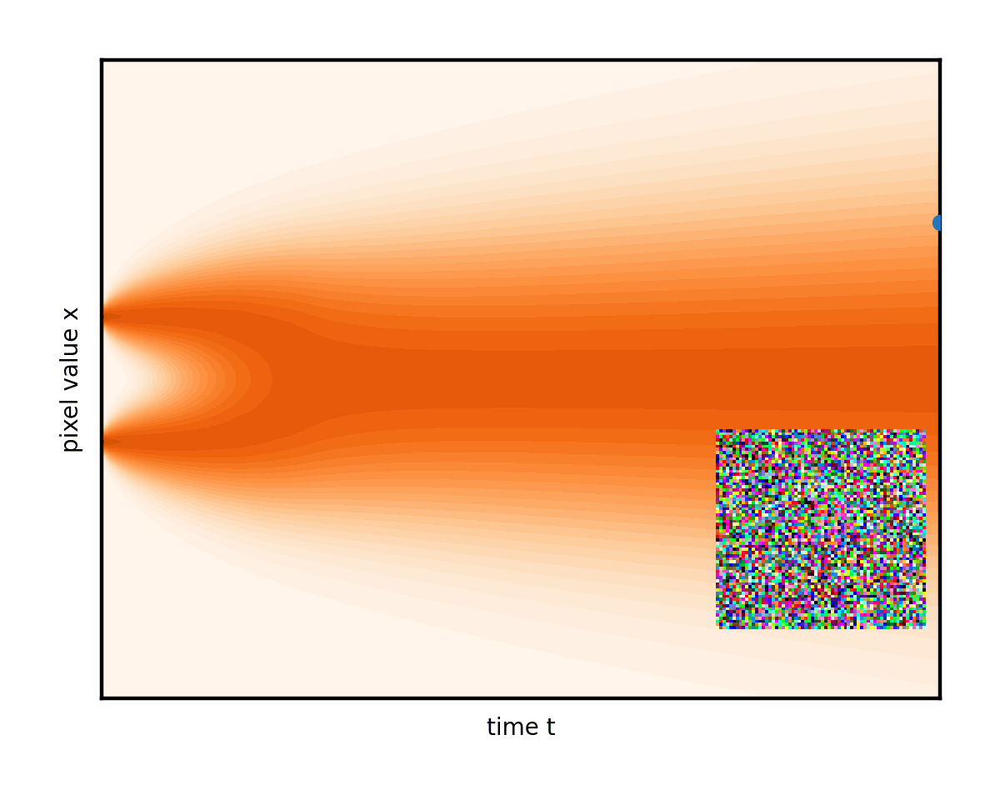
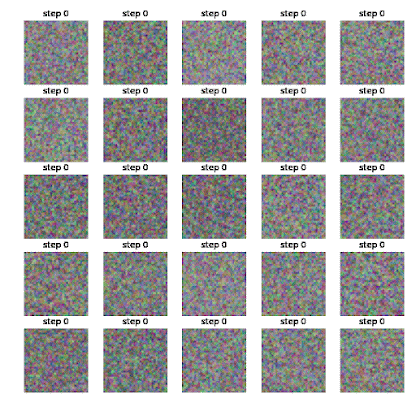
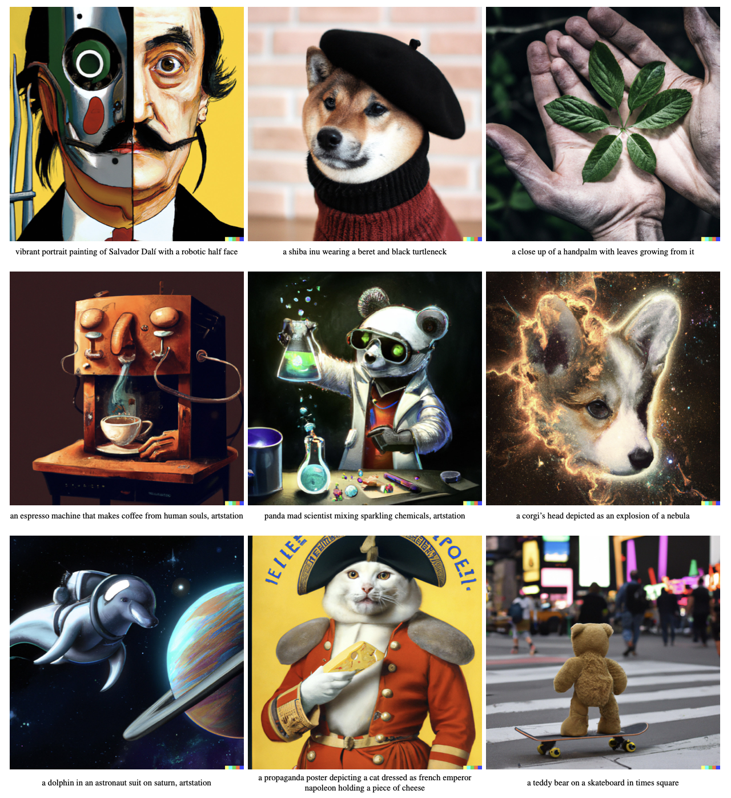

# Diffusion Model

The Langevin Dynamics can be used to sample from a distribution $p \propto \exp(-f)$ when $f$ is known. However, for most cases, we need to learn the distribution from finite samples, e.g., images, where the distribution is unknown. This lecture introduces a **diffusion generative model** based on the diffusion process, which is a powerful tool for learning unknown distributions.

From the [previous lecture](./langevin_dynamics.md), we know that the diffusion process

$$
X_t =  X_0 + \sqrt{2t} \varepsilon_t, \quad \varepsilon_t \sim \mathcal{N}(0, I)
$$

will converge to a Gaussian distribution. Imagining you add noise to an image, it will be blurred gradually to a white noise image as follows:



The key idea of diffusion generative model is to learn the **reverse process** of the diffusion process. We can generate images of cats by removing the noise from the image.


## From Noise to Data

!!! quote "Michelangelo:"
    Every block of stone has a statue inside it. I just chip away the stone that doesn’t look like David.

Let’s say we want to build a generative model as a process that transforms a random noise vector $z$ into a data sample $x$. Imagine you are Michelangelo, and you want to build a David statue from a block of stone.


> Prompt: "a hyper realistic twitter post by Michelangelo . include a selfie of him chopping the stones on a halfway done David statue."

We can imagine this process as “sculpting,” where the random noise $z$ is raw materials like stones, and the data sample $x$ is the sculpture. So, a generative model is like Michelangelo who removes the stone to reveal the sculpture.

$$
\begin{array}{ccc}
\text{Random noise $z$} & \xrightarrow{\text{reverse}} & \text{Sample data $x$} \\
\downarrow& &   \downarrow \\
\text{Rock} & \xrightarrow{\text{chip}} & \text{Sculture}
\end{array}
$$


This process is hard, which is why there’s so much research on generative models. But as the saying goes, “destruction is easier than construction.” Maybe you can’t build a skyscraper, but you can definitely tear one down. So let’s think about the reverse process of dismantling a skyscraper into bricks and cement.

Let $x_0$ be the finished sculpture (data sample), and $x_T$ be the pile of stones (random noise). Assume it takes $T$ steps to dismantle it. The entire process is:

$$
x = x_0 \rightarrow x_1 \rightarrow x_2 \rightarrow \cdots \rightarrow x_{T-1} \rightarrow x_T = z
$$



The challenge of building a David statue is that going from raw materials $x_T$ to the final structure $x_0$ is too big a leap. But if we have the intermediate states $x_1, x_2, \dots, x_T$, we can understand how to go from one step to the next. Even master like Michelangelo need to chip one block at a time.

So, if we know the transformation $x_{t-1} \rightarrow x_t$ (dismantling), then reversing it $x_t \rightarrow x_{t-1}$ is like chipping. If we can learn the reverse function $\mu(x_t)$, then starting from $x_T$, we can repeatedly apply $\mu$ to reconstruct the David statue:

$$
x_{T-1} = \mu(x_T),\quad x_{T-2} = \mu(x_{T-1}), \dots
$$

## Denoising Diffusion Probabilistic Models

We now are ready to introduce the Denoising Diffusion Probabilistic Models (DDPM) to implement the reverse process.

As the saying goes, “one bite at a time.” As another saying goes, "Rome wasn't built in a day."
DDPM follows this principle by defining a gradual transformation from data samples to noise (dismantling), then learns the reverse (chipping). So it’s more accurate to call DDPM a “gradual model” rather than a “diffusion model.”

### Forward Process

Specifically, DDPM defines the dismantling process as:

$$
x_t = \alpha_t x_{t-1} + \beta_t \varepsilon_t, \quad \varepsilon_t \sim \mathcal{N}(0, I)
$$

Here, $\alpha_t, \beta_t > 0$ and $\alpha_t^2 + \beta_t^2 = 1$. Typically, $\beta_t$ is close to 0, representing small degradation at each step. The noise $\varepsilon_t$ adds randomness—think of it as raw material injected at each step.

Repeating this step, we get:

$$
\begin{align*}
x_t &= \alpha_t x_{t-1} + \beta_t \varepsilon_t\\
 &= \alpha_t (\alpha_{t-1} x_{t-2} + \beta_{t-1} \varepsilon_{t-1}) + \beta_t \varepsilon_t\\
 &= (\alpha_t \alpha_{t-1}) x_{t-2} + (\alpha_t \beta_{t-1} + \beta_t) \varepsilon_{t-1} + \beta_t \varepsilon_t\\
 &= \cdots\\
 &= (\alpha_t \cdots \alpha_1)x_0 + \underbrace{(\alpha_t \cdots \alpha_2) \varepsilon_1 + (\alpha_t \cdots \alpha_3) \varepsilon_2 + \cdots + \beta_t \varepsilon_{t}}_{\text{a weighted sum of Gaussian noises}}
\end{align*}
$$

Why do we require $\alpha_t^2 + \beta_t^2 = 1$? Because the Gaussian noise sum then becomes a single Gaussian with mean 0 and total variance 1, i.e.,

$$
x_t = \underbrace{(\alpha_t \cdots \alpha_1)}_{\bar{\alpha}_t}x_0 + \underbrace{\sqrt{1 - (\alpha_t \cdots \alpha_1)^2}}_{\bar{\beta}_t}\bar{\varepsilon}_t, \quad \bar{\varepsilon}_t \sim \mathcal{N}(0, I) \tag{1}
$$

This makes computing $x_t$ very convenient. Furthermore, $\bar{\alpha}_T \approx 0$, meaning that after $T$ steps, only noise remains.


### Reverse Process

Now that we have data pairs $(x_{t-1}, x_t)$ from dismantling, we can learn the reverse $x_t \rightarrow x_{t-1}$ via a model $\mu(x_t)$. The loss is:

$$
\|x_{t-1} - \mu(x_t)\|^2 \tag{2}
$$

The dismantling equation:

$$
x_{t-1} = \frac{1}{\alpha_t}(x_t - \beta_t \varepsilon_t)
$$

motivates us to design the reverse model as:

$$
\mu(x_t) = \frac{1}{\alpha_t}(x_t - \beta_t \varepsilon_\theta(x_t, t))
$$

We aim to model the stone-to-be-chipped $\varepsilon_t$ as $\varepsilon_\theta(x_t, t)$.

The loss in (2) becomes:

$$
\|\varepsilon_t - \varepsilon_\theta(x_t, t)\|^2 
$$

Now we get the training loss:

$$
\mathbb{E}_{x_0 \sim \text{Data}, t \sim \text{Uniform}\{1 ,\ldots, T\}, \varepsilon_t \sim \mathcal{N}(0, I)} \|\varepsilon_t - \varepsilon_\theta(x_t, t)\|^2 \tag{3}
$$


### Variance-Reduction Trick

From the loss in (3), we can see that the variance is high because of many things to sample:

- $x_0$ from the data distribution
- $t$ from $1, 2, \ldots, T$
- $\varepsilon_t, t=1, 2, \ldots, T$ from the normal distribution

The more to sample, the higher the variance of loos will be, and harder to train.

To reduce the variance, we can use the variance-reduction trick proposed in the [DDPM paper](https://arxiv.org/abs/2006.11239). You will see it is basic change of variables and Gaussian addition tricks.


Using the earlier expression for $x_t$ in (1):

$$
\begin{align*}
x_t  &= \alpha_t x_{t-1} + \beta_t \varepsilon_t \\
     &= \alpha_t (\bar{\alpha}_{t-1} x_0 +  \bar{\beta}_{t-1} \bar{\varepsilon}_{t-1} )+ \beta_t \varepsilon_t \\
     &= \bar{\alpha}_t x_0 + \alpha_t \bar{\beta}_{t-1} \bar{\varepsilon}_{t-1} + \beta_t \varepsilon_t 
\end{align*}
$$

We get the training loss:

$$
\|\varepsilon_t - \varepsilon_\theta(\bar{\alpha}_t x_0 + \alpha_t \bar{\beta}_{t-1} \bar{\varepsilon}_{t-1} + \beta_t \varepsilon_t , t)\|^2
$$

and it is easy to check that $\omega, \varepsilon \sim \mathcal{N}(0, I)$ and $\mathbb{E}[\varepsilon \omega^T] = 0$. So $\omega$ is independent of $\varepsilon$.

We construct two new Gaussian noises:

$$
\begin{align*}
\bar{\beta}_t \varepsilon &= \alpha_t \bar{\beta}_{t-1} \bar{\varepsilon}_{t-1} + \beta_t \varepsilon_t \\
\bar{\beta}_t \omega &= \beta_t \bar{\varepsilon}_{t-1} - \alpha_t \bar{\beta}_{t-1} \varepsilon_t
\end{align*}
$$

We can also represent $\varepsilon_t$ by $\omega$ and $\varepsilon$ as:

$$
\varepsilon_t = \frac{\beta_t \varepsilon - \alpha_t \bar{\beta}_{t-1} \omega}{\bar{\beta}_t}
$$

Substitute back to the loss in (3) and simplify to get the final DDPM loss:

$$
\begin{align*}
&\mathbb{E}_{\varepsilon_t \sim \mathcal{N}(0, I)} \|\varepsilon_t - \varepsilon_{\theta}  (x_t, t)\|^2\\
&= \mathbb{E}_{\varepsilon, \omega \sim \mathcal{N}(0, I)} \left\|\frac{\beta_t \varepsilon - \alpha_t \bar{\beta}_{t-1} \omega}{\bar{\beta}_t} - \frac{\bar{\beta}_t}{\beta_t} \varepsilon_\theta(\bar{\alpha}_t x_0 + \bar{\beta}_t \varepsilon, t)\right\|^2 \tag{4}\\
&= \frac{\bar{\beta}^2_t}{\beta^2_t}\mathbb{E}_{\varepsilon \sim \mathcal{N}(0, I)} \left\| \varepsilon - \varepsilon_\theta(\bar{\alpha}_t x_0 + \bar{\beta}_t \varepsilon, t)\right\|^2 + \text{const},
\end{align*}
$$

where the last equality holds by taking the expectation out of $\omega$ by noticing the loss in (4) is quadratic in $\omega$.

This gives us the final DDPM loss:

$$
\mathbb{E}_{x_0 \sim \text{Data}, t \sim \text{Uniform}\{1 ,\ldots, T\}, \varepsilon \sim \mathcal{N}(0, I)} \| \varepsilon - \varepsilon_\theta(\bar{\alpha}_t x_0 + \bar{\beta}_t \varepsilon, t)\|^2 
$$

We can see that we need to train the noise predictor $\varepsilon_\theta$ with the time step $t$ as input. In the original [DDPM paper](https://arxiv.org/abs/2006.11239), the time step $t$ is specified by adding the Transformer [sinusoidal position embedding](../chapter_language_model/wordvec.md#position-embeddings)
into each [residual block](../chapter_neural_networks/resnet.md#skip-connections). The paper also suggests to choose $T=1000$ and $\alpha_t = \sqrt{1 - 0.02t/T}$ to choose smaller steps when closer to the original data distribution.

### Sampling

Once $\varepsilon_\theta$ is trained, DDPM generates samples by starting from $x_T \sim \mathcal{N}(0, I)$ and running:

$$
x_{t-1} = \frac{1}{\alpha_t}(x_t - \beta_t \varepsilon_\theta(x_t, t))
$$

You can do the random sampling as follows:

$$
x_{t-1} = \frac{1}{\alpha_t}(x_t - \beta_t \varepsilon_\theta(x_t, t)) + \beta_t z, z \sim \mathcal{N}(0, I).
$$





### Code Implementation

We can implement the DDPM model in PyTorch by defining a class `DDPM` with both the noise predictor and sampling.

```python
import torch 
from torch import nn, Tensor

class DDPM(nn.Module):
    def __init__(self, dim: int = 2, h: int = 64, n_steps: int = 100):
        super().__init__()
        self.n_steps = n_steps
        # Define beta schedule from small to large values
        self.betas = torch.linspace(1e-4, 0.02, n_steps)
        # Calculate alphas: α_t = 1 - β_t
        self.alphas = 1.0 - self.betas
        # Calculate cumulative product of alphas: ᾱ_t = ∏_{i=1}^t α_i
        self.alpha_bars = torch.cumprod(self.alphas, dim=0)
        
        # Simple MLP network for noise prediction ε_θ
        self.net = nn.Sequential(
            nn.Linear(dim + 1, h), nn.ELU(),
            nn.Linear(h, h), nn.ELU(),
            nn.Linear(h, h), nn.ELU(),
            nn.Linear(h, dim)
        )
    
    def forward(self, t: Tensor, x_t: Tensor) -> Tensor:
        # Reshape time step and concatenate with noisy input
        # This implements ε_θ(x_t, t)
        t = t.view(-1, 1)
        return self.net(torch.cat((t, x_t), dim=-1))
    
    def sample_step(self, x_t: Tensor, t: int) -> Tensor:
        # Sample Gaussian noise for the stochastic part of sampling
        noise = torch.randn_like(x_t)
        # Get α_t and ᾱ_t for current timestep
        alpha_t = self.alphas[t]
        alpha_bar_t = self.alpha_bars[t]
        # Calculate coefficient for the noise prediction
        coeff = (1 - alpha_t) / torch.sqrt(1 - alpha_bar_t)
        # Normalize time step to [0,1] range for the model
        t_tensor = torch.full((x_t.shape[0],), t / self.n_steps, device=x_t.device)
        # Predict noise using the model: ε_θ(x_t, t)
        predicted_noise = self(t_tensor, x_t)
        # Implement the sampling formula: x_{t-1} = (x_t - coeff * ε_θ(x_t, t)) / sqrt(α_t) + noise term
        x_t = (x_t - coeff * predicted_noise) / torch.sqrt(alpha_t)
        # Add noise term if not the final step, implementing the stochastic sampling
        return x_t + torch.sqrt(1 - alpha_t) * noise if t > 0 else x_t
```

We can train the DDPM model by compute the loss in (3).

```python
from sklearn.datasets import make_moons

ddpm = DDPM()
optimizer = torch.optim.Adam(ddpm.parameters(), lr=1e-3)
loss_fn = nn.MSELoss()

for _ in range(10000):
    x_0 = Tensor(make_moons(256, noise=0.05)[0])
    t = torch.randint(0, ddpm.n_steps, (x_0.shape[0],))
    noise = torch.randn_like(x_0)
    
    alpha_bar_t = ddpm.alpha_bars[t].view(-1, 1)
    x_t = torch.sqrt(alpha_bar_t) * x_0 + torch.sqrt(1 - alpha_bar_t) * noise
    
    optimizer.zero_grad()
    t_normalized = t / ddpm.n_steps
    predicted_noise = ddpm(t_normalized, x_t)
    loss = loss_fn(predicted_noise, noise)
    loss.backward()
    optimizer.step()
```


## Contextual DDPM

We can generalize the DDPM model to generate the conditional distribution $p(x |c)$ where $c$ could be even be a text prompt.

We can just simple add the context $c$ to the input of the noise predictor $\varepsilon_\theta(x_t, t, c)$ and train the loss function as:

$$
\mathbb{E}_{(x_0, c) \sim \text{Data}, t \sim \text{Uniform}\{1 ,\ldots, T\}, \varepsilon \sim \mathcal{N}(0, I)} \| \varepsilon - \varepsilon_\theta(\bar{\alpha}_t x_0 + \bar{\beta}_t \varepsilon, t, c)\|^2 
$$

More technologies like the [CLIP](https://arxiv.org/abs/2103.00020) can be used to improve the quality of the generated images. Please refer to the [OpenAI DALL-E paper](https://arxiv.org/pdf/2204.06125) for more details.




### Classifier-Free Guidance

For conditional probabiltiy generation, there is a trade-off between the fidelity and mode-coverage (diversity) of the generated images. In order to tune the trade-off, we can use the **classifier-free guidance** to sample using a linear combination of conditional and unconditional samples:

$$
\tilde{\varepsilon}_\theta(x_t, t, c) = (1+w) \varepsilon_\theta(x_t, t, c) - w \varepsilon_\theta(x_t, t),
$$

where $\varepsilon_\theta(x_t, t)$ is an unconditional noise predictor. Usually, we will use the same network for both conditional and unconditional cases. For unconditional case, we will use a null token $\varnothing$ as the context $c$ and fit $\varepsilon_\theta(x_t, t) = \varepsilon_\theta(x_t, t, \varnothing)$.

The training process can be summarized as follows.

**Input**: $p_{uncond}$: probability of unconditional training

**Repeat**:

  1. Sample data with conditioning from the dataset: $(x, c) \sim p(x, c)$
  2. Randomly discard conditioning to train unconditionally: $c \leftarrow \emptyset$ with probability $p_{uncond}$
  3. Sample log SNR value: $\lambda \sim p(\lambda)$
  4. Sample Gaussian noise: $\epsilon \sim \mathcal{N}(0, I)$
  5. Corrupt data to the sampled log SNR value: $z_\lambda = \alpha_\lambda x + \sigma_\lambda \epsilon$
  6. Take gradient step on $\nabla_\theta \|\epsilon_\theta(z_\lambda, c) - \epsilon\|^2$

**Until** converged


We will then use $\tilde{\varepsilon}_\theta(x_t, t, c)$ to sample from the model.

When $w$ increases from 0 to $\infty$, the generated images will become less fidelity and more diversity.


