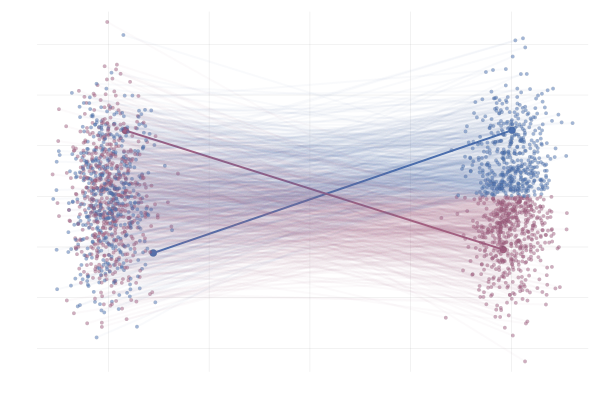
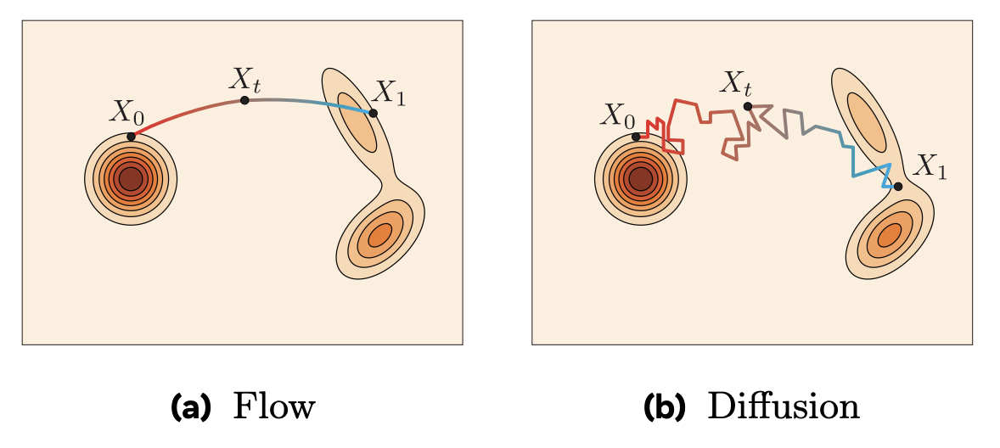
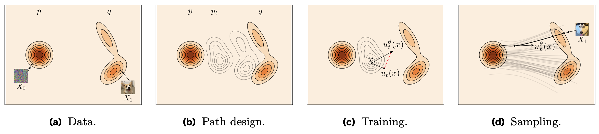
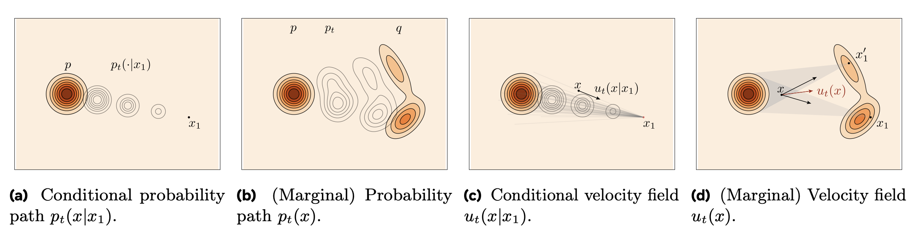
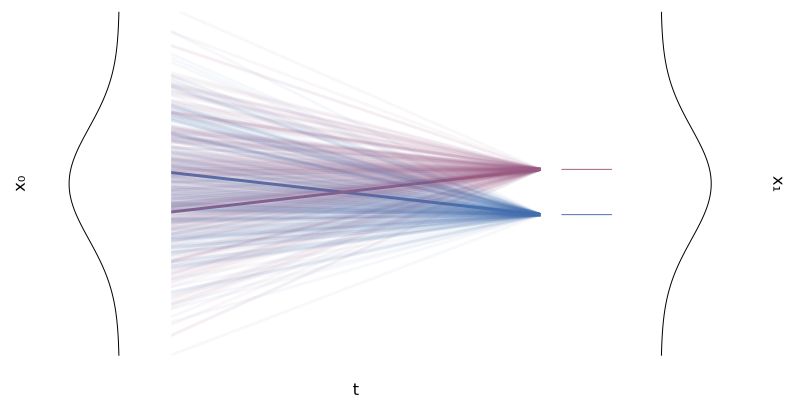
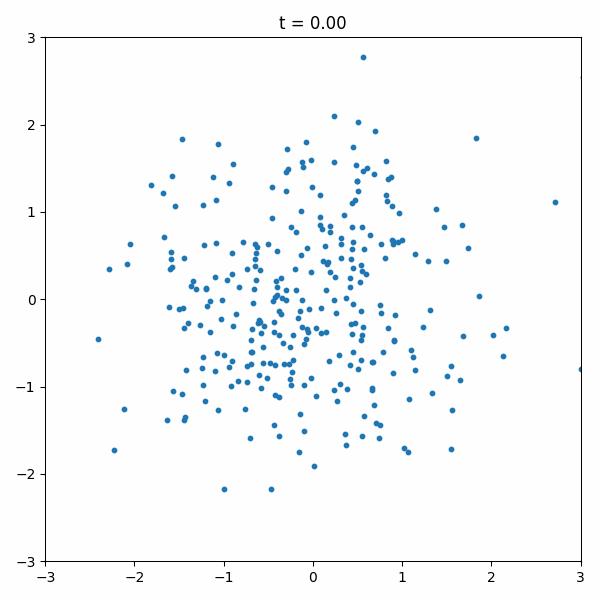
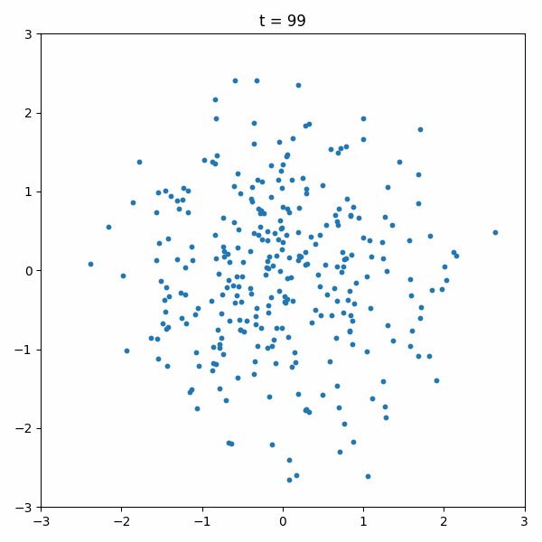

# Flow Matching

In the diffusion model, the forward process adding noise to the data distribution as

$$
x_t = \sqrt{\alpha_t} x_0 + \sqrt{1 - \alpha_t} \epsilon, \quad \epsilon \sim \mathcal{N}(0, I)
$$

where $\alpha_t$ is a function of $t$.

This process connects the data distribution $p_0(x)$ to Gaussian distribution $p_{\infty}(x)$ as $x_t$ for $t \to \infty$. And then DDPM aims to reverse this process to start from Gaussian distribution $p_{\infty}(x)$ and recover the data distribution $p_0(x)$ by training a denoising diffusion model.

However, there are two problems for the DDPM:

1. We add noise in each step in the forward process, which adds variance to the process.
2. $p_T(x)$ is close but not exactly a Gaussian distribution, which introduces bias to the reverse process.

To overcome these two problems, Flow matching's idea is to **directly interpolate between the data density $p_1(x)$ and the Gaussian density (or other simple density) $p_0(x)$**.

So how do we interpolate between $p_1(x)$ and $p_0(x)$? From the [previous lecture](langevin_dynamics.md#vector-field-of-gradient-flow), we know that a density $p_t(x)$ can be evolved following a vector field $u_t(x)$:

$$
\frac{\partial p_t}{\partial t} = - \nabla \cdot (p_t u_t)
$$

The interpolation between $X_0 \sim p_0(x)$ and $X_1 \sim p_1(x)$ can be achieved by many ways but the simplest way is to use a linear interpolation:

$$
X_t = (1-t)X_0 + t X_1 \sim p_t.
$$

We can learn the vector field $u_t(x)$ by a neural network model $u^{\theta}_t(x)$ or other methods and minimize the following Flow Matching loss:

$$
\mathcal{L}_{\text{FM}} = \mathbb{E}_{t \sim U[0,1], X_t\sim p_t(x)} \left\| u^{\theta}_t(X_t) - u_t(X_t) \right\|^2 
$$

However, the vector field $u_t(x)$ is usually too complicated to make the above loss possible to solve.

## Conditional Flow Matching

To overcome this problem, we now consider a simpler case for the target density $p_1(x)$ being a singleton point $x_1$. The interpolation between $X_0 \sim p_0(x) = N(0, I)$ and $X_1 = x_1$ becomes:

$$
X_{t|1} = (1-t)X_0 + t x_1 \sim p_{t|1} = N(t x_1, (1-t)^2 I).
$$

As we have

$$
\frac{d}{dt} X_{t|1} = x_1 - X_0 = \frac{x_1-X_{t|1}}{1-t} = u_{t}(X_{t|1}| x_1),
$$

so we have the conditional vector field 

$$
u_{t}(x | x_1) = \frac{x_1-x}{1-t}.
$$

It can be shown that if $p_0(x)$ evolves over the vector field $u_{t}(x | x_1)$, it will converge to $x_1$ at $t=1$.

We can then take the above example as a conditional case for the general target density $X_1 \sim p_1(x)$. Each $X_{t|1}$ is a conditional path and we mix all paths $p_t(x|x_1)$ to get the final density $p_t(x)$.

We consider the **conditional flow matching** loss:

$$
\mathcal{L}_{\text{CFM}} = \mathbb{E}_{t \sim U[0,1], X_t\sim p_t(x), X_1 \sim p_1(x)} \left\| u^{\theta}_t(X_t) - u_t(X_t|X_1) \right\|^2 
$$

It can be shown that $\mathcal{L}_{\text{CFM}}$ is same as the marginal flow matching loss $\mathcal{L}_{\text{FM}}$ up to a constant:

$$
\mathcal{L}_{\text{CFM}}(\theta) = \mathcal{L}_{\text{FM}}(\theta) + \text{const}.
$$

Plugging the conditional vector field $u_t(X_t|X_1) = X_1 - X_0$ into the CFM loss, we get:

$$
\mathcal{L}_{\text{CFM}}(\theta) = \mathbb{E}_{t \sim U[0,1], X_t\sim p_t(x), X_1 \sim p_1(x)} \left\| u^{\theta}_t(X_t) - (X_1 - X_0) \right\|^2 
$$

| Flow Matching | DDPM |
| --- | --- |
|  |  |

The above example compares the flow matching and the DDPM on the moons dataset. You can see that the flow matching is more stable and efficient.

### General Case

The linear interpolation of course is the simplest case. Summarizing the above, we have the following general strategy: we first construct an interpolation between $p_0(x)$ and a singleton point $x_1$ and then we find the corresponding conditional vector field $u_t(x|x_1)$. 

Following this, we have the general form of the density $p_t$ interpolated between $N(0, I)$ and $x_1$. Suppose we want conditional vector field which generates a path of Gaussians, i.e.,

$$
p_t(x|x_1) = N(\mu_t(x_1), \sigma_t^2(x_1) I)
$$

where $\mu_0(x_1) = 0$, $\mu_1(x_1) = x_1$ and $\sigma_0(x_1) = 1$, $\sigma_1(x_1) = \sigma_{\min}$. Here we choose a sufficiently small $\sigma_{\min}$ and use $N(x_1, \sigma_{\min}^2 I)$ to approximate the singleton point $x_1$. 

Namely, we have

$$
X_{t|1} = \sigma_t(x_1) X_0 +  \mu_t(x_1) \text{ has } X_{t|1} \sim p_t(x|x_1).
$$

So we has the ordinary differential equation:

$$
\begin{align*}
\frac{d}{dt} X_{t|1} &= X_{0} \sigma'_t(x_1) + \mu'_t(x_1) \\
&=  \frac{\sigma'_t(x_1)}{\sigma_t(x_1)} (X_{t|1} - \mu_t(x_1)) + \mu'_t(x_1) \\
&= u_{t|1}(X_{t|1}|x_1).
\end{align*}
$$

This implies that the conditional vector field is:`

$$
u_{t|1}(x|x_1) = \frac{\sigma'_t(x_1)}{\sigma_t(x_1)} (x - \mu_t(x_1)) + \mu'_t(x_1).
$$

We then have the general conditional flow matching loss:

$$
\mathcal{L}_{\text{CFM}}(\theta) = \mathbb{E}_{t, X_1, X_0} \left\| u^{\theta}_t(X_t) - X_{0} \sigma'_t(X_1) - \mu'_t(X_1) \right\|^2 ,
$$

where $X_t = \sigma_t(X_1) X_0 + \mu_t(X_1)$.

### Example:  Optimal Transport conditional vector field

The aforementioned linear interpolation considers:

$$
\mu_t(x_1) = t x_1, \quad \sigma_t(x_1) = 1 - (1-\sigma_{\min})t.
$$

Thus the conditional vector field is:

$$
u_{t|1}(x|x_1) = \frac{x_1 - (1-\sigma_{\min})x}{1-(1-\sigma_{\min})t}.
$$

The CFM loss becomes:

$$
\mathcal{L}_{\text{CFM}}(\theta) = \mathbb{E}_{t, X_1, X_0} \left\| u^{\theta}_t(X_t) - (X_1 - (1-\sigma_{\min})X_0) \right\|^2 .
$$

### Example: Diffusion Conditional Vector Field

Recalling the forward process of the diffusion model, we have

$$
X_t = \alpha_{1-t} X_1 + \sqrt{1 - \alpha^2_{1-t}} \epsilon, \quad \epsilon \sim \mathcal{N}(0, I).
$$

Note that we flipped the notation compared to the [previous lecture](ddpm.md#forward-process): $X_1$ now is the simple Gaussian distribution $N(0, I)$ and $X_0$ is the data distribution. So we need to reverse the time of weight as $\alpha_{1-t}$.

Then we have the conditional vector field:

$$
u_{t|1}(x|x_1) = \frac{\alpha'_{1-t}}{1-\alpha^2_{1-t}} (\alpha_{1-t}x - x_1).
$$

We usually choose $\alpha_t = \exp(-\frac{1}{2}T(t))$, where $T(t) = \int_0^t \beta(s) ds$. Such choice corresponds to the process (see the [paper](https://arxiv.org/pdf/2011.13456) for more details):

$$
X_t = \sqrt{1-\beta_t} X_{t-1} + \sqrt{\beta_t} \epsilon, \quad \epsilon \sim \mathcal{N}(0, I).
$$

Therefore, we have the conditional vector field:

$$
u_{t|1}(x|x_1) = -\frac{T'(1-t)}{2} \left[ \frac{e^{-T(1-t)}x - e^{-\frac{1}{2}T(1-t)}x_1}{1 - e^{-T(1-t)}} \right].
$$

Mathematically, this is equivalent to the DDPM. However, it has been shown that the flow matching approach is more stable and efficient.

