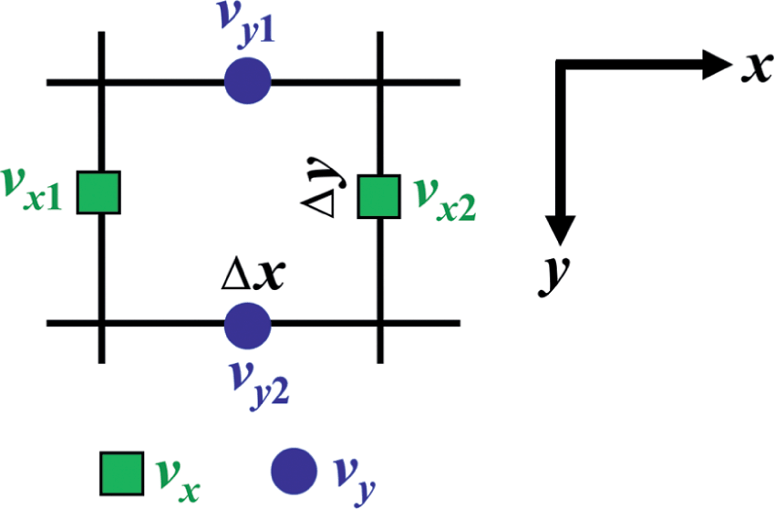

# Langevin Dynamics

Our goal is to sample from a target distribution $p(x) = e^{-f(x)}$. When $V$ is complicated, we cannot sample from $p$ directly.
We are going to heuristically show you that sampling from $p$ is essentially an optimization problem. There will be many gaps in the following derivation. We suggest the reader to read the [paper](https://arxiv.org/pdf/1802.08089) for more details.

## From Sampling to Optimization

In order to sample from $p$, our idea is to start with an optimization problem with the minimizer as $p$. One natural choice of the optimization problem is:

$$
p = \min_{\rho} \text{KL}(\rho \| p) = \int \rho(x) \log \frac{\rho(x)}{p(x)} \, dx
$$

where $\text{KL}(\rho \| p)$ quantifies the discrepancy between distributions $\rho$ and $p$, and it is called the **Kullback-Leibler (KL) divergence**.

As $p = e^{-f(x)}$, the loss function

$$
\begin{aligned}
 F(\rho):=\text{KL}(\rho \| p) & = \mathbb{E}_{\rho}[ \log(\rho/q)]  \\
 &= \int \rho(x) \log \frac{\rho(x)}{p(x)} \, dx \\
 &= \int \rho(x) \left( \log \rho(x) - \log p(x) \right) \, dx \\
 &= \mathbb{E}_{\rho}[f] - H(\rho)
\end{aligned}
$$

where $H(\rho) = - \int \rho(x) \log \rho(x) \, dx$ is the entropy of $\rho$.

So now our problem is how to minimize $F(\rho)$ over the space of distributions which is an infinite-dimensional optimization problem.

To compare to the [finite-dimensional optimization](../chapter_optimization/index.md), we need to find out the analog of the following concepts:

- Compared to $x_{t+1} = x_t - \epsilon \nabla f(x_t)$, how to update $\rho$
- What is the gradient of $F(\rho)$?

In the following sections, we will heuristically build the language for the infinite-dimensional optimization for density.

## Vector Field of Gradient Flow

We will answer the first question: how to update $\rho$? Recall the gradient descent algorithm for finite-dimensional optimization $\min_{x} f(x)$ is given by:

$$
x_{t+1} = x_t - \epsilon g(x_t),
$$

where $g(x) = \nabla f(x)$.

To make an analogy, our idea is to first consider the infinitesimal case with $\epsilon \to 0$, working in the continuous-time domain, and then discretize the continuous-time dynamics to get the discrete-time update.

As $\epsilon \to 0$, the discrete update can be rewritten as a differential equation:

$$
\frac{x_{t+\epsilon} - x_t}{\epsilon} = -g(x_t)
$$

Taking the limit as $\epsilon \to 0$, we get the continuous-time differential equation:

$$
\frac{dx(t)}{dt} = -g(x(t))
$$

This ordinary differential equation (ODE) describes how a finite-dimensional point $x(t)$ moves along the negative gradient direction of $f(x)$. Thus we also call this **gradient flow**. In general, if we have a vector-valued function $v(x)$ defined on any point $x$ in the space (e.g., $v(x) = -g(x)$ for the gradient flow), we call it a **vector field**, namely any point $x$ in the space has a corresponding vector $v(x)$. In general, the vector field can be written as:

$$
\frac{dx(t)}{dt} = v(x(t))
$$

Now we want to consider the infinite-dimensional case. As $\rho$ is a density of $x$, imagine that each $x$ is a particle moving along the vector field $v(x)$, following the differential equation above. We aim to answer the key question: How the density $\rho(x)$ evolves as $\rho(x,t)$ when every of its sample $x(t)$ is moving along the vector field $v(x)$?

## Continuity Equation

Our encourage to build the picture of the evolution of $\rho(x,t)$ as the fluid flow.
We are going to use the **law of mass conservation** to derive the evolution of $\rho(x,t)$.

We consider an infinitesimally small box with volume $\Delta x \Delta y$ in the space. The mass of fluid in the box is $\rho(x,y,t) \Delta x \Delta y$. 

When time evolves from $t$ to $t+\Delta t$, we have the **law of mass conservation**:

> Mass changed in the box = Net mass flowed in the boundary

We are going to compute both sides of the above equation.

$$
\text{Mass changed in the box} =(\rho(x,y,t+\Delta t) - \rho(x,y,t)) \Delta x \Delta y
$$

For the right hand side, recalling that the vector field $v(x,y)$ is a two-dimensional vector $(v_x, v_y)$, without loss of generality, we assume $v$ points to the upper right corner of the box. Namely: the mass flowed in on the left and bottom boundaries, and flowed out on the right and top boundaries, i.e., Net mass flowed in the boundary = Mass flowed in - Mass flowed out.

$$
\begin{align*}
\text{Mass flowed in} = &v_x(x,y) \rho(x,y,t) \Delta y \Delta t\\
& + v_y(x,y) \rho(x,y,t) \Delta x \Delta t \\
\text{Mass flowed out} = &v_x(x+\Delta x,y) \rho(x+\Delta x,y,t) \Delta y \Delta t \\
& + v_y(x,y+\Delta y) \rho(x,y+\Delta y,t) \Delta x \Delta t
\end{align*}
$$

The net increase of mass flowed in the boundary is:

$$
\begin{align*}
 &- \left[\left( v_x(x+\Delta x,y)\rho(x+\Delta x,y,t) -v_x(x,y)\rho(x,y,t)  \right)  \Delta y + \left(v_y(x,y+\Delta y)\rho(x,y+\Delta y,t) - v_y(x,y)\rho(x,y,t) \right) \Delta x \right]\Delta t \\
= &- \left[\frac{\left( v_x(x+\Delta x,y)\rho(x+\Delta x,y,t) -v_x(x,y)\rho(x,y,t)  \right)}{\Delta x} + \frac{\left(v_y(x,y+\Delta y)\rho(x,y+\Delta y,t) - v_y(x,y)\rho(x,y,t) \right)}{\Delta y}\right]\Delta t \Delta x \Delta y
\end{align*}
$$

Now we combine the two sides of the mass conservation equation together:

$$
\frac{\rho(x,y,t+\Delta t) - \rho(x,y,t)}{\Delta t} = - \left[\frac{\left( v_x(x+\Delta x,y) \rho(x+\Delta x,y,t) -v_x(x,y) \rho(x,y,t)  \right)}{\Delta x} + \frac{\left(v_y(x,y+\Delta y) \rho(x,y+\Delta y,t) - v_y(x,y) \rho(x,y,t) \right)}{\Delta y}\right]
$$

Let all the infinitesimal quantities $\Delta x, \Delta y, \Delta t$ go to zero, we get the **continuity equation**:

$$
\frac{\partial \rho(x,y,t)}{\partial t} = - \frac{\partial}{\partial x} \left( v_x(x,y) \rho(x,y,t) \right) - \frac{\partial}{\partial y} \left( v_y(x,y) \rho(x,y,t) \right)
$$

Now we want to simplify the notation above to make math more elegant. We will treat the gradient operator as a vector  $\nabla = (\partial_x, \partial_y)$, then we define the divergence of a vector field $v = (v_x, v_y)$ as

$$
\nabla \cdot v= \partial_x v_x(x,y) + \partial_y v_y(x,y),
$$

where we abuse the inner product notation $a \cdot b = a_1 b_1 + a_2 b_2$ for vectors $a, b \in \mathbb{R}^2$.

Then the above equation can be rewritten as:

$$
\frac{\partial \rho}{\partial t} = - \nabla \cdot (v \rho)
$$

This equation is true for all dimensions.

!!! note "Continuity Equation for Vector Field"
    Given a density $\rho$ and a velocity field $v$, we suppose each particle $x$ moves along the velocity field $v(x)$. Let $\rho(x,t)$ be the density of $x(t)$. Then $\rho(x,t)$ evolves following the continuity equation:
    $$
    \frac{\partial \rho}{\partial t} = - \nabla \cdot (v \rho)
    $$

This answer the first question on how to generalize the gradient descent to the infinite-dimensional case: If we have a descent direction $v$, then the density $\rho$ evolves following the continuity equation.

## Gradient Descent on the Space of Densities

Now we are ready to answer the second question: what is the gradient of $F(\rho)$?

First, we need to specify what do we mean  by the gradient of $F(\rho)$ denoted as $\text{grad}_{\rho}F$. By the continuity equation, we aim to find the right vector field $v$ to minimize $F(\rho)$. Thus $\text{grad}_{\rho}F$ should be a vector field.

Let us first recall the finite-dimensional case. Given a function $f(x)$, how can we ``rediscover'' the concept of gradient? One way is to consider the time derivative of $f(x(t))$ along the trajectory $x(t)$:

$$
\frac{d}{dt} f(x(t)) = \langle \nabla f, \frac{dx}{dt} \rangle
$$

This means if a vector $g$ satisfies 

$$
\langle g, \frac{dx}{dt} \rangle = \frac{d}{dt} f(x(t))
$$

then $g$ is the gradient of $f$.

In the infinite-dimensional case, the inner product is replaced by the integral:

$$
\langle f, g \rangle_{\rho} = \mathbb{E}_{\rho}[fg] = \int f(x) g(x)  \rho(x) \, dx
$$

Therefore, heuristically, the gradient of $F(\rho)$ should satisfy:

$$
\frac{d}{dt} F(\rho) = \left\langle \text{grad}_{\rho}F, \frac{d\rho}{dt} \right\rangle_{\rho} \tag{1}
$$

We now start from the left hand side. Recalling the chain rule for finite-dimensional functions, if we have a function $f(x(t))$ for a vector $x(t)$, then the time derivative of $f$ is given by:

$$
\frac{d}{dt} f(x(t)) = \left\langle \nabla f(x), \frac{dx}{dt} \right\rangle
$$

The chain rule for the infinite-dimensional  $\rho$ changes the inner product to integration:

$$
\frac{d}{dt} F(\rho) = \int \frac{\delta F}{\delta \rho} \frac{d\rho}{dt} \, dx
$$

where $\frac{\delta F}{\delta \rho}$ is the functional derivative of $F$ with respect to $\rho$. Plugging in the continuity equation
$\frac{d\rho}{dt} = - \nabla \cdot (v \rho)
$ to the above equation, we get:

$$
\begin{align*}
\frac{d}{dt} F(\rho) &= \int \frac{\delta F}{\delta \rho} \frac{d\rho}{dt} \, dx\\
&= \int \frac{\delta F}{\delta \rho} \left( - \nabla \cdot (v \rho) \right) \, dx \\
&=  \int \left( \nabla  \frac{\delta F}{\delta \rho} \right) v \rho  \, dx\\
&= \left\langle \nabla \frac{\delta F}{\delta \rho}, v \right\rangle_{\rho}, \tag{2}
\end{align*} 
$$
where we apply the integration by parts in the third line:

$$
\int f \nabla g \, dx = - \int \nabla f \cdot g \, dx + f g |_{-\infty}^{\infty} = - \int \nabla f \cdot g \, dx
$$
if $f, g$ vanish at the infinity. (Note that we abuse a lot of notations here. Please see the [paper](https://arxiv.org/pdf/1802.08089) for rigorous derivation.)

Therefore, by comparing (1) and (2), we have:

$$
\text{grad}_{\rho}F = \nabla \frac{\delta F}{\delta \rho}
$$

We are going to practice our infinite-dimensional calculus now. Let us start with the simplest case of linear functional, i.e., $L(\rho) = \int f(x) \rho(x) \, dx$. Then 

$$
\frac{\delta L }{\delta \rho} = f \text{ and }\text{grad}_{\rho} L = \nabla \frac{\delta L}{\delta \rho} = \nabla f
$$

Now let us try a more complicated case of  entropy functional, $H(\rho) = - \int \rho \log \rho \, dx$. 

$$
\frac{\delta H }{\delta \rho} = \log \rho + 1 \text{ and }\text{grad}_{\rho} H = \nabla \frac{\delta H}{\delta \rho} = \nabla (\log \rho + 1) = \frac{\nabla \rho}{\rho}
$$

Therefore, the gradient of our functional loss
$F(\rho) = \int f(x) \rho(x) \, dx - H(\rho)$ is given by:

$$
\text{grad}_{\rho}F = \nabla \frac{\delta F}{\delta \rho} = \nabla f + \frac{\nabla \rho}{\rho}
$$

Thus we have answered the second question on the analog of the gradient  for the infinite-dimensional  loss function $F(\rho)$.

Plugging in the gradient $\text{grad}_{\rho}F$ as the vector field $v$ into the continuity equation, we get the **Fokker-Planck equation**:

$$
\begin{align*}
\frac{\partial \rho}{\partial t} &= - \nabla \cdot (\rho \cdot \text{grad}_{\rho}F  ) \\
&= - \nabla \cdot \left( \rho \cdot \left( \nabla f + \frac{\nabla \rho}{\rho} \right) \right)\\
& = - \nabla \cdot( \rho \nabla f) + \Delta \rho \tag{3}
\end{align*}
$$
where the last equation is due to $\nabla \cdot \nabla = \Delta$, where $\Delta$ is the Laplacian operator $\Delta f =  \sum_{i=1}^d \frac{\partial^2 f}{\partial x_i^2}$.

Therefore, we have the following "gradient algorithm" for our loss function $F(\rho)$:

!!! note "Fokker-Planck Equation for Gradient Flow"
    Let $p = e^{-f}$ be the target distribution. The gradient algorithm for $\min_\rho \text{KL}(\rho \| p)$ is equivalent to the Fokker-Planck equation:
    $$
    \frac{\partial \rho}{\partial t} = - \nabla \cdot( \rho \nabla f) + \Delta \rho
    $$

Mathematicians will be angry about our derivation above. Our derivation above is totally heuristic though we get the correct answer. However, we will defend ourself by the following quote:

!!! quote "An anonymous bad statistician:"
    A bad statistician makes odd number of mistakes. A good statistician makes even number of mistakes.

## Sampling from the Fokker-Planck Equation

You might have forgotten why we are here. Let me remind you: we want to sample from the target distribution $p = e^{-f}$ by solving the optimization problem $\min_\rho \text{KL}(\rho \| p)$. Our verbose derivation above is to show that the gradient descent analogy solving this problem is equivalent to the evolution of the density $\rho$ following the Fokker-Planck equation.

But how could we use the Fokker-Planck equation to sample from $p$? Recalling the continuity equation, the evolution of $\rho$ following the continuity equation $\frac{\partial \rho}{\partial t} = - \nabla \cdot( \rho v)$ is equivalent to the movement of particles following the vector field $v$.

That means if the density $\rho$ evolves following

$$
\frac{\partial \rho}{\partial t} = - \nabla \cdot( \rho \nabla f),
$$

then the movement of particles $x(t)$ will follow the vector field  $- \nabla f(x)$, namely 

$$
x_{t+1} = x_t - \epsilon \nabla f(x_t).
$$

This is exactly the gradient descent algorithm.

However, the Fokker-Planck equation in (3) has two terms on the right hand side:  $- \nabla \cdot( \rho \nabla f)$ which gives the gradient descent, and $\Delta \rho$ which we will discuss now.

As the continuity equation considers the first term, we now consider the equation with only the Laplacian term on the right hand side:

$$
\frac{\partial \rho}{\partial t} =  \Delta \rho
$$

This is the famous **heat equation** which you can check that the Gaussian distribution below is the solution:

$$
\rho(x,t) = \frac{1}{(4\pi t)^{d/2}} e^{-\frac{|x|^2}{4t}}, \text{ i.e.,} x \sim \mathcal{N}(0,2t)
$$

In fact, the solution of the heat equation cannot be unique without the  initial condition at time $t=0$, i.e., $\rho(x,0)$. We have the following heat equation solution:

!!! note "Heat Equation Solution"
    The solution of the heat equation
    $$
    \frac{\partial \rho}{\partial t} =  \Delta \rho, \quad \rho(x,0) = \rho_0(x)
    $$
    is given by the density of adding $X_0 \sim \rho_0$ with Gaussian noise:
    $$
    X_t = X_0 + \sqrt{2t} \xi, \quad \xi \sim \mathcal{N}(0,I).
    $$
    Namely, the solution $\rho(x,t)$ as the density of $X_t$ is the convolution of the initial density $\rho_0$ with the Gaussian distribution:
    $$
    \rho(x,t) = \int \rho_0(y) \frac{1}{(4\pi t)^{d/2}} e^{-\frac{|x-y|^2}{4t}} \, dy.
    $$

You can check that the solution of the heat equation by plugging in the solution into the heat equation.

Now we have the good intuition on the two terms in the Fokker-Planck equation (3). The first term $- \nabla \cdot( \rho \nabla f)$ gives the gradient descent, and the second term $\Delta \rho$ add the Gaussian noise. Therefore, we can sample from the target distribution $p$ by translating the Fokker-Planck equation to the particle movement:

!!! note "Langevin Dynamics"
    The Fokker-Planck equation 
    $$
    \frac{\partial \rho}{\partial t} =  - \nabla \cdot( \rho \nabla f) + \Delta \rho
    $$
    is equivalent to the Langevin dynamics:
    $$
    \frac{dX_t}{dt} = - \nabla f(X_t) + \sqrt{2} \xi_t, \quad \xi_t \sim \mathcal{N}(0,I)
    $$

