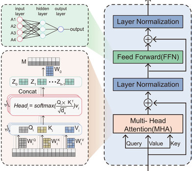
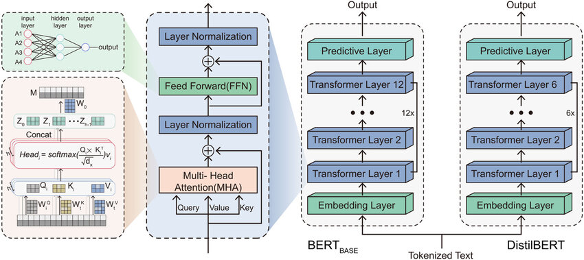
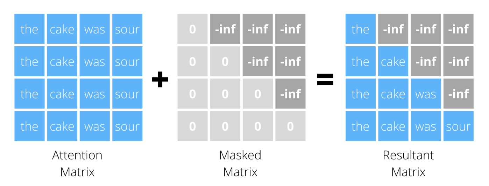
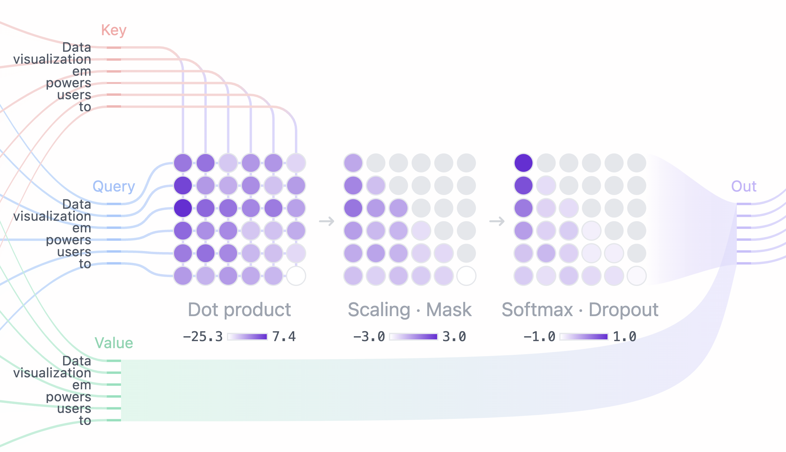
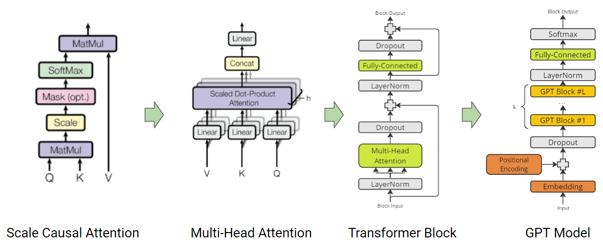
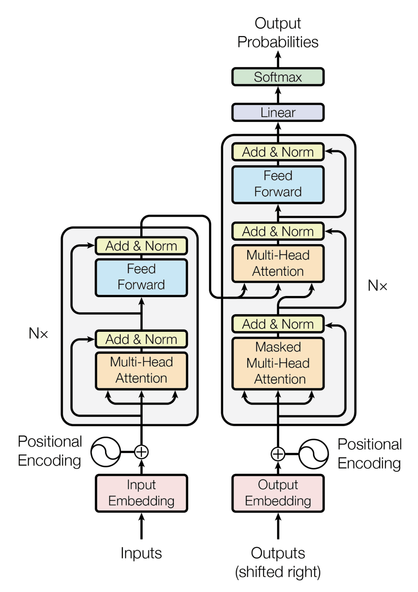

# Transformer

The Transformer is a neural network architecture that is used for natural language processing tasks. It was introduced in the paper [Attention is All You Need](https://arxiv.org/abs/1706.03762) based on the [attention mechanism](./attention.md). We will first introduce the architecture of the Transformer and then the training process.

## Transformer block

The Transformer block is the main building block of the Transformer.

Let $X \in \mathbb{R}^{n \times d}$ be the input matrix, where $n$ is the sequence length and $d$ is the embedding dimension. The Transformer block consists of the following ope`rations:

- **Multi-Head Attention**:

$$
\text{Attention}(Q, K, V) = \text{softmax}\left(\frac{QK^T}{\sqrt{d_k}}\right)V
$$

For multi-head attention with $h$ heads:

$$
\text{MultiHead}(X) = \text{Concat}(\text{head}_1, \text{head}_2, \ldots, \text{head}_h)W^O
$$

where each head is:

$$
\text{head}_i = \text{Attention}(XW_i^Q, XW_i^K, XW_i^V)
$$

- **Residual Connection and Layer Normalization** (Add & Norm):

$$
X' = \text{LayerNorm}(X + \text{MultiHead}(X))
$$

where the layer normalization is similar to the [batch normalization](../chapter_neural_networks/regularization.md#batch-normalization) but instead of computing the mean and variance over the batch, we compute them over the embedding dimension. In PyTorch, you can use `torch.nn.LayerNorm` to implement the layer normalization.

- **Feed-Forward Network** (FFN):

$$
\text{FFN}(X') = \text{ReLU}(X'W_1 + b_1)W_2 + b_2
$$

- **Second Residual Connection and Layer Normalization** (Add & Norm):

$$
\text{Output} = \text{LayerNorm}(X' + \text{FFN}(X'))
$$



Using PyTorch `torch.nn.MultiheadAttention`, we can implement the Transformer block as follows:

```python
import torch.nn as nn

import torch
import torch.nn as nn
import torch.nn.functional as F

class TransformerBlock(nn.Module):
    def __init__(self, embed_dim, num_heads, ff_hidden_dim):
        """
        Args:
            embed_dim (int): Dimensionality of the input embeddings.
            num_heads (int): Number of attention heads.
            ff_hidden_dim (int): Hidden layer dimensionality in the feed-forward network.
        """
        super(TransformerBlock, self).__init__()
        
        # Multi-head attention layer. We use batch_first=True so that input shape is (batch_size, sequence_length, embed_dim).
        self.mha = nn.MultiheadAttention(embed_dim=embed_dim, 
                                         num_heads=num_heads,
                                         batch_first=True)
        
        # First layer normalization applied after the multi-head attention residual addition.
        self.attention_norm = nn.LayerNorm(embed_dim)
        
        # Feed-forward network: two linear layers with ReLU activation.
        self.ffn = nn.Sequential(
            nn.Linear(embed_dim, ff_hidden_dim),
            nn.ReLU(),
            nn.Linear(ff_hidden_dim, embed_dim)
        )
        
        # Second layer normalization after the feed-forward residual addition.
        self.ffn_norm = nn.LayerNorm(embed_dim)


    def forward(self, x, attn_mask=None, key_padding_mask=None):
        # Apply Multi-Head Attention (self-attention) where Q = K = V = x.
        # attn_output shape: (batch_size, sequence_length, embed_dim)
        attn_output = self.mha(x, x, x, need_weights=False) # need_weights=False to avoid computing the attention weights
        
        # First residual connection and layer normalization.
        # X' = LayerNorm(x + attn_output)
        x = self.attention_norm(x + attn_output)
        # Feed-Forward Network (FFN)
        ffn_output = self.ffn(x)
        # Second residual connection and layer normalization.
        # Output = LayerNorm(x + ffn_output)
        output = self.ffn_norm(x + ffn_output)
        return output
```


## Transformer encoder

The Transformer encoder is a stack of multiple Transformer blocks and connect to a final fully connected layer for classification output.

Using the `TransformerBlock` we defined above, we can build the encoder as follows:

```python
class TransformerEncoder(nn.Module):
    def __init__(self, embed_dim, num_heads, ff_hidden_dim, num_layers):
        super(TransformerEncoder, self).__init__()
        self.blocks = nn.ModuleList([TransformerBlock(embed_dim, num_heads, ff_hidden_dim) for _ in range(num_layers)])

    def forward(self, x, attn_mask=None, key_padding_mask=None):
        for block in self.blocks:
            x = block(x, attn_mask, key_padding_mask)
        return x
```

| Model | Layers | Hidden Size | Attention Heads | Feedforward Size | Parameters |
|-------|--------|-------------|-----------------|------------------|------------|
| [BERT-Base](https://huggingface.co/bert-base-uncased) | 12 | 768 | 12 | 3072 | 110M |
| [BERT-Large](https://huggingface.co/bert-large-uncased) | 24 | 1024 | 16 | 4096 | 340M |
| [DistilBERT](https://huggingface.co/distilbert-base-uncased) | 6 | 768 | 12 | 3072 | 66M |





## Transformer decoder

The Transformer decoder is similar to the encoder but with a key difference: it uses masked self-attention in its first sublayer. This masking prevents the decoder from attending to future positions during training, which is essential for autoregressive generation.


### Masked Self-Attention

In the decoder's masked self-attention, we modify the attention mechanism to ensure that the prediction for position $i$ can only depend on known outputs at positions less than $i$. This is achieved by masking future positions in the attention weights:

$$
\text{MaskedAttention}(Q, K, V) = \text{softmax}\left(\frac{QK^T + M}{\sqrt{d_k}}\right)V
$$

where $M$ is a mask matrix with:

$$
M_{ij} = 
\begin{cases} 
0 & \text{if } i \geq j \\
-\infty & \text{if } i < j 
\end{cases}
$$



When we apply softmax to a row containing $-\infty$ values, those positions effectively receive $0$ attention weight, preventing information flow from future tokens.



The Transformer decoder stacks multiple masked self-attention layers. Modern generative language models like GPT-2 and GPT-3 use the **decoder-only** architecture with a stack of masked self-attention layers followed by a feed-forward network.



GPT-2 is so far the last open-sourced model from OpenAI. It has 124M, 355M, and 774M parameters for small, medium, and large models, respectively.

| Model | Layers | Hidden Size | Attention Heads | Feedforward Size | Parameters |
|-------|--------|-------------|-----------------|------------------|------------|
| [GPT-2 Small](https://huggingface.co/gpt2) | 12 | 768 | 12 | 3072 | 124M |
| [GPT-2 Medium](https://huggingface.co/gpt2-medium) | 24 | 1024 | 16 | 4096 | 355M |
| [GPT-2 Large](https://huggingface.co/gpt2-large) | 36 | 1280 | 20 | 5120 | 774M |

## Encoder-Decoder Transformer

The encoder-decoder transformer is a variant of the Transformer that uses both encoder and decoder blocks. It is used for sequence-to-sequence tasks such as translation and summarization.




### Choosing Transformer Architecture

We list below the best use cases for each type of transformer architecture.

**Encoder-Only Models**

- **Best for**: Understanding and analyzing input text (classification, entity recognition, sentiment analysis)
- **Examples**: [BERT](https://huggingface.co/bert-base-uncased), [RoBERTa](https://huggingface.co/roberta-base), [DistilBERT](https://huggingface.co/distilbert-base-uncased)
- **Characteristics**: Bidirectional attention (can see full context in both directions)
- **Use when**: Your task requires deep understanding of input text without generating new text

**Decoder-Only Models**

- **Best for**: Text generation tasks (completion, creative writing, chat)
- **Examples**: [GPT-2](https://huggingface.co/gpt2)
- **Characteristics**: Autoregressive generation with masked self-attention
- **Use when**: Your primary goal is to generate coherent, contextually relevant text

**Encoder-Decoder Models**

- **Best for**: Sequence-to-sequence tasks (translation, summarization)
- **Examples**: [T5](https://huggingface.co/t5-small), [BART](https://huggingface.co/facebook/bart-large-cnn), [Pegasus](https://huggingface.co/google/pegasus-large)
- **Characteristics**: Encoder processes input, decoder generates output based on encoder representations
- **Use when**: Your task involves transforming one sequence into another related sequence


## Transformer in PyTorch

PyTorch provides a `torch.nn.Transformer` module that implements the Transformer architecture. We will use this module to implement the encoder and decoder of the Transformer.

```python
import torch.nn as nn
import torch
# Transformer encoder
encoder_layer = nn.TransformerEncoderLayer(d_model=512, nhead=8)
encoder = nn.TransformerEncoder(encoder_layer, num_layers=6)
src = torch.rand(10, 32, 512)
out = encoder(src)

# Transformer decoder
decoder_layer = nn.TransformerDecoderLayer(d_model=512, nhead=8)
decoder = nn.TransformerDecoder(decoder_layer, num_layers=6)

tgt = torch.rand(10, 32, 512)
memory = torch.rand(10, 32, 512) # the output of the last layer of the encoder
out = decoder(tgt, memory)

# Transformer encoder-decoder
encoder_decoder = nn.Transformer(encoder, decoder)
src = torch.rand(10, 32, 512)
tgt = torch.rand(10, 32, 512)
out = encoder_decoder(src, tgt)
```


