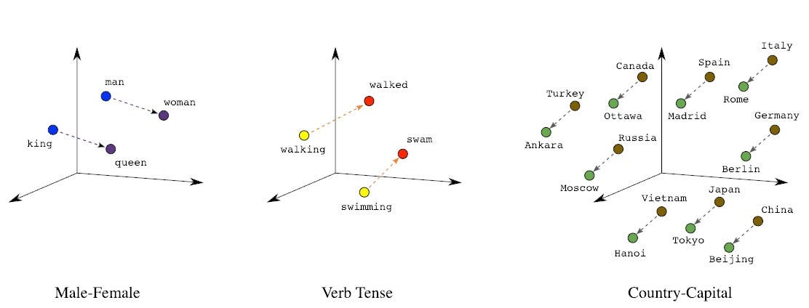
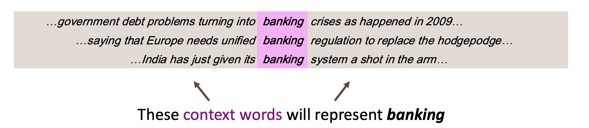
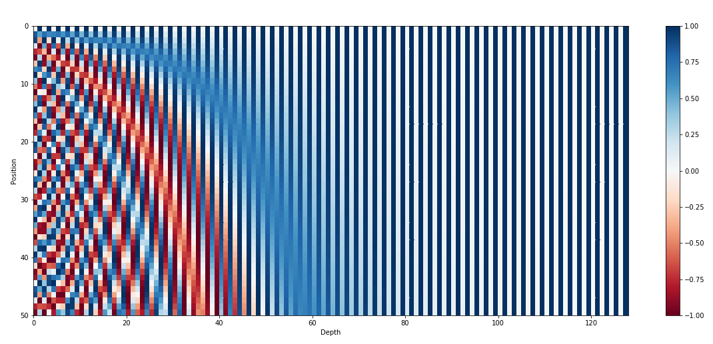

# Word Vectors

Word vectors, also known as word embeddings, are dense vector representations of words. As computer programs can only understand numbers, we need to convert the words into numbers. 

The simplest way to represent words as vectors is to use **one-hot vectors** (means one 1, the rest 0s):

$$
\begin{align*}
\text{motel} = [0 0 0 0 0 0 0 0 0 0 1 0 0 0 0] \\
\text{hotel} = [0 0 0 0 0 0 0 1 0 0 0 0 0 0 0]
\end{align*}
$$

If there are $N$ words in the vocabulary, the one-hot vector has $N$ dimensions, and each word is represented by a one-hot vector with a single 1.

However, the one-hot vector does not capture the semantic meaning of the words. 

We expect word embeddings capture the semantic relationships between words by encoding their meanings in a lower-dimensional space. This approach allows mathematical operations on words that reflect their semantic relationships - for example, "king" - "man" + "woman" ≈ "queen". 



There are many methods to learn the word embeddings, such as [GloVe](https://nlp.stanford.edu/projects/glove/) and [Word2Vec](https://code.google.com/archive/p/word2vec/). In this course, we will not discuss in detail  how these methods to learn the word embeddings. The high level idea of these methods is to use the co-occurrence of words to learn the word embeddings. The intuition is that the meaning of a word is given by the words that frequently appear close-by.





In modern language models, the word embeddings are learned along with the model parameters. We will show a simple example of how to learn the word embeddings using PyTorch below and discuss how embeddings are trained in the language models in the next lecture.

**PyTorch Implementation**

In PyTorch, we can use the `nn.Embedding` layer to learn the word embeddings.

```python
import torch
import torch.nn as nn

# The vocabulary size is 10 and the embedding dimension is 3.
embedding = nn.Embedding(num_embeddings=10, embedding_dim=3)
```

The trainable parameters are the word embeddings, which have the shape of `[num_embeddings, embedding_dim]`.

The input to the `nn.Embedding` layer is the index of the word in the vocabulary. The output is the word embedding of the word.

```python
input = torch.tensor([1, 2, 3, 4, 5])
output = embedding(input)
print(output) # output shape: [5, 3]
```

You can then train your embeddings by connecting the `nn.Embedding` layer to the model. For example, we train a linear model of the word embeddings to predict the next word in the sentence.

```python
model = nn.Sequential(
    nn.Embedding(num_embeddings=10, embedding_dim=3),
    nn.Linear(3, 10)
)
```


## Tokenization

In natural language processing, the most basic unit is the **token** instead of the word. A token is the smallest unit of text that has a meaning.  These tokens can be words, characters, or subwords.


Different tokenization approaches serve different purposes:

- **Word-level tokenization**: Splits text by spaces and punctuation
  ```
  "I love NLP!" → ["I", "love", "NLP", "!"]
  ```

- **Character-level tokenization**: Splits text into individual characters
  ```
  "Hello" → ["H", "e", "l", "l", "o"]
  ```

- **Subword tokenization**: In modern NLP, we often break words into meaningful subunits
  ```
  "unhappiness" → ["un", "happy", "ness"]
  ```

- Special tokens: We sometimes need to add some special tokens to the vocabulary to help the model understand the text.
  - `[UNK]`: Unknown token
  - `[PAD]`: Padding token
  - `[CLS]`: Classification token
  - `[SEP]`: Separator token
  - `[MASK]`: Mask token


Sometimes, for non-text data, we also need to tokenize the data. 

- Audio: Tokenize the audio into frames
- Image: Tokenize the image into patches
- DNA: Tokenize the DNA sequence into nucleotides 'A', 'T', 'C', 'G'
- Protein: Tokenize the protein sequence into amino acids 

We can represent each token by a vector in $\mathbb{R}^d$. Then, a text can be represented as a sequence of token vectors, i.e., the matrix $X = [x_1, x_2, \cdots, x_n] \in \mathbb{R}^{n \times d}$.


### Tokenization in Hugging Face Transformers

Hugging Face [Transformers](https://huggingface.co/docs/transformers/index) provides a unified interface for tokenization, model loading, and training. We will start with how to convert text into tokens using Transformers. Please refer to the [lecture on Hugging Face](hg_transformers.md) for more details.

Transformers provides a `AutoTokenizer` class that can be used to convert text into tokens ids using the `tokenize` method. For different models, the tokenizer is different. You can choose the tokenizer method from the `AutoTokenizer.from_pretrained(name)` class, where `name` is the name of the model choosing from the [model hub](https://huggingface.co/models).

```python
from transformers import AutoTokenizer
model_name = "bert-base-uncased"
tokenizer = AutoTokenizer.from_pretrained(model_name)
text = "Hello, how are you?"
# Get tokens as strings
tokens = tokenizer.tokenize(text)
# ['Hello', ',', 'how', 'are', 'you', '?']

inputs = tokenizer(text, return_tensors='pt') # return_tensors='pt' returns a PyTorch tensor
```

The `inputs` is a dictionary with the keys `input_ids` and `attention_mask`.

- `input_ids`: The token ids of the input text.
- `attention_mask`: The attention mask of the input text.


After tokenizing text, we often need to convert tokens into embeddings that capture semantic meaning. We show the code for getting token embeddings from BERT model using the `AutoModel` class. The tokenization embedding input has the shape of `[batch_size, seq_length, embedding_dim]`.

```python
import torch
from transformers import BertTokenizer, BertModel

# Initialize the pretrained BERT model and tokenizer.
model_name = 'bert-base-uncased'
tokenizer = BertTokenizer.from_pretrained(model_name)
model = BertModel.from_pretrained(model_name)
# Example input sentence.
input_text = "Hello, how are you?"
# Convert text to input IDs.
inputs = tokenizer(input_text, return_tensors="pt")
# Get input_ids tensor (shape: [batch_size, seq_length])
input_ids = inputs["input_ids"]
word_embeddings = model.get_input_embeddings()(input_ids) # [batch_size, seq_length, embedding_dim]
```

## Position Embeddings

In language models, position embeddings are crucial because the [self-attention mechanism](attention.md) is inherently permutation-invariant. Without position information, the model would treat tokens the same regardless of their position in the sequence.

In order to inject position information, we can use position embeddings. The original transformer paper introduced sinusoidal position embeddings:

$$
P_{(j, 2i)} = \sin\left(\frac{j}{10000^{2i/d}}\right),
P_{(j, 2i+1)} = \cos\left(\frac{j}{10000^{2i/d}}\right)
$$

where
- $j$ is the position of the token in the sequence
- $i$ is the dimension index
- $d$ is the embedding dimension




From the plot above, we can see that the position embeddings use the binary period to encode the absolute position information and the sinusoidal function to encode the relative position information. We skip the rationale why we design the position embeddings in this way. You can refer to the detailed tutorial [here](https://huggingface.co/blog/designing-positional-encoding). Also you can use other types of position embeddings, such as [Rotary Position Embedding (RoPE)](https://arxiv.org/abs/2104.09864).

In the language models, we usually use the input by adding the token embeddings and the position embeddings 

$$
\text{Model Input} = X+P
$$


**PyTorch Implementation**

Here's how to implement both sinusoidal and learned position embeddings:

```python
class PositionalEncoding(nn.Module):
    def __init__(self, num_hiddens, dropout, max_len=1000):
        super(PositionalEncoding, self).__init__()
        self.P = torch.zeros((1, max_len, num_hiddens))
        X = torch.arange(max_len, dtype=torch.float32).reshape(
            -1, 1) / torch.pow(10000, torch.arange(
            0, num_hiddens, 2, dtype=torch.float32) / num_hiddens)
        self.P[:, :, 0::2] = torch.sin(X)
        self.P[:, :, 1::2] = torch.cos(X)

    def forward(self, X):
        X = X + self.P[:, :X.shape[1], :].to(X.device)
        return X
```

In practice, we sometimes even directly take the positional embeddings as learnable parameters and train them together with the model parameters. See the example below.

```python
class InputEmbeddings(nn.Module):
    def __init__(self, d_model: int, vocab_size: int):
        super().__init__()
        self.tok_emb = nn.Embedding(vocab_size, d_model)
        self.pos_emb = nn.Parameter(torch.zeros(1, block_size, d_model))

    def forward(self, x):
        tok_emb = self.tok_emb(x)
        pos_emb = self.pos_emb(x)
        return tok_emb + pos_emb
```

Many language models in Hugging Face use the approach above. We can directly get the position embeddings from the `AutoModel` class.

```python
from transformers import AutoTokenizer, AutoModel
name = "distilbert/distilbert-base-cased"
tokenizer = AutoTokenizer.from_pretrained(name)
model = AutoModel.from_pretrained(name)

text = "Hello, how are you?"
# Get input IDs from your tokenized input
inputs = tokenizer(text, return_tensors='pt')
input_ids = inputs["input_ids"]
position_ids = torch.arange(0, input_ids.size(1)).unsqueeze(0)
position_embeddings = model.distilbert.embeddings.position_embeddings
position_embeddings_output = position_embeddings(position_ids)
print(position_embeddings_output.shape) # [batch_size, seq_length, embedding_dim]
word_embeddings = model.get_input_embeddings()(input_ids) 
input_embeddings = word_embeddings + position_embeddings_output # Model_Input = X + P
```


