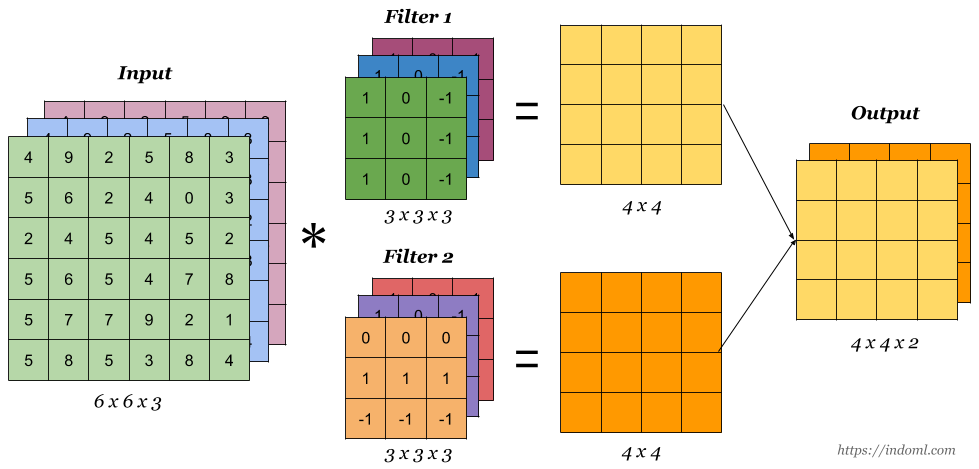
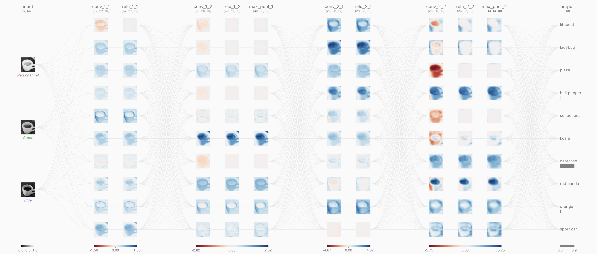

# Convolutional Neural Networks


Convolutional Neural Networks (CNNs) are a specialized type of neural network designed for processing structured grid data such as images. Unlike fully connected networks where each neuron is connected to all neurons in the previous layer, CNNs use a mathematical operation called convolution that applies localized filters to the input data.

The key intuition behind CNNs is to exploit spatial locality - nearby pixels in images tend to be related. By using convolutional filters that operate on local regions of the input, CNNs can efficiently identify local patterns like edges, textures, and shapes that are important for tasks like image recognition.

## The Convolution Operation

Given an input image $\mathbf{I}$ and a kernel (filter) $\mathbf{K}$, the 2D convolution operation is defined as:

$$
(\mathbf{I} * \mathbf{K})(i,j) = \sum_{m} \sum_{n} \mathbf{I}(i+m, j+n) \mathbf{K}(m,n)
$$

This operation slides the kernel $\mathbf{K}$ over the input image $\mathbf{I}$, performing element-wise multiplication at each location and summing the results to produce a single output value at each position.

### Padding and Stride

The convolution operation has two important hyperparameters:

- **Padding**: Adding zeros around the input to control the spatial dimensions of the output. If we have a $n \times n$ image and a $k \times k$ kernel:
  - Without padding: Output size is $(n - k + 1) \times (n - k + 1)$
  - With padding $p$: Output size is $(n + 2p - k + 1) \times (n + 2p - k + 1)$

- **Stride**: The step size for moving the kernel. With a stride of $s$, the output size becomes:
  - $\lfloor (n + 2p - k) / s + 1 \rfloor \times \lfloor (n + 2p - k) / s + 1 \rfloor$

You can compute the output size with the following formula:

$$
\text{Output Size} =  \frac{\text{Input Size} - \text{Kernel Size} + 2 \times \text{padding}}{\text{stride}} + 1 
$$


Below is an example of a 2D convolution operation with `kernel_size=3`, `stride=1`, and `padding=1`.


  
In PyTorch, we can use the `nn.Conv2d` layer to perform the 2D convolution operation.

```python
conv = nn.Conv2d(in_channels, out_channels, kernel_size, stride, padding)
```



Here are the tips for choosing the hyperparameters of the convolution operation:


- **Kernel size**: Choose odd numbers like 3, 5, 7, ... because they have a center pixel and we can pad the same amount on both sides.
- **Stride**: Set stride to 1 to preserve the spatial dimensions of the input. If you want to reduce the spatial dimensions of the input by $1/N$ times, you can set stride to $N$.
- **Padding**: Choose $(\text{kernel size} - 1) / 2$ as the padding amount with `stride=1` will keep the spatial dimensions of the input unchanged.


## Pooling Operations

Pooling layers reduce the spatial dimensions of the feature maps, providing:

1. Computational efficiency
2. Some degree of translation invariance
3. Control over overfitting

There are two types of pooling operations:

- Max pooling: takes the maximum value within a local region
- Average pooling: takes the average value within a local region


In PyTorch, we can use the `nn.MaxPool2d` layer to perform the max pooling operation. Below is an example of a max pooling operation with `kernel_size=2`, `stride=2`.

```python
pool1 = nn.MaxPool2d(kernel_size, stride)
pool2 = nn.AvgPool2d(kernel_size, stride)
```


Similarly, we can use the `nn.AvgPool2d` layer to perform the average pooling operation.

## CNN Architectures

The typical CNN architecture consists of:

1. **First Convolutional layer**: Extract local patterns and reduce spatial dimensions to the proper size if the input image is too large
2. **Activation functions** (typically ReLU): Add non-linearity
3. **A Convolutional Block**: May have multiple convolutional layers keeping the spatial dimensions unchanged connected by activation functions
4. **Pooling layers**: Reduce spatial dimensions typically by half
5. **Repeat the above steps**: Have multiple convolutional blocks to make the model deeper
6. **Flatten layer**: Flatten the output of the last convolutional block to a 1D vector
7. **Fully connected layers**: Final classification/regression

We illustrate the [VGG16 architecture](https://pytorch.org/vision/main/models/vgg.html) with the following diagram:


## PyTorch for CNNs

PyTorch provides a convenient API for building CNNs using the `torch.nn` module. The basic building blocks include:

- `nn.Conv2d(in_channels, out_channels, kernel_size, stride, padding)`: 2D convolutional layer
- `nn.MaxPool2d(kernel_size, stride)`: Max pooling layer
- `nn.AvgPool2d(kernel_size, stride)`: Average pooling layer
- `nn.ReLU()`: ReLU activation function
- `nn.Flatten()`: Flatten layer to convert the output of the last convolutional block to a 1D vector
- `nn.Linear(in_features, out_features)`: Linear layer to perform the final classification/regression

**Simple CNN with Sequential API**

```python
import torch
import torch.nn as nn

# Define a simple CNN for MNIST (28x28 grayscale images)
input_channels, output_size = 1, 10
model = nn.Sequential(
    # First convolutional block
    nn.Conv2d(in_channels=input_channels, out_channels=16, kernel_size=3, padding=1),
    nn.ReLU(),
    nn.MaxPool2d(kernel_size=2, stride=2),  # Output: 16x14x14
    
    # Second convolutional block
    nn.Conv2d(in_channels=16, out_channels=32, kernel_size=3, padding=1),
    nn.ReLU(),
    nn.MaxPool2d(kernel_size=2, stride=2),  # Output: 32x7x7
    
    # Flatten and fully connected layers
    nn.Flatten(),  # Output: 32*7*7 = 1568
    nn.Linear(32*7*7, 128),
    nn.ReLU(),
    nn.Linear(128, output_size)
)
```

**Custom CNN using nn.Module**

We will define a TinyVGG model with the following architecture:



Here is an [interactive website](https://poloclub.github.io/cnn-explainer/) of the TinyVGG model and training.


```python
import torch
import torch.nn as nn
import torch.nn.functional as F

class TinyVGG(nn.Module):
    def __init__(self, input_channels=3, hidden_units=10, num_classes=10):
        super().__init__()
        
        # First convolutional block
        self.conv_block_1 = nn.Sequential(
            nn.Conv2d(in_channels=input_channels, 
                      out_channels=hidden_units, 
                      kernel_size=3, 
                      padding=1),
            nn.ReLU(),
            nn.Conv2d(in_channels=hidden_units, 
                      out_channels=hidden_units,
                      kernel_size=3,
                      padding=1),
            nn.ReLU(),
            nn.MaxPool2d(kernel_size=2,
                         stride=2)
        )
        
        # Second convolutional block
        self.conv_block_2 = nn.Sequential(
            nn.Conv2d(in_channels=hidden_units, 
                      out_channels=hidden_units*2, 
                      kernel_size=3, 
                      padding=1),
            nn.ReLU(),
            nn.Conv2d(in_channels=hidden_units*2, 
                      out_channels=hidden_units*2,
                      kernel_size=3,
                      padding=1),
            nn.ReLU(),
            nn.MaxPool2d(kernel_size=2,
                         stride=2)
        )
        
        # Classifier
        self.classifier = nn.Sequential(
            nn.Flatten(),
            # Note: The actual input size will depend on the input image dimensions
            # For a 32x32 input image, after two 2x2 max pooling layers, the feature map size is 8x8
            nn.Linear(in_features=hidden_units*2*8*8, 
                      out_features=num_classes)
        )
    
    def forward(self, x):
        x = self.conv_block_1(x)
        x = self.conv_block_2(x)
        x = self.classifier(x)
        return x

# Example usage
model = TinyVGG(input_channels=3, hidden_units=64, num_classes=10)
x = torch.randn(32, 3, 32, 32)  # 32 batch size, 3 color channels, 32x32 images
output = model(x)
print(output.shape)  # torch.Size([32, 10])

```

**Deeper CNN Architecture**

You can define a deeper CNN architecture by first define a convolutional block and then repeating the convolutional block and the classifier.

```python
import torch
import torch.nn as nn
import torch.nn.functional as F

class ConvBlock(nn.Module):
    def __init__(self, in_channels, out_channels, kernel_size=3, stride=1, padding=1):
        super().__init__()
        self.conv = nn.Conv2d(in_channels, out_channels, kernel_size=kernel_size, 
                              stride=stride, padding=padding)
        self.bn = nn.BatchNorm2d(out_channels)
        
    def forward(self, x):
        x = self.conv(x)
        x = self.bn(x)
        x = F.relu(x)
        return x

class DeepCNN(nn.Module):
    def __init__(self, input_channels, hidden_channels, output_size):
        super().__init__()
        
        # First block: two convolutions followed by pooling
        self.block1 = nn.Sequential(
            ConvBlock(input_channels, hidden_channels),
            ConvBlock(hidden_channels, hidden_channels),
            nn.MaxPool2d(kernel_size=2, stride=2)
        )
        
        # Second block: two convolutions followed by pooling
        self.block2 = nn.Sequential(
            ConvBlock(hidden_channels, hidden_channels*2),
            ConvBlock(hidden_channels*2, hidden_channels*2),
            nn.MaxPool2d(kernel_size=2, stride=2)
        )
        
        # Global average pooling and classifier
        self.global_pool = nn.AdaptiveAvgPool2d(1)
        self.classifier = nn.Linear(hidden_channels*2, output_size)
        
    def forward(self, x):
        x = self.block1(x)
        x = self.block2(x)
        x = self.global_pool(x)
        x = torch.flatten(x, 1)
        x = self.classifier(x)
        return x

# Initialize the model
input_channels, hidden_channels, output_size = 3, 64, 10
model = DeepCNN(input_channels, hidden_channels, output_size)
```
