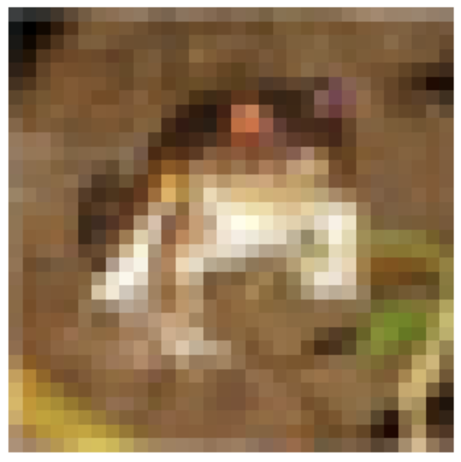
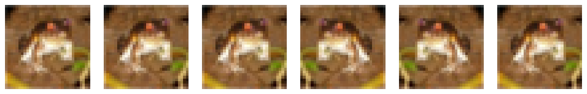
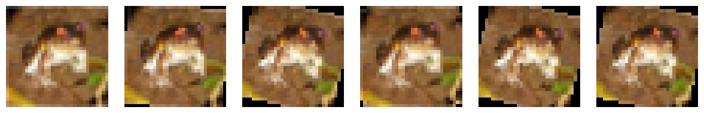
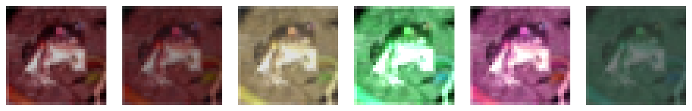
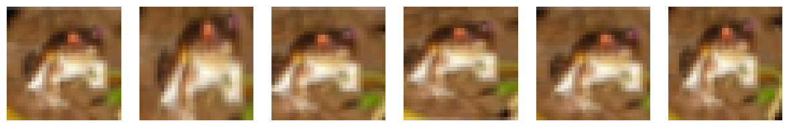
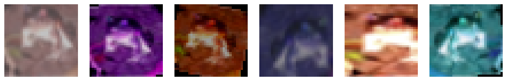

# Computer Vision


Computer vision applications such as medical imaging, autonomous vehicles, surveillance systems, and photo filters have become increasingly integrated into our daily lives and will continue to shape our future. Deep learning has revolutionized this field, dramatically improving the capabilities of computer vision systems. Today's cutting-edge computer vision technologies rely almost exclusively on deep learning approaches. This lecture explores the computer vision domain, examining basic pipelines for image classification.


## Dataset: CIFAR-10

PyTorch provides a convenient package called `torchvision` that includes common datasets, model architectures, and image transformations for computer vision. The `torchvision.datasets` module contains many popular [datasets](https://pytorch.org/vision/stable/datasets.html) that can be downloaded with just a few lines of code.

One of the most widely used datasets for learning computer vision is [CIFAR-10](https://www.cs.toronto.edu/~kriz/cifar.html). This dataset consists of 60,000 32x32 color images divided into 10 classes, with 6,000 images per class. The classes include common objects like airplanes, cars, birds, cats, deer, dogs, frogs, horses, ships, and trucks. The dataset is split into 50,000 training images and 10,000 test images.


Here's how to load the CIFAR-10 dataset using torchvision:

```python
from torchvision import datasets
from torchvision import transforms

# Convert images to tensors for training
transform = transforms.ToTensor()
# Download and load training dataset
trainset = datasets.CIFAR10(root='./data', train=True,
                          download=True, transform=transform)
print(len(trainset)) # 50000
# Download and load test dataset
testset = datasets.CIFAR10(root='./data', train=False,
                          download=True, transform=transform)
print(len(testset)) # 10000
```

You can then visualize the first 10 images in the training dataset:

```python
import matplotlib.pyplot as plt
import numpy as np

def show_image(image_tensor):
    # Convert to numpy and transpose to (H, W, C)
    image_np = image_tensor.numpy().transpose(1, 2, 0)
    # Plot the image
    plt.imshow(image_np)
    plt.axis('off')
    plt.show()

image, _ = trainset[0]
print(image.shape) # torch.Size([3, 32, 32])
show_image(image)
```



## Data Augmentation

Deep neural networks typically require extensive datasets to achieve optimal performance. Data augmentation techniques address this need by artificially expanding the training dataset through controlled modifications of existing images. These transformations create new, valid training examples that help the network learn more robust features. Beyond simply increasing dataset size, augmentation encourages models to develop invariance to specific image properties. For instance, applying random cropping teaches the network to recognize objects regardless of their position within the frame. Similarly, altering brightness levels and color characteristics helps the model become less dependent on exact color information and more focused on fundamental visual patterns. This approach significantly enhances a model's ability to generalize to unseen data.

```python
def apply_transform(img, aug, num_times=6):
    imgs = [aug(img) for _ in range(num_times)]
    plt.figure(figsize=(num_times * 2, 2))
    for i, im in enumerate(imgs):
        img_np = im.numpy().transpose(1, 2, 0)
        plt.subplot(1, num_times, i + 1)
        plt.imshow(img_np)
        plt.axis('off')
    plt.tight_layout()
    plt.show()
```

In PyTorch, the `torchvision.transforms` module provides a set of common transformations for images：

- `transforms.RandomHorizontalFlip()` or `transforms.RandomVerticalFlip()`: Flips the image horizontally or vertically.

```python
apply_transform(image, torchvision.transforms.RandomHorizontalFlip())
```



- `transforms.RandomRotation(degrees)`: Rotates the image by a random angle.

```python
apply_transform(image, torchvision.transforms.RandomRotation(degrees=15))
```



- `torchvision.transforms.ColorJitter`: Applies random brightness, contrast, saturation, and hue to the image.

```python
apply_transform(image, torchvision.transforms.ColorJitter(brightness=0.5, contrast=0.5, saturation=0.5, hue=0.5))
```



- `torchvision.transforms.RandomResizedCrop`: Crops the image to a random size and resizes it to a fixed size.

```python
apply_transform(image, torchvision.transforms.RandomResizedCrop(size=(32, 32), scale=(0.5, 1.5), ratio=(0.5, 1.5)))
```




You can also combine multiple transformations:

```python
transform = torchvision.transforms.Compose([
    torchvision.transforms.RandomHorizontalFlip(),
    torchvision.transforms.RandomRotation(degrees=15),
    torchvision.transforms.ColorJitter(brightness=0.5, contrast=0.5, saturation=0.5, hue=0.5),
    torchvision.transforms.RandomResizedCrop(size=(32, 32), scale=(0.5, 1.5), ratio=(0.5, 1.5))
])
apply_transform(image, transform)
```



You can load the CIFAR-10 training dataset with the augmentation:

```python
from torchvision import transforms
transform = transforms.Compose([
    transforms.RandomHorizontalFlip(),
    transforms.RandomResizedCrop(size=(32, 32), scale=(0.5, 1.5), ratio=(0.5, 1.5)),
    transforms.ToTensor()
])
trainset_aug = datasets.CIFAR10(root='./data', train=True,
                          download=True, transform=transform)
trainloader = DataLoader(trainset_aug, batch_size=128, shuffle=True)
```

Every batch the `trainloader` will apply different augmentations to the images to augment the training dataset.

<!-- ## Feature Extraction

We will use TinyVGG model to illustrate how to output the features from the middle layers of the model. -->


