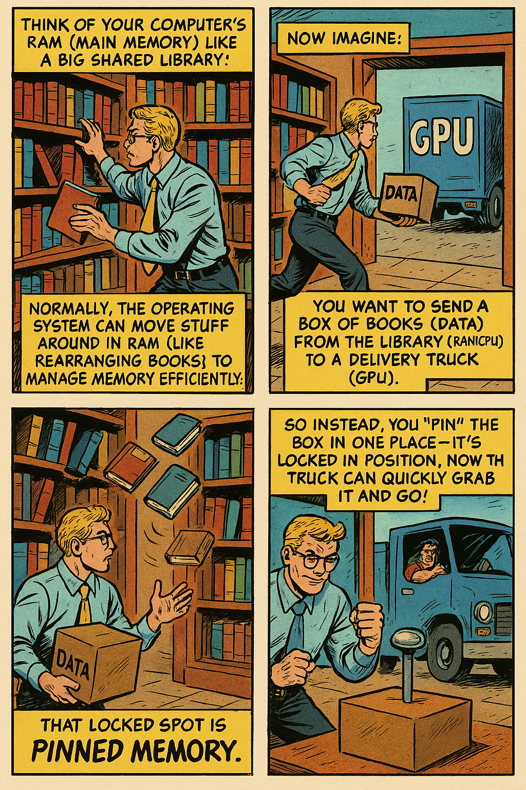

# Deep Learning with GPU

Training deep learning models can be computationally intensive. Leveraging Graphics Processing Units (GPUs) can significantly accelerate this process. This guide introduces the basics of GPU usage in PyTorch, including the differences between CPUs and GPUs, how to move data and models between devices, and strategies for multi-GPU training.

## CPU versus GPU

Central Processing Units (CPUs) are designed for general-purpose computing tasks. They excel at handling a few complex threads simultaneously.​


Graphics Processing Units (GPUs) are specialized hardware designed to handle parallel tasks efficiently. They are particularly well-suited for operations like matrix multiplications, which are common in deep learning.​
By utilizing GPUs for deep learning, training times can be reduced significantly compared to using CPUs alone.​


## PyTorch with GPU 

Before leveraging GPUs in PyTorch, ensure that your environment is set up correctly.
We have discussed how to set up GPU cores in the class cluster in the [GPU Matrix](./gpu_matrix.md#set-up-gpu-core-in-the-class-cluster) chapter. In general, you can use the command `nvidia-smi` to check the GPU status.

```bash
[jul924@ip-10-37-33-243 ~]$ salloc --partition=gpu --cpus-per-task=1 --mem=30G --time=01:00:00 srun --pty bash
salloc: Granted job allocation 38087
[jul924@gpu-dy-gpu-cr-7 ~]$ nvidia-smi
Mon Mar  3 19:16:23 2025       
+---------------------------------------------------------------------------------------+
| NVIDIA-SMI 535.216.01             Driver Version: 535.216.01   CUDA Version: 12.2     |
|-----------------------------------------+----------------------+----------------------+
| GPU  Name                 Persistence-M | Bus-Id        Disp.A | Volatile Uncorr. ECC |
| Fan  Temp   Perf          Pwr:Usage/Cap |         Memory-Usage | GPU-Util  Compute M. |
|                                         |                      |               MIG M. |
|=========================================+======================+======================|
|   0  NVIDIA L4                      On  | 00000000:31:00.0 Off |                    0 |
| N/A   28C    P8              16W /  72W |      0MiB / 23034MiB |      0%      Default |
|                                         |                      |                  N/A |
+-----------------------------------------+----------------------+----------------------+
                                                                                         
+---------------------------------------------------------------------------------------+
| Processes:                                                                            |
|  GPU   GI   CI        PID   Type   Process name                            GPU Memory |
|        ID   ID                                                             Usage      |
|=======================================================================================|
|  No running processes found                                                           |
+---------------------------------------------------------------------------------------+
```

In PyTorch, we can check the device type by using the `torch.cuda.is_available()` function. 

```python
import torch

# Check if CUDA is available
if torch.cuda.is_available():
    print("CUDA is available. You can use GPU acceleration.")
else:
    print("CUDA is not available. Using CPU.")
```

**Moving data and models between devices**

To move data and models between devices, we can use the `to()` method. If you train your model on the GPU, you need to move both the training data and the model parameters to the GPU.

```python
device = "cuda" if torch.cuda.is_available() else "cpu"
print(f"Using {device} device")
x = torch.randn(3, 3)
x = x.to(device)
model = MyModel()
model.to(device)
```

**Best practices for `.to(device)` in PyTorch Training**

- Remember that move data among CPU and GPU is time-consuming. 

- Keep model and data on the same GPU device if the GPU memory is enough.

- Don’t move the entire dataset to the GPU at once. If the dataset is large, it won’t fit into GPU memory. Instead, move each batch of data to the GPU inside the training loop.

- Use `pin_memory=True` in the `DataLoader`. In PyTorch's `DataLoader`, setting `pin_memory=True` ensures that the data loaded by the `DataLoader` resides in pinned (page-locked) memory. Pinned memory cannot be swapped to disk by the operating system, allowing faster data transfer to the GPU. Normally, data in pageable memory requires an extra step during transfer to the GPU: it must first be copied to an intermediate pinned memory buffer before being sent to the GPU. By directly loading data into pinned memory, this intermediate step is eliminated, resulting in faster and more efficient data transfers. You may need to set `pin_memory=False` when your system has limited RAM, as pinned memory consumes more of it. Excessive use can lead to system instability.

```python
train_loader = DataLoader(train_dataset, batch_size=64, shuffle=True, pin_memory=True)
```

Think of your computer’s RAM (main memory) like a big shared library:
Normally, the operating system can move stuff around in RAM (like rearranging books) to manage memory efficiently. That kind of RAM is called “pageable memory”.

Now imagine: You want to send a box of books (data) from the library (RAM/CPU) to a delivery truck (GPU). If the books are moving around or not fixed in place (pageable), it’s harder to pick them up and load them into the truck. So instead, you “pin” the box in one place — it’s locked in position. Now the truck can quickly grab it and go!




- Use `non_blocking=True` in the `to()` method if using GPU. When moving data from the CPU to the GPU using the `.to()` method, setting `non_blocking=True` allows the data transfer to occur asynchronously. This means the CPU can continue executing subsequent operations without waiting for the data transfer to complete. Asynchronous data transfers enable the overlap of data transfer and computation, leading to better utilization of both CPU and GPU resources. This overlap reduces idle times and can significantly speed up the training process.​ Notice that you need to set `pin_memory=True` in the `DataLoader` to make `non_blocking=True` effective. If the source tensor is not in pinned memory, the asynchronous transfer may be even slower.

```python
data = data.to(device, non_blocking=True)
```


We summarize the best practices for `.to(device)` above in the following checklist.

| Checklist | When to Use |
|-----------|-------------|
| `.to(device)` on model | Once after model creation |
| `.to(device)` on data | Inside the training loop, batch-by-batch |
| `pin_memory=True` in `DataLoader` | When using GPU, to speed up transfer |
| `non_blocking=True` in `.to()` | For faster async transfer with pinned memory |


Here we provide an example code for training a model on GPU.

```python
import torch
from torch.utils.data import DataLoader
from torchvision import datasets, transforms
import torch.nn as nn
import torch.optim as optim

# 1. Setup device
device = torch.device("cuda" if torch.cuda.is_available() else "cpu")
# 2. Define transforms and dataset (on disk)
transform = transforms.ToTensor()
train_dataset = datasets.MNIST(root='./data', train=True, download=True, transform=transform)
# 3. Dataloader - use pin_memory to speed up CPU -> GPU transfer
train_loader = DataLoader(train_dataset, batch_size=64, shuffle=True, pin_memory=True)
# 4. Define model and move to GPU
model = nn.Sequential(
    nn.Flatten(),
    nn.Linear(28*28, 128),
    nn.ReLU(),
    nn.Linear(128, 10)
)
model.to(device)
# 5. Optimizer and loss
optimizer = optim.Adam(model.parameters())
criterion = nn.CrossEntropyLoss()
# 6. Training loop - move each batch to GPU
for epoch in range(5):
    model.train()
    for batch_idx, (data, targets) in enumerate(train_loader):
        # Move data to the same device as model
        data = data.to(device, non_blocking=True)
        targets = targets.to(device, non_blocking=True)
        # Forward
        outputs = model(data)
        loss = criterion(outputs, targets)
        # Backward
        optimizer.zero_grad()
        loss.backward()
        optimizer.step()

        if batch_idx % 100 == 0:
            print(f"Epoch {epoch} Batch {batch_idx} Loss {loss.item():.4f}")
```

## Multi-GPU Training

For larger models or datasets, utilizing multiple GPUs can further accelerate training. PyTorch offers two main approaches:​

1. `DataParallel`: This method first put the data on the main GPU and then split the data across multiple GPUs, which is not efficient. It's straightforward but may not be the most efficient for all scenarios.
2. `DistributedDataParallel`: DDP is more scalable and efficient for multi-GPU training, especially across multiple nodes. It requires more setup but offers better performance.


Therefore, in this lecture, we will focus on the `DistributedDataParallel` method. To implement multi-GPU training, you need to follow the following steps:

- **Spawn a process per GPU**: Each GPU needs its own training process. When training on multiple GPUs, you need to define a `train(rank, world_size)` function which executes on `rank`-th GPU among `world_size` GPUs
  
```python
def train(rank, world_size):
    # ... training code ...
```

Then in the main part of your code, you need to spawn a process per GPU.

```python
import torch.multiprocessing as mp

if __name__ == "__main__":
    world_size = torch.cuda.device_count()
    mp.spawn(train, args=(world_size,), nprocs=world_size)
```
The code above will spawn `world_size` processes, each of which will handle a different GPU.


Inside the `train(rank, world_size)` function which executes on `rank`-th GPU among `world_size` GPUs, you need to conduct the following steps:

- **Assign a specific GPU to each process**: So they don’t all try to use the same one. You can tell each process which GPU to use by using the following function.

```python 
import torch.distributed as dist
# To use GPU #rank out of world_size of GPUs
dist.init_process_group("nccl", rank=rank, world_size=world_size)
torch.cuda.set_device(rank)
```


The code `dist.init_process_group("nccl", rank=rank, world_size=world_size)` sync GPUs across processes. It says "I'm process #rank, and there are #world_size processes in total. Hey GPUs, let’s team up for this job!". Here `nccl` refers to the NVIDIA Collective Communications Library, which is a library for parallel computing with GPUs.

- **Create the Dataloader**: If you have created a [dataset class](./dl_workflow.md#dataset-class), you can create a `DistributedSampler` to sampler as the input of the `DataLoader`.


```python
from torch.utils.data import DataLoader, DistributedSampler
dataset = YourDatasetClass() 
sampler = DistributedSampler(dataset, num_replicas=world_size, rank=rank)
dataloader = DataLoader(dataset, batch_size=64, sampler=sampler, num_workers=4, pin_memory=True)
```


Here `DistributedSampler(dataset, num_replicas=world_size, rank=rank)` splits the dataset into `world_size` equal chunks and return `rank`-th chunk.

Here `num_workers` is the number of subprocesses (CPU workers) used to load the data in the background. These workers run in parallel to your GPU, preparing data while your GPU is training the current batch. It is like while the chef (GPU) is cooking, multiple assistants (workers) are chopping vegetables (loading data from disk and transforming data). The more helpers you have, the less the chef has to wait!

If your `num_workers` is too small, the data loading will become a bottleneck and GPU needs to wait for CPU to load data. Too high `num_workers` can overload your CPU or RAM.
We suggest you set `num_workers = (num_cpu_cores) // (num_gpus) `, where you can get these numbers by the following code.

```python
import os
import multiprocessing
import torch
num_cpu_cores = multiprocessing.cpu_count()
num_gpus = torch.cuda.device_count()
num_workers = (num_cpu_cores) // (num_gpus) 
```


- **Wrap the model in `DistributedDataParallel`**: So gradients sync across GPUs. Here is an example code for setting up the model, loss, and optimizer.

```python
device = torch.device(f"cuda:{rank}")
model = YourModelClass().to(device)
model = nn.parallel.DistributedDataParallel(model, device_ids=[rank])
criterion = nn.CrossEntropyLoss().to(device)
optimizer = torch.optim.SGD(model.parameters(), lr=0.01)
```

At every `loss.backward()`, DDP does something magical: All GPUs talk to each other and exchange gradients. 

- **Training loop**:

```python
for epoch in range(5):
    sampler.set_epoch(epoch)  # Ensure data shuffling is different each epoch
    for batch_idx, (data, target) in enumerate(dataloader):
        data = data.to(device, non_blocking=True)
        target = target.to(device, non_blocking=True)

        output = model(data)
        loss = criterion(output, target)

        optimizer.zero_grad()
        loss.backward()
        optimizer.step()

    if rank == 0: # Only the main process (rank 0) prints the epoch completion
        print(f"Epoch {epoch} completed.")
    
dist.destroy_process_group() # Clean up the process group created by init_process_group
```


Here is the complete code for multi-GPU training.

```python
# ddp_train.py
import os
import torch
import torch.nn as nn
import torch.distributed as dist
import torch.multiprocessing as mp
from torch.nn.parallel import DistributedDataParallel as DDP
from torchvision import models, datasets, transforms
from torch.utils.data import DataLoader, DistributedSampler

def train(rank, world_size):
    print(f"Running DDP training on rank {rank}.")
    dist.init_process_group("nccl", rank=rank, world_size=world_size)
    torch.cuda.set_device(rank)
    torch.backends.cudnn.benchmark = True # Open cuDNN, only if your model dimension and batch size are fixed, see #Advanced Tips for GPU Training

    # Set device
    device = torch.device(f"cuda:{rank}")

    # Dataset and DataLoader with DistributedSampler
    transform = transforms.Compose([transforms.ToTensor()])
    dataset = datasets.FakeData(transform=None)
    sampler = DistributedSampler(dataset, num_replicas=world_size, rank=rank)
    dataloader = DataLoader(dataset, batch_size=64, sampler=sampler, num_workers=4, pin_memory=True)

    # Model, loss, optimizer
    model = models.resnet18().to(device)
    model = DDP(model, device_ids=[rank])
    criterion = nn.CrossEntropyLoss().to(device)
    optimizer = torch.optim.SGD(model.parameters(), lr=0.01)

    # Training loop
    for epoch in range(5):
        sampler.set_epoch(epoch)  # Ensure data shuffling is different each epoch
        for batch_idx, (data, target) in enumerate(dataloader):
            data = data.to(device, non_blocking=True)
            target = target.to(device, non_blocking=True)

            output = model(data)
            loss = criterion(output, target)

            optimizer.zero_grad()
            loss.backward()
            optimizer.step()

        if rank == 0:
            print(f"Epoch {epoch} completed.")

    dist.destroy_process_group()

if __name__ == "__main__":
    world_size = torch.cuda.device_count()
    mp.spawn(train, args=(world_size,), nprocs=world_size)
```

Finally, you can run the code by using the following command.

```bash
torchrun --nproc_per_node=4 ddp_train.py
```
Here `--nproc_per_node=4` means you want to use 4 GPUs.


## Advanced Tips for GPU Training

Here we summarize some advanced tips for GPU training.

- **Asynchronous Data Loading & Pin Memory**: We have discussed this in the [Single GPU](#pytorch-with-gpu) section. In summary, use `pin_memory=True` in the `DataLoader` to speed up CPU -> GPU transfer and use `to(device, non_blocking=True)` method.

```python
train_loader = DataLoader(train_dataset, batch_size=64, shuffle=True, pin_memory=True, num_workers=4)
for data, target in train_loader:
    data = data.to(device, non_blocking=True)
    target = target.to(device, non_blocking=True)
```


- **Gradient Accumulation**: If your GPU memory is not enough, you can use gradient accumulation to train your model.

```python
accum_steps = 4
loss = loss / accum_steps
loss.backward()
if (step + 1) % accum_steps == 0:
    optimizer.step()
    optimizer.zero_grad()
```

- **Align the model tensor dimensions**: Try to use dimensions that are multiples of 32 or 8 for tensor sizes, batch sizes, input sizes, and all other dimensions. For operations like convolutions and matrix multiplications, it's best to align your tensor dimensions with the GPU's "kernel settings". If your tensor sizes are "odd" numbers like 33 or 65, it may cause some threads in a warp to idle (wasting resources) during execution.


- **Automatic Mixed Precision**: There are two types of precision: FP32 (32-bit floating point) and FP16 (16-bit floating point). FP16 is faster on some GPUs, but it can cause precision loss. Automatic Mixed Precision (AMP) is a technique that automatically switches between FP32 and FP16 precision during training to balance performance and accuracy. Notice AMP only works on some GPUs (e.g.,NVIDIA V100, A100, H100, etc.) 

In PyTorch, you can use `torch.amp` to implement AMP. In your training loop, you only need to change two parts.

```python
from torch.cuda.amp import autocast, GradScaler

scaler = GradScaler()
for data, target in dataloader:
    optimizer.zero_grad()
    data = data.to(device)
    target = target.to(device)

    # Use autocast to automatically switch between FP32 and FP16 precision
    with autocast():
        output = model(data)
        loss = loss_fn(output, target)

    # Scale the loss and backward
    scaler.scale(loss).backward()
    scaler.step(optimizer)
    scaler.update()
```

- **Open cuDNN**: If your model dimension and batch size are fixed, you can open cuDNN to speed up training using the following code.

```python
torch.backends.cudnn.benchmark = True
```

PyTorch uses NVIDIA's cuDNN acceleration library for operations like convolutions, normalization, and pooling. For each operation (like convolution), cuDNN offers multiple implementation algorithms with different trade-offs: some are faster but memory-intensive, others are slower but memory-efficient, and some are optimized for large batches or small kernels. At the beginning of training, PyTorch can benchmark several algorithms, identify the fastest one, and consistently use it thereafter. 

This approach significantly speeds up training, but requires **fixed input dimensions and batch sizes**. If your input dimensions or batch sizes are changing, you may not open it.


### GPU Training Checklist

| Component | Setting / Tip | Why |
|-----------|---------------|-----|
| DataLoader | `pin_memory=True` | Faster CPU → GPU transfer (via DMA) |
| | `num_workers = num_CPU_cores // num_GPUs` | Loads data in parallel using CPU workers |
| | Multi-GPU: Use `DistributedSampler` (DDP)| Ensures each GPU sees unique data |
| | Multi-GPU: Call `sampler.set_epoch(epoch)` | Ensures shuffling differs across epochs in DDP |
| Device Handling | Single GPU: `device = torch.device("cuda" if torch.cuda.is_available())` | For single GPU training |
| | Multi-GPU: `device = torch.device(f"cuda:{rank}")` | For multi-GPU training |
| | Use `.to(device)` for model | Moves tensors to GPU (or CPU) |
| | Use `.to(device)` for data in batch loop| Moves whole data to GPU will cause memory issue|
| | Use `.to(device, non_blocking=True)` | Enables async transfer from CPU to GPU |
| Model Setup | `torch.backends.cudnn.benchmark = True` | Speeds up convolution if input sizes are constant |
| | Use `model.eval()` during validation | Disables dropout/batchnorm updates |
| Loss & Optimizer | Move loss to GPU: `criterion.to(device)` | Keeps computation on GPU |
| | Use `.zero_grad(set_to_none=True)` | More efficient gradient reset |
| | Gradient Accumulation | If GPU memory is not enough |
| Mixed Precision | Use `autocast()` and `GradScaler()` from `torch.cuda.amp` | Speeds up training and reduces memory usage |
| Multi-GPU  | Use `torchrun --nproc_per_node=NUM_GPUs` | Launches one process per GPU |
| | Wrap model in `DistributedDataParallel` | Enables gradient sync between GPUs |
| Monitoring | `nvidia-smi` / `wandb` / `tensorboard` | Monitor GPU usage, memory, and training speed |


