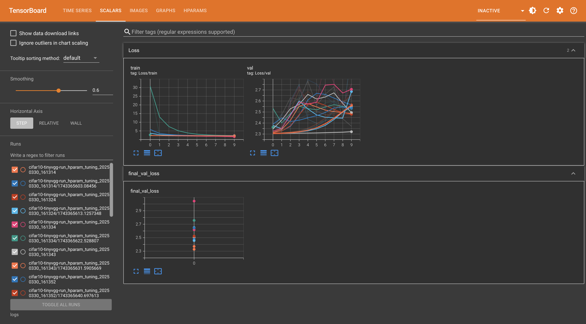
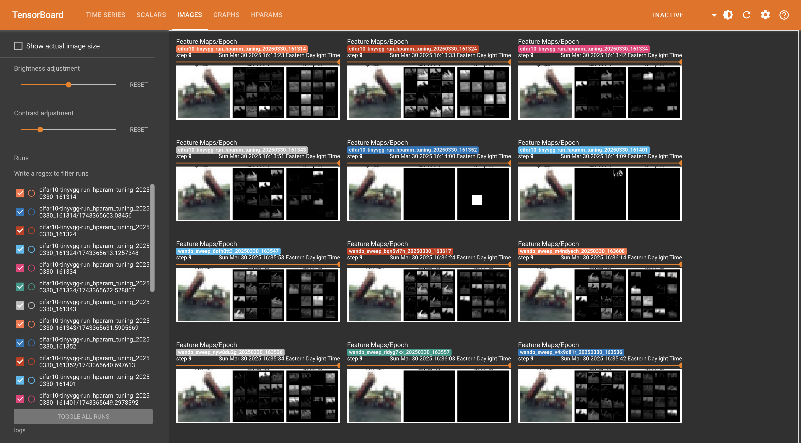
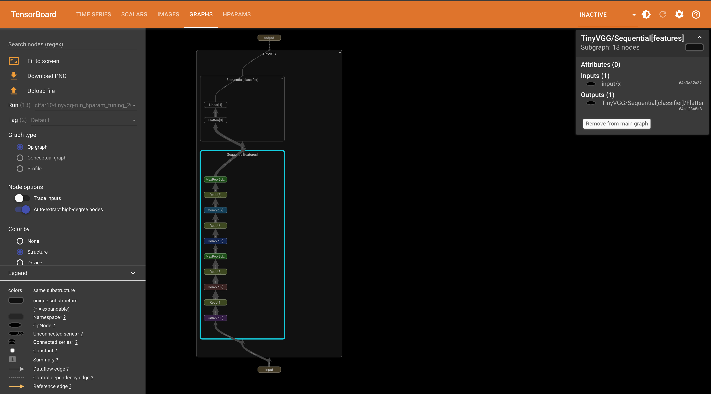
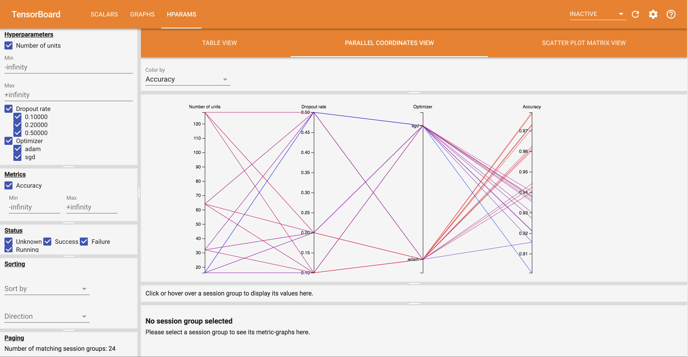

# Deep Learning Training Workflow


## Training Template


A well-organized deep learning project can significantly improve development efficiency, readability, and reproducibility. Below is a comprehensive template for structuring your deep learning training project with separate Python files for different components.

```
project_root/
│
├── data/                      # Data storage
│
├── models/                    # Saved model checkpoints 
│   └── checkpoints/           # Model checkpoints during training
│
├── src/                       # Source code
│   ├── dataset.py             # Dataset and data loading code
│   ├── model.py               # Model architecture definitions
│   ├── train.py               # Training loop and logic
│   ├── main.py                # Entry point for training
│   ├── config.py              # Configuration parameters
│   └── utils.py               # Utility functions
│
├── sandbox/                 # Jupyter notebooks for exploration
│
├── results/                   # Training results, logs, etc.
│   ├── logs/                  # Training logs
│   └── visualizations/        # Generated plots and visualizations
│
├── requirements.txt           # Project dependencies
└── README.md                  # Project documentation
```

- `config.py`: Configuration parameters for the training.  This should be the only file that you need to change when you want to try different configurations.
- `dataset.py`: Dataset and data loading code. Define your own dataset class by inheriting from `torch.utils.data.Dataset`.
- `model.py`: Model architecture definitions. Define your own model class by inheriting from `torch.nn.Module`.
- `train.py`: Training loop and logic. We suggest you to define a `Trainer` class that handles the training loop and the evaluation loop.
- `utils.py`: Utility functions for visualization, logging, etc.
- `main.py`: Entry point for training.


You should maintain a template code for your future projects with the above structure.


### Dataset Class

In the `dataset.py` file, you should define your own dataset class by inheriting from `torch.utils.data.Dataset`.

You need to implement the following methods:

- `__len__`: Return the length of the dataset.
- `__getitem__`: Return the item at the given index.

Here is an example to generate a dataset from linear model $y = 3x + 2 + \epsilon$ with Gaussian noise $\epsilon \sim \mathcal{N}(0, 2)$.

```python
class LinearModelDataset(Dataset):
    def __init__(self, num_samples=100):
        self.x = torch.randn(num_samples, 1)
        self.y = 3 * self.x + 2 + torch.randn(self.x.size()) * 2
    def __len__(self): # Return the length of the dataset
        return len(self.x)

    def __getitem__(self, idx): # Return the item at the given index
        # Add any preprocessing here if needed
        return self.x[idx], self.y[idx]
```

### Trainer Class

In the `train.py` file, you should define a `Trainer` class that handles the training. Below is a simplest example for the structure of the `Trainer` class.


```python
class Trainer:
    def __init__( # Initialize the trainer with all the necessary components
        self, 
        model, 
        train_loader, 
        val_loader, 
        optimizer, 
        criterion,
        hparams # other hyperparameters needed for training
        ):
        self.model = model
        self.optimizer = optimizer
        self.criterion = criterion

    def train(self):
        for epoch in range(self.hparams.num_epochs):
            self.model.train()
            for batch_idx, (data, target) in enumerate(self.train_loader):
                # Forward pass
                output = self.model(data)
                loss = self.criterion(output, target)
                # Backward pass
                self.optimizer.zero_grad()
                loss.backward()
                self.optimizer.step()
                # Add more code on logging, metrics, etc.

    # Define other functions for evaluation, checkpoint saving, etc.
```

You may consider adding more methods to the `Trainer` class including:

- Evaluation: Define a method to evaluate the model on the validation set.
- Checkpoint: Define a method to save the model checkpoint.
- Logging: Define a method to log the training process. We will discuss about logging in the [next section](#logging).
- Git commit: Define a method to commit the code for the current training.
- Visualization: Define a method to visualize the training process.

Instead of defining your own `Trainer` class, you can use existing packages for training, e.g., [pytorch-lightning](https://lightning.ai) and  [Hugging Face Trainer](https://huggingface.co/docs/transformers/trainer).


### Model Class

In the `model.py` file, you should define your own model class by inheriting from `torch.nn.Module`.  You have learned how to define a model class for many neural networks in the [previous lecture](nn.md#pytorch-for-neural-networks). 


### Configuration

In the `config.py` file, you should define the configuration parameters for the training.  This should be the only file that you need to change when you want to try different configurations. 

Below is an example to use dictionaries to store the configuration parameters.

```python
# config.py
train_config = {
    # Directories
    "checkpoint_dir": "models/checkpoints",
    "log_dir": "results/logs",
    # Training parameters
    "optimizer": "Adam",
    "learning_rate": 1e-3,
    "epochs": 10,
    "batch_size": 64
    # Other parameters
    "seed": 42
}
# Configuration parameters for TinyVGG model
config_model = {
    "input_channels": 3,
    "num_classes": 10,
    "conv1_channels": 64,
    "conv2_channels": 128,
    "kernel_size": 3,
    "padding": 1
}
```

People may use different ways to store the configuration parameters. Some people may use `yaml` to store the configuration parameters. You should find out the best way for your project.


## Logging

TensorBoard is a powerful visualization toolkit for TensorFlow that also works seamlessly with PyTorch. It allows you to track and visualize various aspects of your training process, making it easier to understand, debug, and optimize your models.

If you're using PyTorch, you'll need the torch.utils.tensorboard module which provides a PyTorch interface to TensorBoard:

```python
from torch.utils import tensorboard
```

You can initialize a TensorBoard writer:

```python
logger = tensorboard.SummaryWriter(log_dir="results/logs")
```

You can then start the TensorBoard server:

```bash
tensorboard --logdir=results/logs
```

and then open the TensorBoard in your browser at http://localhost:6006/

You can add different types of training results to the TensorBoard including:

- Scalar: Add scalar values by `logger.add_scalar`. You typically use it to log the training loss, accuracy, etc, e.g.,

```python
logger.add_scalar("train_loss", train_loss, global_step=epoch)
logger.add_scalar("val_loss", val_loss, global_step=epoch)
```



- Image: Add images by `logger.add_image`. You can visualize the input images, model features, the confusion matrix, etc.

```python
logger.add_image(tag="input_image", figure=input_image, global_step=epoch)
```



- Graph: Add graph by `logger.add_graph`. This is super useful for visualizing the model architecture via the computational graph. The following code is an example to add the computational graph of the model to the TensorBoard.

```python
dataiter = iter(train_loader)
data, _ = next(dataiter)
logger.add_graph(model, data)
```



- Hyperparameters: Add hyperparameters by `logger.add_hparams`.

```python
hparam_dict = {
    "learning_rate": 1e-3,
    "batch_size": 64,
    "epochs": 10
}
metric_dict = {
    "train_loss": train_loss,
    "val_loss": val_loss
}
logger.add_hparams(hparam_dict, metric_dict)
```

This is super useful for comparing different configurations and you can use it to tune the hyperparameters for the best performance logged in `metric_dict`.



There are other logging tools including [Weights & Biases](https://wandb.ai) and [Comet](https://www.comet.com) which is commercialized but free for basic usage.


