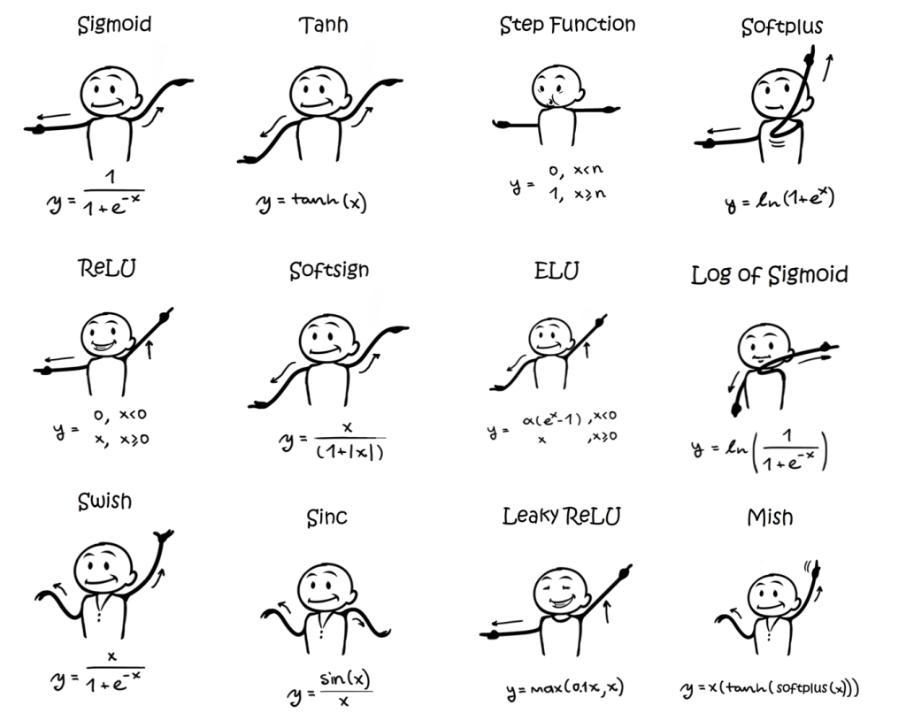

# Neural Networks

## Overview

Neural networks are a type of machine learning model that are inspired by the structure of the human brain. They are a type of deep learning model that are used to model complex relationships between input and output variables.

## Lectures

* [Neural Networks](nn.md)
* [Regularization](regularization.md)
* [Convolutional Neural Networks](cnn.md)
* [Residual Networks](resnet.md)
* [Fine-tuning](fine_tuning.md)
* [Computer Vision](computer_vision.md)
* [PyTorch Pitfalls](pitfall.md)