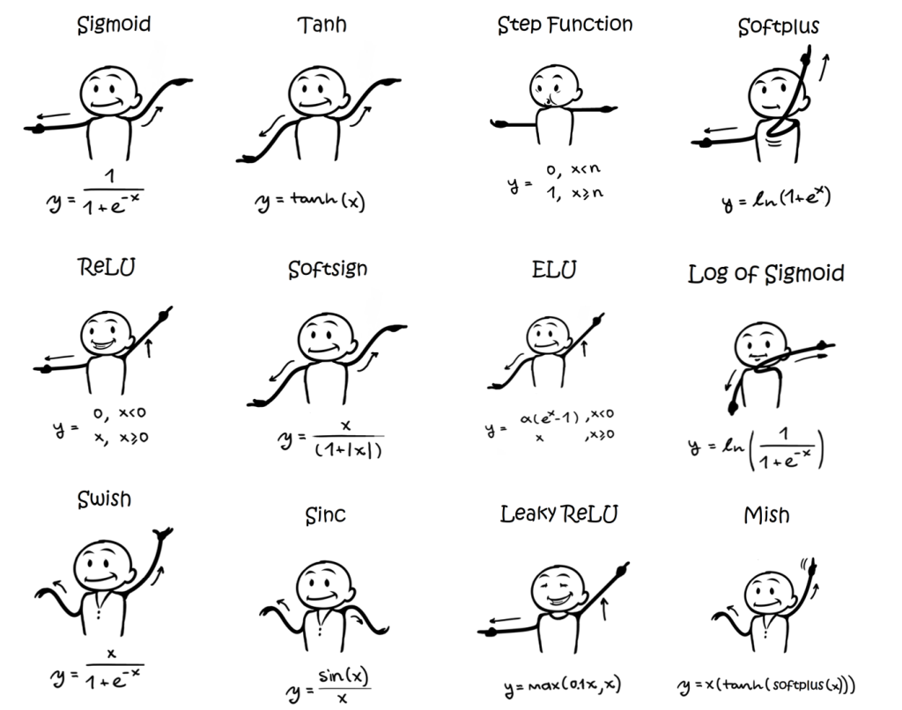

# Neural Networks

## Overview

  <a href="https://colab.research.google.com/github/junwei-lu/bst236/blob/main/codes/chapter09_neural_networks.ipynb"
     target="_blank"
     style="display: inline-flex; align-items: center; gap: 8px; padding: 10px 16px; background: linear-gradient(135deg, #2e7d32 0%, #66bb6a 100%); color: white; border-radius: 8px; text-decoration: none; font-weight: 600; box-shadow: 0 4px 15px rgba(46, 125, 50, 0.4);">
    <svg width="20" height="20" viewBox="0 0 24 24" fill="none" stroke="currentColor" stroke-width="2">
      <path d="M10 20l4-16m4 4l4 4-4 4M6 16l-4-4 4-4"/>
    </svg>
    Open Interactive Notebook in Colab
  </a>

Neural networks are a type of machine learning model that are inspired by the structure of the human brain. They are a type of deep learning model that are used to model complex relationships between input and output variables.

## Lectures

* [Neural Networks](nn.md)
* [Regularization](regularization.md)
* [Convolutional Neural Networks](cnn.md)
* [Residual Networks](resnet.md)
* [Fine-tuning](fine_tuning.md)
* [Computer Vision](computer_vision.md)
* [Training Workflow](dl_workflow.md)
* [GPU Training](dl_gpu.md)
* [Tips for Training Neural Networks](dl_tips.md)
* [PyTorch Pitfalls](pitfall.md)