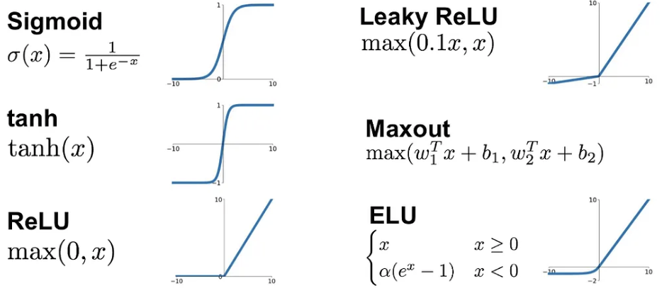
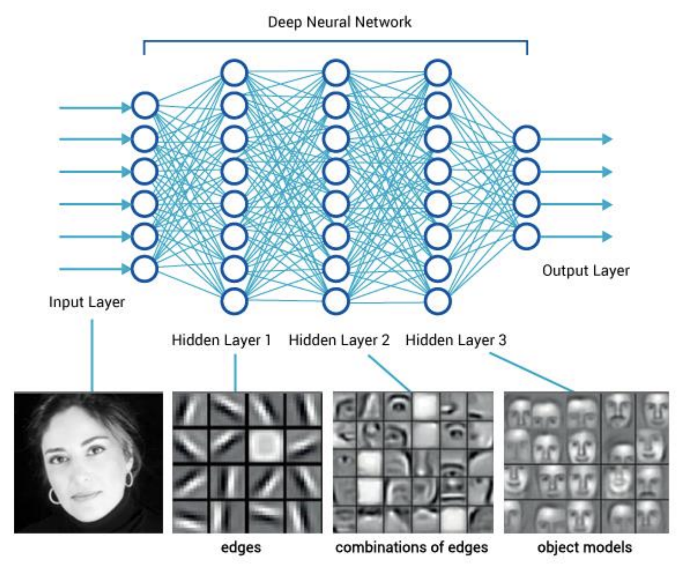

# Neural Networks

## Linear Classifier

Given the input $\mathbf{X} = (X_1, X_2, \ldots, X_d)$, a linear model with multiple outcomes $\mathbf{O} = (O_1, O_2, \ldots, O_m)$ is given by:

$$
\mathbf{O} = \mathbf{W} \mathbf{X} + \mathbf{b}
$$

where $\mathbf{W} = (w_{ij})$ is a $m \times d$ matrix of weights, and $\mathbf{b} = (b_1, b_2, \ldots, b_m)$ is a vector of biases.

If the goal is to classify the input $\mathbf{X}$ into one of $m$ classes, we can use the softmax function to convert the outputs to probabilities to have the linear classifier model

$$
\mathbf{Y} = \text{softmax}(\mathbf{O}) = \text{softmax}(\mathbf{\mathbf{W} \mathbf{X} + \mathbf{b}}), 
$$

$$
\text{where } Y_i = \frac{\exp(O_i)}{\sum_{j=1}^m \exp(O_j)} \text{ is the probability} P(Y=i|\mathbf{X})
$$

### Cross-entropy loss

We have the data $(\mathbf{X}_1, \mathbf{Y}_1), (\mathbf{X}_2, \mathbf{Y}_2), \ldots, (\mathbf{X}_n, \mathbf{Y}_n)$, where $\mathbf{Y}_i$ is the one-hot encoded target vector for the $i$-th training example, i.e., $Y_{ij} = 1$ if the $i$-th training example belongs to class $j$, and $0$ otherwise. The linear classifier model predicts the probability $\hat{\mathbf{Y}} = \text{softmax}(\mathbf{\mathbf{W} \mathbf{X} + \mathbf{b}})$. So the negative log-likelihood of the linear classifier is given by:

$$
-\log P(\mathbf{Y}|\mathbf{X}, \mathbf{W}, \mathbf{b}) = -  \sum_{i=1}^n \log \prod_{j=1}^m P(Y_{ij} = 1|\mathbf{X}_i, \mathbf{W}, \mathbf{b})^{Y_{ij}} = - \sum_{i=1}^n \sum_{j=1}^m Y_{ij} \log \hat{Y}_{ij}
$$

Therefore, for any predicted probability vector $\hat{\mathbf{Y}}$, the cross-entropy loss is given by:

$$
L(\mathbf{Y}, \hat{\mathbf{Y}}) = -  \sum_{j=1}^m Y_{j} \log \hat{Y}_{j}
$$

In Pytorch, we can use the `nn.CrossEntropyLoss` function to compute the cross-entropy loss.


!!! warning "Cross-entropy loss in Pytorch"

    The `nn.CrossEntropyLoss` function expects raw logits, not softmaxed outputs.

    That means for linear classifier $O = Wx + b$, we predict $\hat{y} = \text{softmax}(O)$, but we should pass the raw logits $O$ to the loss function, not the softmaxed outputs $\hat{y}$.

    ```python
    num_classes, num_features = 10, 100
    x = torch.randn(num_features)
    y_true = torch.randint(0, num_classes, (1,))
    model = nn.Linear(num_features, num_classes)
    O = model(x) # raw logits
    y_pred = torch.softmax(O, dim=1) # softmaxed outputs
    criterion = nn.CrossEntropyLoss()
    loss = criterion(O, y_true) 
    ```

    Instead, we should pass the raw logits $O$ to the loss function:


    
## Neural Network Architectures

### One-hidden-layer Neural Network
    
We consider the one-hidden-layer neural network:

$$
\begin{align*}
\mathbf{H} &= \sigma(\mathbf{W}^{(1)} \mathbf{X} + \mathbf{b}^{(1)})\\
\mathbf{O} &= \sigma(\mathbf{W}^{(2)} \mathbf{H} + \mathbf{b}^{(2)})
\end{align*}
$$

where $\sigma$ is a non-linear activation function. 

 


### Activation functions


 The activation functions introduce non-linearity into neural networks, allowing them to learn and model complex non-linear relationships in the data that would be impossible with just linear transformations.

 Here are popular activation functions:

 - Sigmoid: $\sigma(x) = \frac{1}{1 + \exp(-x)}$
 - ReLU: $\sigma(x) = \max(0, x)$
 - Tanh: $\sigma(x) = \frac{\exp(x) - \exp(-x)}{\exp(x) + \exp(-x)}$
 - Leaky ReLU: $\sigma(x) = \max(0.01x, x)$



 Among these, ReLU is the most popular activation function in deep neural networks as it is computationally efficient and leads to sparse activations. From the figure above, we can see that the sigmoid and tanh activation functions has vanishing gradient problem when the input is far away from the origin, which makes the training of deep neural networks less efficient. On the other hand, the ReLU always has non-vanishing gradient when the input is positive. The leaky ReLU further adds a small gradient when the input is negative, which can prevent the dying ReLU problem.


 ## Multi-layer Neural Network

 We can stack multiple one-hidden-layer neural networks to form a multi-layer neural network:

<!-- 
## Neural Network Architectures
### One-hidden-layer Neural Network

 We consider the one-hidden-layer neural network:

 $$
 \mathbf{H} = \sigma(\mathbf{W}^{(1)} \mathbf{X} + \mathbf{b}^{(1)}) 
 $$

 $$
 \mathbf{O} = \mathbf{W}^{(2)} \mathbf{H} + \mathbf{b}^{(2)}
 $$

 where $\sigma$ is a non-linear activation function. 

 


 ### Activation functions

 The activation functions introduce non-linearity into neural networks, allowing them to learn and model complex non-linear relationships in the data that would be impossible with just linear transformations.

 Here are popular activation functions:

 - Sigmoid: $\sigma(x) = \frac{1}{1 + \exp(-x)}$
 - ReLU: $\sigma(x) = \max(0, x)$
 - Tanh: $\sigma(x) = \frac{\exp(x) - \exp(-x)}{\exp(x) + \exp(-x)}$
 - Leaky ReLU: $\sigma(x) = \max(0.01x, x)$


 Among these, ReLU is the most popular activation function in deep neural networks as it is computationally efficient and leads to sparse activations. From the figure above, we can see that the sigmoid and tanh activation functions has vanishing gradient problem when the input is far away from the origin, which makes the training of deep neural networks less efficient. On the other hand, the ReLU always has non-vanishing gradient when the input is positive. The leaky ReLU further adds a small gradient when the input is negative, which can prevent the dying ReLU problem. -->

 ## Multi-layer Neural Network

 We can stack multiple one-hidden-layer neural networks to form a multi-layer neural network:

 $$
 O = W^{(L)} \sigma(W^{(L-1)} ... \sigma(W^{(2)} \sigma(W^{(1)} X + b^{(1)}) + b^{(2)}) ... + b^{(L-1)}) + b^{(L)}
 $$

 Multiple hidden layers allow neural networks to learn hierarchical representations of the data. The early layers typically learn low-level features (like edges and textures in images), while deeper layers combine these to detect higher-level patterns and more abstract concepts. This hierarchical feature extraction enables the network to build increasingly complex and meaningful representations of the input data. For example, in image recognition, the first layer might detect edges, the second layer might combine edges into simple shapes, and deeper layers might recognize complex objects by combining these simpler patterns.

 

 ## Pytorch for Neural Networks

 Pytorch provides a convenient API for building neural networks using the `torch.nn` module.  The basic building block of the `torch.nn` module includes

 - `nn.Linear(in_features, out_features)`: a linear layer.
 - `nn.ReLU()`: a ReLU activation function.
 - `nn.Sigmoid()`: a sigmoid activation function.
 - `nn.Tanh()`: a tanh activation function.

 In Pytorch, we can simply use the `nn.Sequential` function to stack multiple layers together:

 ```python
 input_size, hidden_size, output_size = 784, 256, 10
net = nn.Sequential(nn.Linear(input_size, hidden_size),
                    nn.ReLU(),
                    nn.Linear(hidden_size, output_size))
 ```

You can even build a multi-layer neural network by adding layers to the model:

```python
net = nn.Sequential()
net.append(nn.Linear(input_size, hidden_size))
net.append(nn.ReLU())
net.append(nn.Linear(hidden_size, output_size))

# You can even use for loop to add layers
depth = 3
net = nn.Sequential()
for _ in range(depth):
    net.append(nn.ReLU())
    net.append(nn.Linear(10, 10))
```

 However, we suggest to use the `nn.Module` class to define a custom neural network class, as it is more flexible for you to generate multiple instances of the same neural network with different parameters. You need to define a model class that inherits from `nn.Module` and at least define two functions:

 - `__init__`: to define and initialize the network parameters.
 - `forward`: to define the forward pass of the network.

```python
 import torch
 import torch.nn as nn
 import torch.nn.functional as F

 class TwoLayerNet(nn.Module):
     def __init__(self, input_size, hidden_size, output_size): # Define and initialize the network parameters
         super().__init__()
         self.net = nn.Sequential(
             nn.Linear(input_size, hidden_size),
             nn.ReLU(),
             nn.Linear(hidden_size, output_size)
         )

     def forward(self, x): # Define the forward pass of the network
         return self.net(x)

 # Initialize the model
 input_size, hidden_size, output_size = 784, 256, 10
 net = TwoLayerNet(input_size, hidden_size, output_size)

 # Print the model
 for name, param in net.named_parameters():
    if param.requires_grad:
        print(f"{name}: {param.shape}")

 # net.0.weight: torch.Size([256, 784])
 # net.0.bias: torch.Size([256])
 # net.2.weight: torch.Size([10, 256])
 # net.2.bias: torch.Size([10])
```

You can even define in the `forward` function on how the model should be executed. Pytorch provide the API `torch.nn.functional` for common functions. The following way to define the model is equivalent to the previous one but it is more flexible to design your own model. For example, we need to consider a special activation function in the second hidden layer
$$
\sigma(x;\alpha) = \begin{cases}
    \frac{1}{1 + \alpha \exp(- x)} & \text{if } x \leq 0 \\
    x & \text{if } x > 0
\end{cases}
$$
where $\alpha$ is a parameter also can be learned.

Notice that you need to use functions in `torch` to define your own activation function, otherwise the autograd will not work.

```python
 import torch
 import torch.nn as nn
 import torch.nn.functional as F

 class TwoLayerNet(nn.Module):
     def __init__(self, input_size, hidden_size, output_size):
         super().__init__()
         self.linear1 = nn.Linear(input_size, hidden_size)
         self.linear2 = nn.Linear(hidden_size, hidden_size)
         self.linear3 = nn.Linear(hidden_size, output_size)
         self.alpha = nn.Parameter(torch.ones(1))

     def my_activation(self, x):
         return torch.where(x <= 0, 1 / (1 + self.alpha * torch.exp(-x)), x)

     def forward(self, x):
         x = self.linear1(x)
         x = F.relu(x)
         x = self.linear2(x)
         x = self.my_activation(x)
         x = self.linear3(x)
         return x
```

**Stack multiple networks**

We can also define a building block of the neural network, and repeat it multiple times to form a multi-layer neural network.

```python
import torch
import torch.nn as nn
import torch.nn.functional as F
# First define a building block of one-hidden-layer neural network
class Block(nn.Module):
    def __init__(self, input_size, hidden_size):
        super().__init__()
        self.net = nn.Sequential(
            nn.Linear(input_size, hidden_size),
            nn.ReLU()
        )

    def forward(self, x):
        return self.net(x)

# Then define a multi-layer neural network by repeating the building block
class MultiLayerNet(nn.Module):
    def __init__(self, input_size, hidden_size, depth, output_size):
        super().__init__()
        self.input_linear = nn.Linear(input_size, hidden_size)
        self.blocks = nn.Sequential(*[Block(hidden_size, hidden_size) for _ in range(depth)]) # repeat the building block depth times
        self.output_linear = nn.Linear(hidden_size, output_size)

    def forward(self, x):
        x = self.input_linear(x)
        x = F.relu(x)
        x = self.blocks(x)
        x = self.output_linear(x)
        return x
```
Notice that we use `*` to unpack the list of blocks in `nn.Sequential(*[Block(hidden_size, hidden_size) for _ in range(depth)])` as `nn.Sequential`