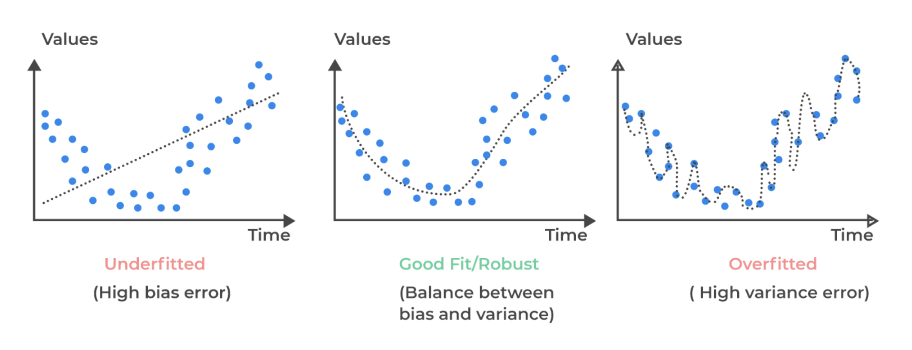
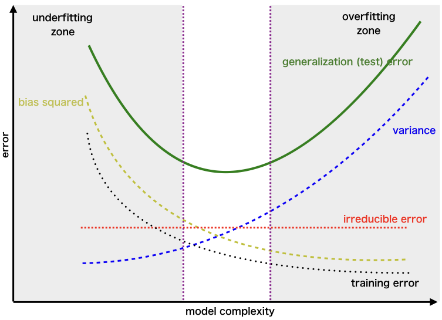
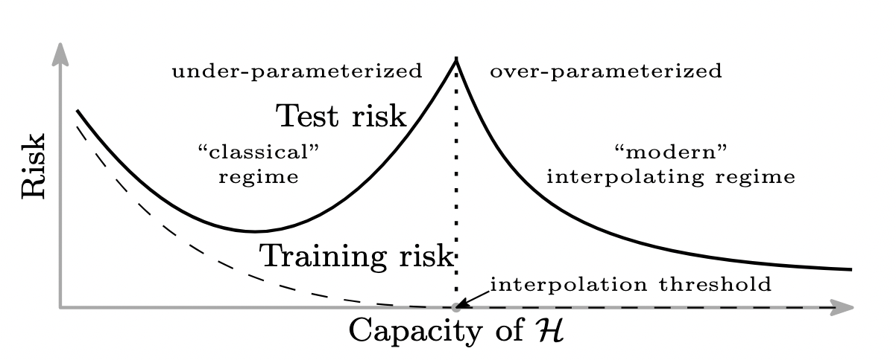
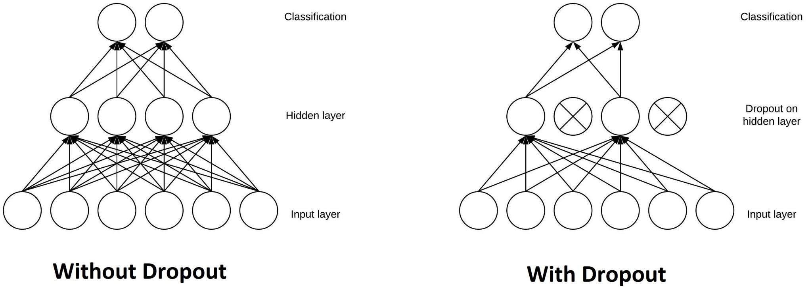

# Regularization of Neural Networks

Regularization techniques help prevent overfitting in neural networks by constraining the model's complexity, enabling better generalization to unseen data. This lecture examines several key regularization methods used in modern neural networks.

## Overfitting

Overfitting is a problem that arises when the model fits the training data too well, making it unable to predict well using new data. 



Modern neep neural network models have a large number of parameters, which makes them prone to overfitting. Therefore, we need to use regularization techniques to prevent overfitting.

### Double Descent


The classical **bias-variance trade-off** suggests that as model complexity increases, bias decreases (the model can fit the training data better) but variance increases (the model becomes more sensitive to fluctuations in the training data). You will see a typical U-shaped curve of the test error as we increase the model complexity.




Howeever, in deep learning, researchers have revealed a more complex phenomenon called **double descent**, which challenges the classical bias-variance trade-off. In double descent:

1. The test error initially follows the classical U-shaped curve as model complexity increases
2. However, at a critical threshold (often when the model has just enough capacity to fit the training data perfectly (**overparameterized**)), test error spikes dramatically
3. Surprisingly, as model complexity continues to increase beyond this threshold, test error begins to decrease again

This creates a "double descent" curve where test error decreases, then increases, then decreases again. This phenomenon suggests that in many deep learning scenarios, larger models can actually generalize better, contrary to traditional statistical wisdom.



Double descent has been observed across various neural network architectures and helps explain why modern overparameterized networks can generalize well despite having far more parameters than training examples. However, this does not mean double descent is always the case for deeper neural networks. In practice, we still need to implement regularization techniques if the model is hard to generalize.


## L2 Regularization

L2 regularization, also known as **weight decay** in Pytorch, is one of the most common regularization techniques. It adds a penalty term to the loss function that is proportional to the squared magnitude of the weights.


Neural networks with large weights often create sharp transitions in the decision boundary, making them more likely to overfit the training data. L2 regularization encourages the network to use smaller weights, resulting in smoother decision boundaries and better generalization.

Given the original loss function $L_0(\theta)$ where $\theta$ represents all model parameters, the L2 regularized loss is:

$$
L(\theta) = L_0(\theta) + \frac{\lambda}{2} \|\theta\|_2^2
$$

where $\lambda$ is the regularization strength hyperparameter. The gradient of this term with respect to each weight is simply $\lambda w$, which means during gradient descent, each weight update includes a term that shrinks the weight proportionally to its magnitude:

$$
w \leftarrow w - \eta \left( \frac{\partial L_0}{\partial w} + \lambda w \right) = (1 - \eta\lambda)w - \eta\frac{\partial L_0}{\partial w}
$$

where $\eta$ is the learning rate. This effectively scales the weight by a factor slightly less than 1 at each update, hence the name "weight decay."

**PyTorch Implementation**

In PyTorch, L2 regularization is implemented simply by adding the `weight_decay` parameter to the optimizer:

```python
# Create optimizer with L2 regularization (weight_decay)
optimizer = optim.Adam(model.parameters(), lr=0.001, weight_decay=0.0001)
```

The `weight_decay` parameter corresponds to the $\lambda$ in the mathematical formulation.

## Dropout

Dropout is a powerful regularization technique that randomly "drops out" (sets to zero) a fraction of neurons during each training iteration, effectively training a different sub-network each time.


When neurons co-adapt and develop complex dependencies during training, the network may become overly specialized to the training data. Dropout forces neurons to learn more robust features by preventing them from relying too heavily on specific neurons. It can be viewed as implicitly training an ensemble of many sub-networks, which are averaged at test time.


For a layer with output $\mathbf{y}$, dropout applies:

$$
\mathbf{y} = \frac{\mathbf{m} \odot \mathbf{a}}{p}
$$

where $\mathbf{a}$ is the pre-dropout activation, $\odot$ is element-wise multiplication, and $\mathbf{m}$ is a binary mask where each element is drawn from a Bernoulli distribution with probability $p$ (keep probability):

$$
m_i \sim \text{Bernoulli}(p)
$$




### PyTorch Implementation

In PyTorch, dropout is implemented using the `nn.Dropout` module:

```python
import torch.nn as nn

class TwoLayerNet(nn.Module):
    def __init__(self, D_in, H, D_out): 
        super().__init__()
        self.net = nn.Sequential(
            nn.Linear(D_in, H),
            nn.ReLU(),
            nn.Dropout(p=0.5),
            nn.Linear(H, D_out)
        )

    def forward(self, x): 
        return self.net(x)
```


!!! warning "Dropout only during training"

    The dropout is only active during training. You need to call `model.train()` before training and `model.eval()` during evaluation. We also do  suggest using `torch.nn.Dropout`  instead of `torch.nn.functional.dropout` when defining your model with dropout. If you use `torch.nn.functional.dropout`, the dropout will be applied even during evaluation.


## Batch Normalization

Deep neural networks can suffer from internal covariate shift, where the distribution of each layer's inputs changes during training as the parameters of previous layers change. This slows down training and may lead to vanishing/exploding gradients. Batch normalization addresses this by normalizing layer inputs, allowing higher learning rates, reducing the sensitivity to initialization, and acting as a form of regularization.


For a mini-batch of activations $\mathbf{x} = \{x_1, x_2, ..., x_m\} = \mathcal{B}$ for a particular neuron, batch normalization performs:

$$
   \text{BN}(\mathbf{x}) = \gamma \odot \frac{\mathbf{x} - \mu_{\mathcal{B}}}{\sqrt{\sigma_{\mathcal{B}}^2 + \epsilon}} + \beta
$$

where $\mu_{\mathcal{B}}$ and $\sigma_{\mathcal{B}}$ are the batch mean and variance of $\mathbf{x}$, $\epsilon$ is a small constant for numerical stability, $\gamma$ and $\beta$ are learnable parameters that allow the network to undo the normalization if needed.


**PyTorch Implementation**

In PyTorch, batch normalization is implemented using `nn.BatchNorm1d`, `nn.BatchNorm2d`, or `nn.BatchNorm3d` depending on the input dimensions:

```python
import torch.nn as nn

class MyModel(nn.Module):
    def __init__(self, input_size, hidden_size, output_size):
        super().__init__()
        self.net = nn.Sequential(
            nn.Linear(input_size, hidden_size),
            nn.BatchNorm1d(hidden_size),
            nn.ReLU(),
            nn.Linear(hidden_size, output_size)
        )
        
    def forward(self, x):
        return self.net(x)
```

Batch normalization is typically applied before the activation function, though some research suggests applying it after the activation can be beneficial in certain cases.

