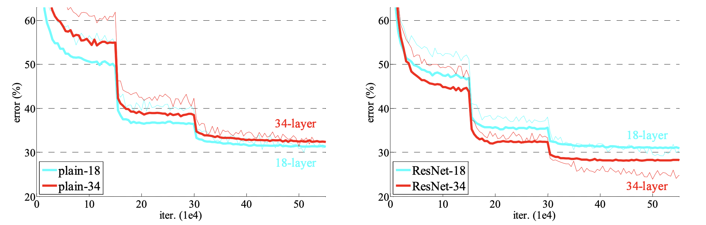
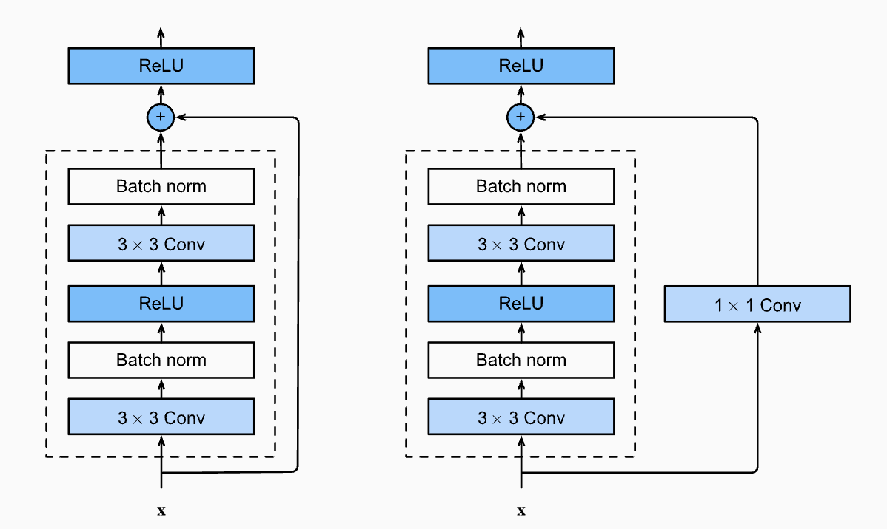

# Residual Networks 


As neural networks grew deeper, researchers encountered a counterintuitive problem: adding more layers to a deep network led to higher training error, not just higher testing error. This phenomenon, known as the **degradation problem**, could not be explained by overfitting alone.

The issue wasn't just [vanishing gradients](nn.md#gradient-vanishing) (which can be partially addressed by proper initialization and batch normalization), but rather the difficulty in optimizing very deep networks. Traditional deep networks struggle to learn identity mappings when they would be optimal, leading to degraded performance as depth increases. The following figure shows a training curve (non-bold line) and testing curve (bold line) on the ImageNet dataset with a network of depth 18 and 34. The left plot uses a traditional deep network and you can see that the validation error increases when model becomes deeper. 



Theoretically, a deeper network should be able to perform at least as well as a shallower one (by learning identity mappings in the added layers), but in practice, directly stacking more layers made optimization more difficult.

## Residual Networks

To overcome the degradation problem, [Kaiming He et al. (2015)](https://arxiv.org/abs/1512.03385) proposed a new architecture called **Residual Networks** (ResNet) which uses **skip connections** (also called shortcut connections) to help the network learn identity mappings.

The key insight of ResNet is the introduction of **residual learning** through **skip connections**. Instead of hoping that stacked layers directly fit a desired underlying mapping $F(x)$, we explicitly let these layers fit a residual mapping 

$$
H(x) = F(x) + x.
$$


This reformulation makes it easier for the network to learn identity mappings (when optimal) by simply pushing the weights of the residual function $F(x)$ toward zero.


### Skip connections

When the input and output dimensions are the same, the skip connection is simply combination: $H(x) = F(x) + x$.

When the dimensions of $x$ and $F(x)$ are different, the skip connection is a linear projection of the input to match the dimensions of the output: $H(x) = F(x) + Wx$. In practice, we use a 1x1 convolution to match the dimensions of the input and output:

```python
# You can choose the stride to match the dimensions of the input and output
Y = nn.functional.conv2d(in_channels, out_channels, kernel_size=1, stride=stride, padding=0, bias=False)(X)
output = Y + F(X)
```



In order to make the skip connection robust to different dimensions, we use a 1x1 convolution to match the dimensions of the input and output.


Here is the suggested practice for implementing the residual block:

- Use a 1x1 convolution to match the dimensions of the input and output.
- Add an `if` statement to check if the dimensions of the input and output are the same. If they are, use the identity skip connection. If they are not, use the 1x1 convolution to match the dimensions of the input and output.
- If you need to downsample the input, always downsample in the first convolutional layer of the residual block controlled by `stride` and use the same `stride` for the 1x1 convolution skip connection.

```python
import torch
import torch.nn as nn

class ResidualBlock(nn.Module):
    def __init__(self, in_channels, out_channels, stride=1):
        super().__init__()
        
        self.conv1 = nn.Conv2d(in_channels, out_channels, kernel_size=3,
                               stride=stride, padding=1, bias=False)
        self.bn1 = nn.BatchNorm2d(out_channels)
        
        self.conv2 = nn.Conv2d(out_channels, out_channels, kernel_size=3,
                               stride=1, padding=1, bias=False)
        self.bn2 = nn.BatchNorm2d(out_channels)

        # Robust shortcut logic for downsampling or channel mismatch
        if in_channels != out_channels or stride != 1:
            self.shortcut = nn.Sequential(
                nn.Conv2d(in_channels, out_channels, kernel_size=1,
                          stride=stride, bias=False),
                nn.BatchNorm2d(out_channels) # Batch normalization is used to stabilize the output of the skip connection
            )
        else:
            self.shortcut = nn.Identity()

    def forward(self, x):
        out = torch.relu(self.bn1(self.conv1(x)))
        out = self.bn2(self.conv2(out))
        out += self.shortcut(x)
        return torch.relu(out)
```


## ResNet Architecture

We will use ResNet18 as an example to understand the architecture of ResNet.


ResNet18 consists of:

1. **Initial Convolution**: 7×7 Conv, 64 filters, stride 2
2. **Max Pooling**: 3×3 MaxPool, stride 2
3. **4 Stages of Residual Blocks**:
   - Stage 1: 2 residual blocks, 64 filters
   - Stage 2: 2 residual blocks, 128 filters
   - Stage 3: 2 residual blocks, 256 filters 
   - Stage 4: 2 residual blocks, 512 filters
4. **Global Average Pooling**
5. **Fully Connected Layer**: 512 to num_classes


Each stage (except the first) begins with a residual block that has stride 2 to perform downsampling. The spatial dimensions are halved while the number of filters is doubled, maintaining computational complexity per layer. The bashed line in the above figure is the skip connection with different dimensions. And the solid line is the identity skip connection.

With the `ResidualBlock` defined in the previous section, we can implement the ResNet18 architecture:

```python
class ResNet18(nn.Module):
    def __init__(self, num_classes):
        super().__init__()
        self.conv1 = nn.Conv2d(3, 64, kernel_size=7, stride=2, padding=3)
        self.bn1 = nn.BatchNorm2d(64)
        self.relu = nn.ReLU()
        self.maxpool = nn.MaxPool2d(kernel_size=3, stride=2, padding=1)

        # Stage 1
        self.layer1 = nn.Sequential(
            ResidualBlock(64, 64),
            ResidualBlock(64, 64)
        )

        # Stage 2
        self.layer2 = nn.Sequential(
            ResidualBlock(64, 128, stride=2),
            ResidualBlock(128, 128)
        )

        # Stage 3
        self.layer3 = nn.Sequential(
            ResidualBlock(128, 256, stride=2),
            ResidualBlock(256, 256)
        )

        # Stage 4
        self.layer4 = nn.Sequential(
            ResidualBlock(256, 512, stride=2),
            ResidualBlock(512, 512)
        )

        self.avgpool = nn.AdaptiveAvgPool2d((1, 1))
        self.fc = nn.Linear(512, num_classes)

    def forward(self, x):
        x = self.conv1(x)
        x = self.bn1(x)
        x = self.relu(x)
        x = self.maxpool(x)

        x = self.layer1(x)
        x = self.layer2(x)
        x = self.layer3(x)
        x = self.layer4(x)

        x = self.avgpool(x)
        x = x.view(x.size(0), -1)
        x = self.fc(x)
        return x
```

