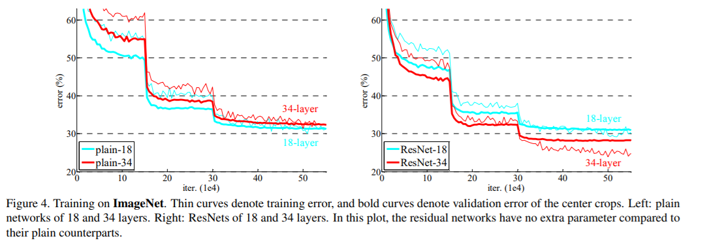
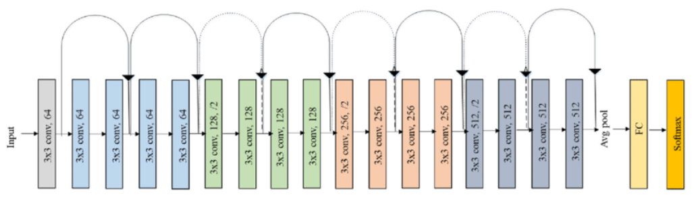

# Residual Networks (ResNet)


As convolutional neural networks grew deeper, researchers encountered a counterintuitive problem: adding more layers to a deep network led to **higher training error**, not just higher testing error. This phenomenon, known as the **degradation problem**, could not be explained by overfitting alone.

The issue wasn't just vanishing gradients (which can be partially addressed by proper initialization and batch normalization), but rather the difficulty in optimizing very deep networks. Traditional deep networks struggle to learn identity mappings when they would be optimal, leading to degraded performance as depth increases.



Theoretically, a deeper network should be able to perform at least as well as a shallower one (by learning identity mappings in the added layers), but in practice, directly stacking more layers made optimization more difficult.

## Residual Networks

The key insight of ResNet is the introduction of **residual learning** through **skip connections** (also called shortcut connections). Instead of hoping that stacked layers directly fit a desired underlying mapping $H(x)$, we explicitly let these layers fit a residual mapping $F(x) = H(x) - x$.

The original mapping is then recast as:

$$H(x) = F(x) + x$$

This reformulation makes it easier for the network to learn identity mappings (when optimal) by simply pushing the weights of the residual function $F(x)$ toward zero.


## ResNet Architecture

We will use ResNet18 as an example to understand the architecture of ResNet.

ResNet18 is a groundbreaking architecture that helped solve the degradation problem in deep neural networks. Introduced by Kaiming He et al. in their seminal 2015 paper "Deep Residual Learning for Image Recognition", ResNet won the 2015 ImageNet Large Scale Visual Recognition Challenge (ILSVRC) with a top-5 error rate of 3.57%, surpassing human-level performance.

The success of ResNet18 and its deeper variants (ResNet50, ResNet101, etc.) demonstrated that very deep networks could be effectively trained using residual connections. This was a major breakthrough, as previous attempts to train very deep networks had failed due to optimization difficulties. The residual learning framework enabled the training of networks with hundreds or even thousands of layers.


ResNet18 consists of:

1. **Initial Convolution**: 7×7 Conv, 64 filters, stride 2
2. **Max Pooling**: 3×3 MaxPool, stride 2
3. **4 Stages of Residual Blocks**:
   - Stage 1: 2 residual blocks, 64 filters
   - Stage 2: 2 residual blocks, 128 filters
   - Stage 3: 2 residual blocks, 256 filters 
   - Stage 4: 2 residual blocks, 512 filters
4. **Global Average Pooling**
5. **Fully Connected Layer**: 512 to num_classes

Each stage (except the first) begins with a residual block that has stride 2 to perform downsampling. The spatial dimensions are halved while the number of filters is doubled, maintaining computational complexity per layer.



## PyTorch Implementation

PyTorch provides built-in implementations of ResNet architectures, but let's implement ResNet18 from scratch to understand its structure.

### Basic Residual Block

```python
import torch
import torch.nn as nn

class ResidualBlock(nn.Module):
    def __init__(self, in_channels, out_channels, stride=1):
        super().__init__()
        
        self.conv1 = nn.Conv2d(in_channels, out_channels, kernel_size=3, 
                              stride=stride, padding=1, bias=False)
        self.bn1 = nn.BatchNorm2d(out_channels)
        
        self.conv2 = nn.Conv2d(out_channels, out_channels, kernel_size=3, 
                              stride=1, padding=1, bias=False)
        self.bn2 = nn.BatchNorm2d(out_channels)
        
        self.shortcut = nn.Sequential()
        # If dimensions change, create a projection shortcut
        if stride != 1 or in_channels != out_channels:
            self.shortcut = nn.Sequential(
                nn.Conv2d(in_channels, out_channels, kernel_size=1, 
                          stride=stride, bias=False),
                nn.BatchNorm2d(out_channels)
            )
            
    def forward(self, x):
        residual = x
        
        out = self.conv1(x)
        out = self.bn1(out)
        out = nn.ReLU()(out)
        
        out = self.conv2(out)
        out = self.bn2(out)
        
        out += self.shortcut(residual)
        out = nn.ReLU()(out)
        
        return out
```


### Using Pre-trained ResNet

PyTorch's torchvision package provides pre-trained ResNet models:

```python
import torch
import torchvision.models as models

# Load pre-trained ResNet18
resnet18 = models.resnet18(pretrained=True)

# For inference
resnet18.eval()
input_tensor = torch.randn(1, 3, 224, 224)
with torch.no_grad():
    output = resnet18(input_tensor)
    
# For fine-tuning on a new task
num_classes = 10  # New number of classes
resnet18.fc = nn.Linear(512, num_classes)  # Replace the final fully connected layer
```
