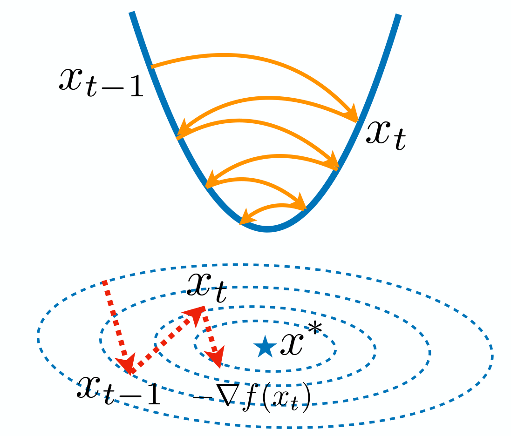
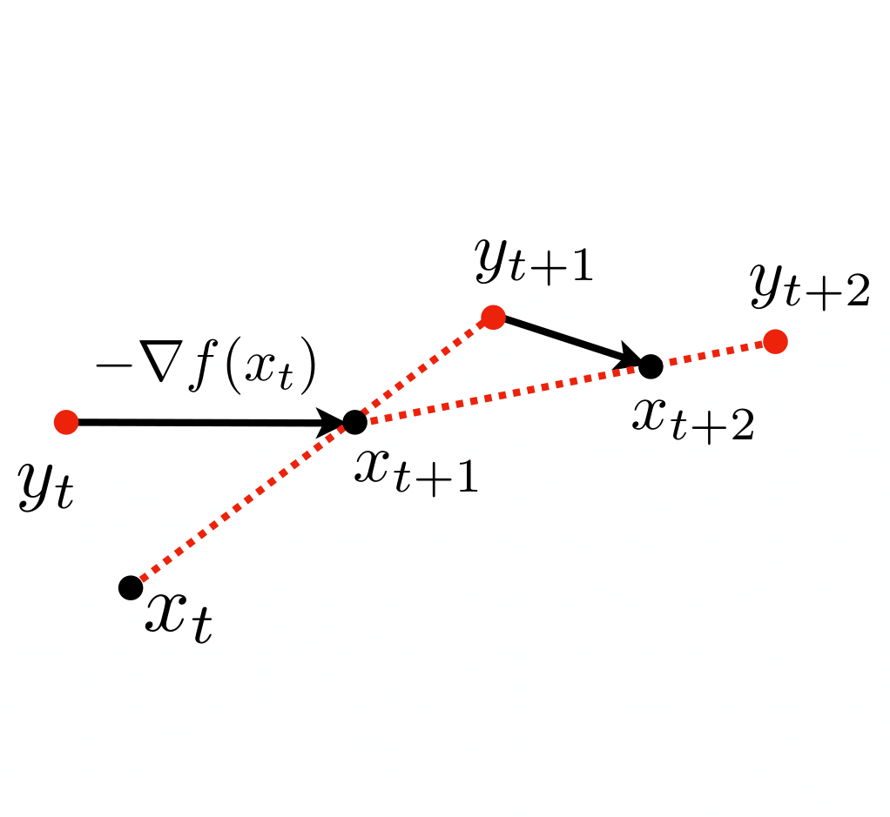
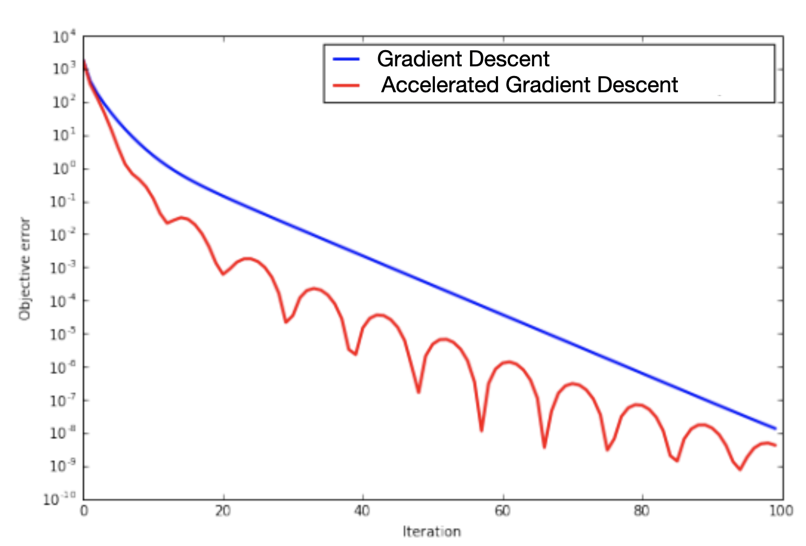

# Accelerated Gradient Descent

Looking at the trajectory of gradient descent, we notice it often follows a zigzag pattern. This happens because the steepest descent direction only uses local information about the objective function, making it shortsighted. Can we design an algorithm that converges faster?



We might consider these strategies to improve upon gradient descent:
- Use the history of the trajectory
- Add momentum for a smoother path

Instead of only using the local gradient at $x_t$, we can combine $-\nabla f(x_t)$ with information from previous points, like $x_t - x_{t-1}$. This creates a more stable direction with less zigzagging. Nesterov proposed the following accelerated gradient descent algorithm: This idea is also called "momentum", borrowed the intuition from the physics.


<!-- **Nesterov's Accelerated Gradient Descent (AGD)**: Initialize $x_0$，$m_0 = 0$, and choose $\beta_t = \frac{t}{t+3}$, then:

$$
\begin{align*}
m_{t+1} &= \beta_t m_t + \eta_t \nabla f(x_{t}+\beta_t m_t)\\
x_{t+1} &= x_t - m_{t+1}
\end{align*}
$$ -->

!!!abstract "Nesterov's Accelerated Gradient Descent (AGD)"

    Initialize $x_0$，$m_0 = 0$, and choose $\beta_t = \frac{t}{t+3}$, then:

    $$
    \begin{align*}
    m_{t+1} &= \beta_t m_t + \eta_t \nabla f(x_{t}+\beta_t m_t)\\
    x_{t+1} &= x_t - m_{t+1}
    \end{align*}
    $$

Nesterov's AGD is a “lookahead” version of the momentum method by looking ahead for the gradient at $y_{t+1}  = x_t + \beta_t m_t = x_{t+1} + \beta_t (x_{t+1} - x_t)$.

Here is the implementation of Nesterov's AGD in PyTorch:

```python
def f(x):
    ... # define the objective function

# Initialize parameters
x = torch.zeros(dim, requires_grad=True)  # Initialize x
m = torch.zeros(dim)  # Initialize momentum m

# AGD parameters
lr = 0.1  # Learning rate (η_t)
num_iters = 100  # Number of iterations
for t in range(num_iters):
    beta_t = t / (t + 3)  # Compute β_t

    # Compute the gradient at x_t + β_t * m_t
    y = x + beta_t * m  # Look-ahead step
    loss = f(y)
    loss.backward()

    with torch.no_grad():
        # Update momentum
        m_new = beta_t * m + lr * y.grad
        # Update x
        x -= m_new
        # Update variables for the next iteration
        m.copy_(m_new)  # In-place update of m
        x.grad.zero_()  # Reset gradient
```

Notice you need to use in-place operations for momentum like `m.copy_(m_new)` to maintain the connection to the computational graph. The momentum term `m` is used in the look-ahead step `y = x + beta_t * m`, and this relationship must be maintained correctly.




**General momentum update**: The momentum method has the following update:

$$
\begin{align*}
m_{t+1} &= \beta m_t + \nabla f(x_{t})\\
x_{t+1} &= x_t - \eta_t m_{t+1}
\end{align*}
$$


Unlike gradient descent, momentum method uses the history of the trajectory:

$$
m_{t+1} = \beta m_t +  \nabla f(x_{t}) = \beta^2 m_{t-1} + \beta \nabla f(x_{t-1}) + \nabla f(x_{t}) = \cdots = \sum_{i=0}^{t} \beta^{t-i} \nabla f(x_{i})
$$


Therefore, the momentum is a weighted average of the gradients in the history trajectory. 

Because it uses historical information, AGD's trajectory is not monotonically decreasing toward the minimum.




**Theorem** (Convergence of AGD): Let $f$ be convex and $L$-smooth. If we choose $\eta_t = 1/L$, then Nesterov's accelerated gradient descent achieves:

$$
f(x_t) - f(x^*) \leq \frac{2L\|x_0 - x^*\|_2^2}{(t+1)^2}
$$

This means AGD has a convergence rate of $O(1/t^2)$, which is faster than gradient descent's $O(1/t)$ rate. In other words, for convex and smooth functions, AGD can achieve $\epsilon$-accuracy within $O(1/\sqrt{\epsilon})$ steps. 


