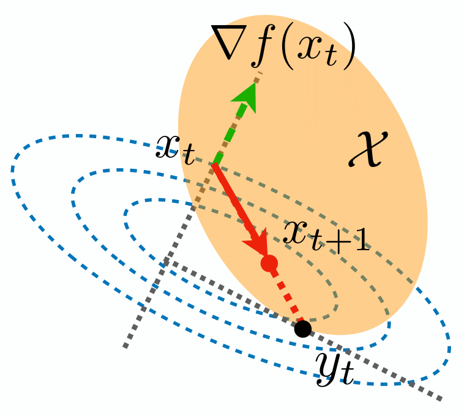
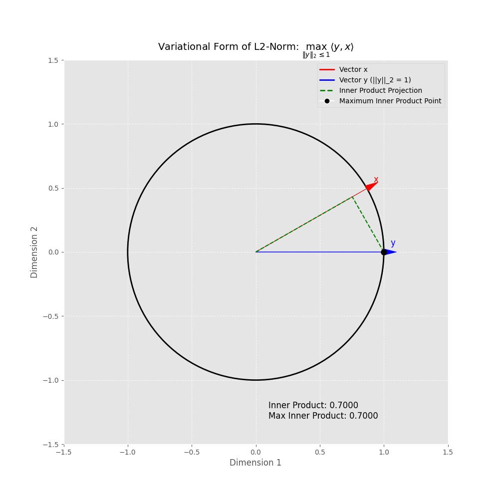
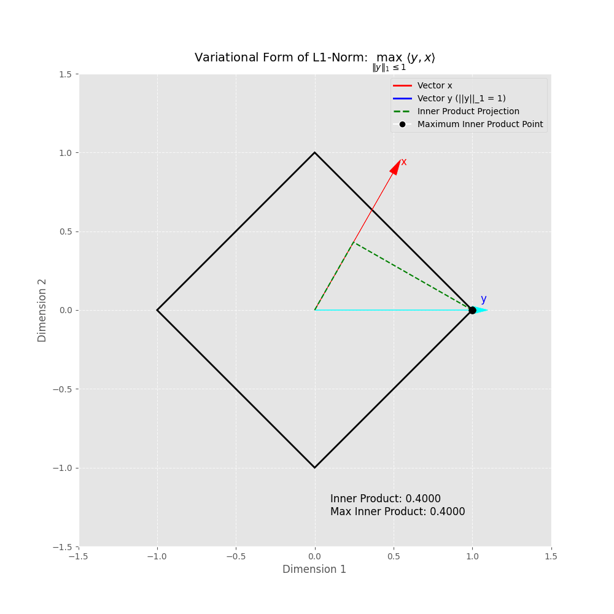

# Gradient Descent


We'll explore algorithms for solving convex optimization problems of the form:

$$
\min_{x \in \mathcal{X}} f(x), \text{ where $f$ and $\mathcal{X}$ are convex}
$$

Our goal is to find the minimizer $x^* = \arg\min_{x\in \mathcal{X}}f(x)$. Let's start with the unconstrained case where $\mathcal{X} = \mathbb{R}^d$.

If we begin our search at some point $x_0$, we want to move in a direction that decreases the value of $f(x)$. When moving along direction $d$ with a small step size $\tau$, the decrease in the objective function is:

$$
\lim_{\tau \rightarrow 0}\frac{f(x_0+\tau d) - f(x_0)}{\tau} = \nabla f(x_0)^\top d
$$

To maximize this decrease, we should choose $d = -\nabla f(x_0)$. This means the negative gradient $-\nabla f(x_0)$ provides the steepest descent direction when we only have local information about $f(x)$ at point $x_0$. This insight leads to the gradient descent algorithm.

!!! abstract "Gradient Descent Algorithm"

    Starting at point $x_0 \in \mathbb{R}^d$, iterate as follows:

    $$
    x_{t+1} = x_t -\eta_t\nabla f(x_t)
    $$
    
    where $\eta_t$ is the step size (also called learning rate).

Here is the implementation of gradient descent in PyTorch:

```python
import torch
def f(x): # objective function
    return x**2

# Initialize x
x = torch.tensor([2.0], requires_grad=True)
lr = 0.1 # learning rate
for t in range(100):
    y = f(x)
    y.backward()
    with torch.no_grad():
        x -= lr * x.grad
    x.grad.zero_()
```


### Convergence of Gradient Descent

The following theorem shows how quickly gradient descent converges:

**Theorem** (Convergence of gradient descent): Let $f$ be convex and $L$-smooth. If we choose $\eta_t = 1/L$, then gradient descent achieves:

$$
f(x_t) - f(x^*) \leq \frac{2L\|x_0 - x^*\|_2^2}{t}
$$

This means gradient descent has a convergence rate of $O(1/t)$, or equivalently, it can achieve $\epsilon$-accuracy ($f(x_t) - f(x^*) \leq \epsilon$) within $O(1/\epsilon)$ steps.


### Learning Rate

Choosing the learning rate $\eta_t$ is vital for the convergence of optimization algorithms. The theorem above suggests that we can choose $\eta_t = 1/L$ for all iterations. However, this is not practical because it requires knowing the smoothness parameter $L$ in advance. Also different algorithms may have different strategies for choosing $\eta_t$.

In practice, we have different strategies for choosing $\eta_t$. The tricky part is to choose $\eta_t$ to be small enough to ensure convergence, but not too small to slow down the convergence.

**Dynamic learning rate**. One common strategy is make the learning rate decreasing over time. The common choices are:

$$
\begin{align*}
\eta_t &= \eta_i, \text{ for } t_i \leq t < t_{i+1} & \text{Piecewise constant}\\
\eta_t &= \eta_0 e^{-\lambda t} & \text{Exponentially decay}\\
\eta_t &= \eta_0 (1+\beta t)^{-\alpha} & \text{Polynomial decay}\\
\end{align*}
$$

A popular choice is the polynomial decay with $\alpha = 0.5$. We refer to the paper [Izmailov et al., 2018](https://arxiv.org/pdf/1803.05407) for more sophisticated strategies for choosing $\eta_t$.

**Backtracking Line search**. Another strategy is to choose $\eta_t$ by a line search. We aim to find the learning rate $\eta$ along the direction of $p$ such that $f(x+\eta p)$ is sufficiently smaller than $f(x)$.

One popular choice is the Armijo rule: Given initial step size $\eta_0$, reduction factor $\beta \in (0,1)$, and constant $c \in (0,1)$:

1. Set $\eta = \eta_0$
2. While $f(x+\eta p) > f(x) + c\eta \nabla f(x)^\top p$:
    Reduce step size: $\eta = \beta\eta$
3. Return $\eta$

The algorithm starts with a large step size and gradually reduces it until finding an $\eta$ that gives sufficient decrease. Common choices are $\beta = 0.5$ and $c = 0.1$.

Backtracking line search requires multiple evaluations of $f(x+\eta p)$ which can be expensive. For large-scale problems like deep learning, it is not practical.


## Frank-Wolfe Algorithm

Now let's consider the constrained problem $\min_{x \in \mathcal{X}} f(x)$. The standard gradient descent might cause $x_t$ to leave the constraint set $\mathcal{X}$. As shown in the figure below, we still want to find the steepest descent direction, but we need to ensure that $x_t$ remains in $\mathcal{X}$ for all iterations.



Starting with $x_0 \in \mathcal{X}$, we want to find the steepest descent direction $d = x - x_0$ with $x \in \mathcal{X}$ by solving:

$$
\arg\min_{x \in \mathcal{X}}\langle\nabla f(x_0), x - x_0\rangle = \arg\min_{x \in \mathcal{X}} \langle\nabla f(x_0), x \rangle
$$

This leads to the Frank-Wolfe algorithm:

!!! abstract "Frank-Wolfe Algorithm"

    $$
    \begin{align*}
    y_t &= \arg\min_{x \in \mathcal{X}} \langle\nabla f(x_t), x \rangle\\
    x_{t+1} &= x_t + \eta_t (y_t - x_t)
    \end{align*}
    $$

where $\eta_t$ is the step size.

We will use the Frank-Wolfe algorithm when the first sub-optimization problem is easy to solve. We have the following two examples.


### Example: Power Iteration

The leading eigenvector of a positive semi-definite matrix $A$ is the solution to:

$$
\max_{\|x\|_2 \leq 1} x^\top A x = \min_{\|x\|_2 \leq 1} -x^\top A x
$$

Although $f(x) = -x^\top A x$ is concave (not convex) when $A \succeq 0$, we can still apply the Frank-Wolfe algorithm. We need to solve:

$$
y_t = \arg\min_{\|x\|_2 \leq 1} \langle\nabla f(x_t), x \rangle = -\frac{\nabla f(x_t)}{\|\nabla f(x_t)\|_2} = \frac{Ax_t}{\|Ax_t\|_2}
$$

where we use the fact that $\arg\max_{\|x\|_2 \leq 1} \langle y, x \rangle = y/\|y\|_2$, which can be shown by the plot below.



This gives us the update rule:

$$
x_{t+1} = x_t + \eta_t\left(\frac{Ax_t}{\|Ax_t\|_2} - x_t\right) = (1-\eta_t)x_t + \eta_t\frac{Ax_t}{\|Ax_t\|_2}
$$

Choosing the optimal step size $\eta_t = 1$ yields $x_{t+1} = \frac{Ax_t}{\|Ax_t\|_2}$, which is the power iteration method for finding the leading eigenvector of $A$.

### Example: Constrained Lasso

The following two constrained Lasso formulations are equivalent:

$$
\min_{\beta} \|Y - X\beta\|_2^2 \text{ s.t. } \|\beta\|_1 \leq \lambda
\Longleftrightarrow
\min_{\beta} \|Y/\lambda - X\beta\|_2^2 \text{ s.t. } \|\beta\|_1 \leq 1
$$

So without loss of generality, we can assume $\lambda = 1$. Therefore, we aim to solve a more general constrained least squares problem:

$$
\min_{\beta} f(\beta) \text{ s.t. } \|\beta\|_1 \leq 1,
$$

where $f$ is any convex function.
Applying the Frank-Wolfe algorithm, we need to solve:

$$
y_t = \arg\min_{\|\beta\|_1 \leq 1} \langle\nabla f(\beta_t), \beta \rangle
$$

where $\nabla f(\beta_t) = -2X^\top(Y - X\beta_t)$.


Using the variational form of the $\ell_1$-norm, we know that:

$$
\arg\max_{\|y\|_1 \leq 1} \langle y,x \rangle = (0,\dots, 0,\text{sign}(x_{j^*}),0, \dots, 0)^\top
$$

where $j^* = \arg\max_{1 \leq j \leq d}|x_j|$.

The visualization of the variational form of the $\ell_1$-norm is shown below.



This gives us:

$$
\begin{align*}
(y_{t})_j &= 
\begin{cases}
-\text{sign}(\nabla_j f(\beta_t)), & \text{if } j = \arg\max_k |\nabla_k f(\beta_t)|\\
0, & \text{otherwise}
\end{cases}\\
\beta_{t+1} &= (1-\eta_t)\beta_t + \eta_ty_t
\end{align*}
$$

Since only one entry of $y_t$ is nonzero, each iteration adds at most one nonzero entry to $\beta_{t+1}$. Starting with $\beta_0 = 0$, we have $\|\beta_t\|_0 \leq t$, making the algorithm efficient and providing insight into why the $\ell_1$ constraint promotes sparsity.

Here is the implementation of the Frank-Wolfe algorithm for the constrained Lasso problem:

```python
import torch
# Define the function f(x) = ||x||^2 (sum of squares)
def f(x):
    return torch.sum(x**2)

# Initialize multi-dimensional x
x = torch.tensor([2.0, -3.0, 1.5], requires_grad=True)  # Example 3D vector
# Learning rate
lr = 0.1
for t in range(100):
    # Compute function value
    y = f(x)
    # Compute gradient
    y.backward()
    with torch.no_grad():
        # Compute the coordinate with the largest absolute gradient
        max_idx = torch.argmax(torch.abs(x.grad))  
        
        # Construct y_t based on Frank-Wolfe rule
        y_t = torch.zeros_like(x)
        y_t[max_idx] = -torch.sign(x.grad[max_idx])  # Only update the max index
        
        # Update using convex combination step
        x_new = (1 - lr) * x + lr * y_t
        x.copy_(x_new)
        x.grad.zero_()  
```


### Convergence of Frank-Wolfe

**Theorem** (Convergence rate of Frank-Wolfe algorithm): Let $f$ be convex and $L$-smooth. If we choose $\eta_t = \frac{2}{t+2}$, then the Frank-Wolfe algorithm achieves:

$$
f(x_t) - f(x^*) \leq \frac{2Ld_\mathcal{X}^2}{t+2}
$$

where $d_\mathcal{X}^2 = \sup_{x,y \in \mathcal{X}}\|x-y\|_2^2$.

Like gradient descent, Frank-Wolfe has a convergence rate of $O(1/t)$ for convex and smooth functions, requiring $O(1/\epsilon)$ steps to achieve $\epsilon$-accuracy. However, unlike gradient descent's constant step size, Frank-Wolfe uses a diminishing step size that doesn't depend on the smoothness parameter $L$.

