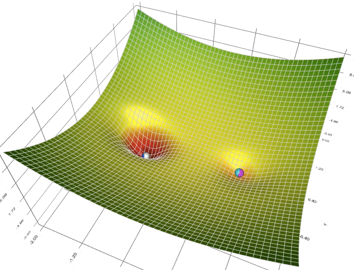

## Overview

  <a href="https://colab.research.google.com/github/junwei-lu/bst236/blob/main/bst236/codes/chapter08_optimization.ipynb"
     target="_blank"
     style="display: inline-flex; align-items: center; gap: 8px; padding: 10px 16px; background: linear-gradient(135deg, #2e7d32 0%, #66bb6a 100%); color: white; border-radius: 8px; text-decoration: none; font-weight: 600; box-shadow: 0 4px 15px rgba(46, 125, 50, 0.4);">
    <svg width="20" height="20" viewBox="0 0 24 24" fill="none" stroke="currentColor" stroke-width="2">
      <path d="M10 20l4-16m4 4l4 4-4 4M6 16l-4-4 4-4"/>
    </svg>
    Open Interactive Notebook in Colab
  </a>

This chapter covers optimization methods. We will focus on the optimization algorithms motivated by data analysis and machine learning.

## Lectures

- [Convexity](convexity.md)
- [Rate of Convergence](rate_of_convergence.md)
- [PyTorch Basics](pytorch_basics.md)
- [Gradient Descent](gradient_descent.md)
- [Accelerated Gradient Descent](agd.md)
- [Stochastic Gradient Descent](sgd.md)
- [Proximal Gradient Descent](proximal_gradient_descent.md)
- [Mirror Descent](mirror_descent.md)
- [Nesterov's Smooth Method](nesterov_smooth.md)
- [Duality and ADMM](duality_and_admm.md)