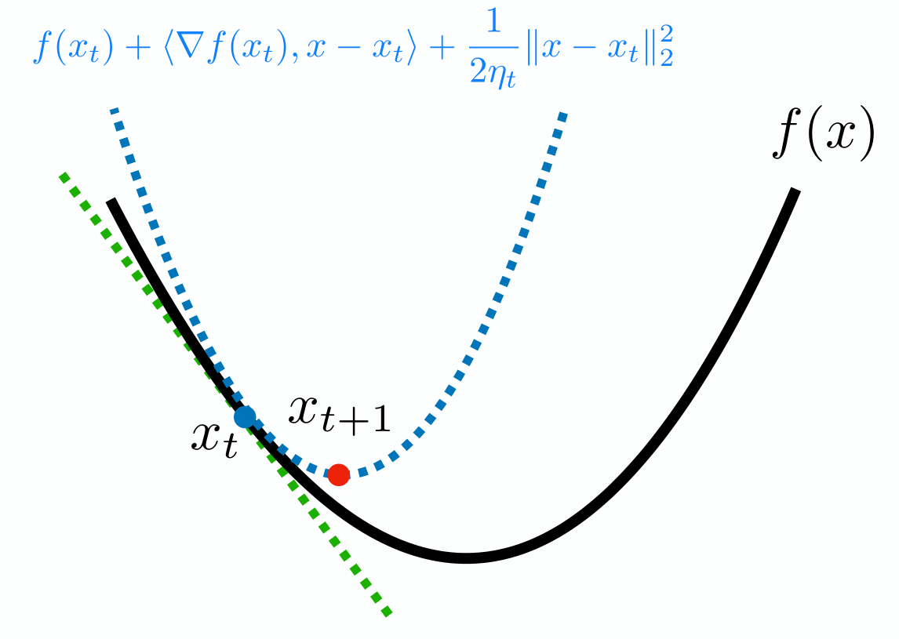
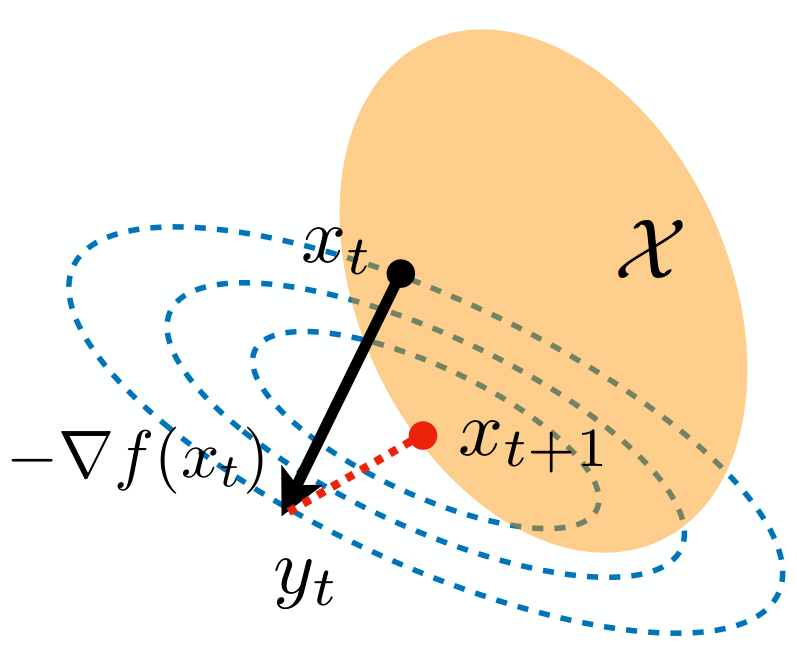
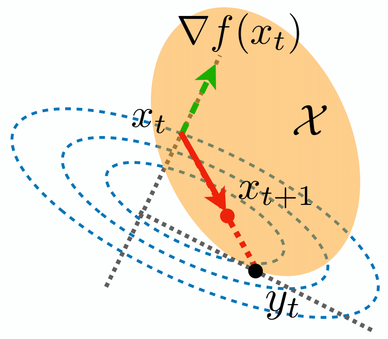
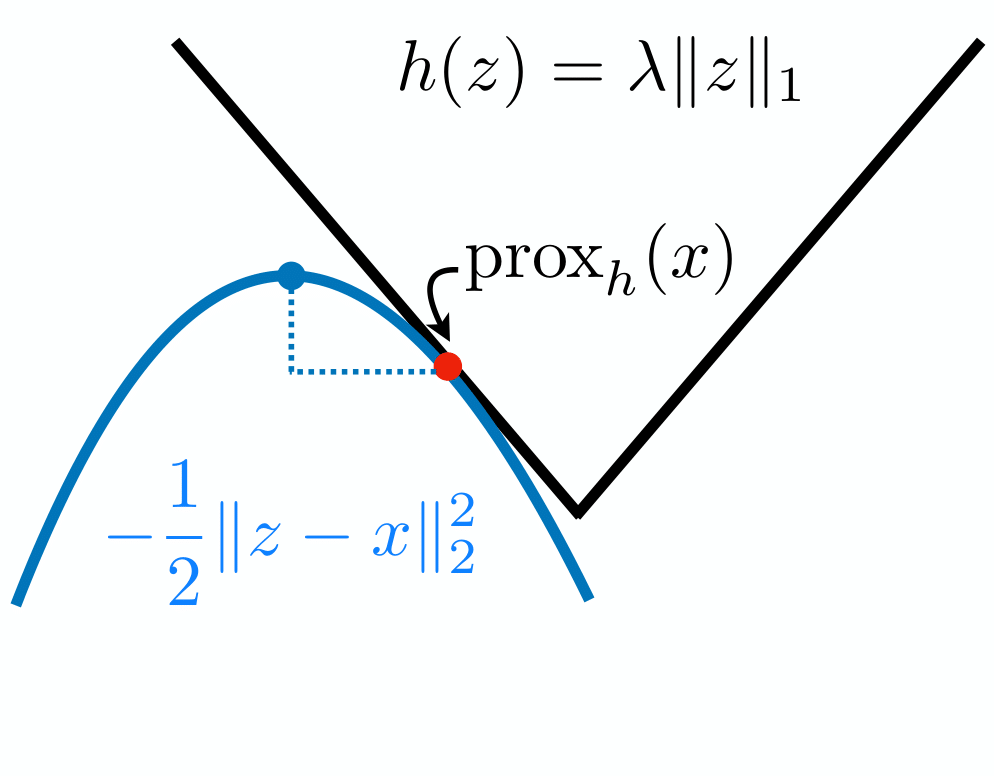
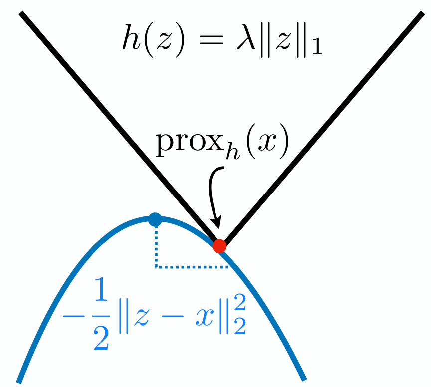

# Proximal Gradient Descent

## Proximal Perspective

In the previous lecture, we introduced gradient descent and accelerated gradient algorithms for solving unconstrained optimization problems. We showed the convergence rates of these algorithms when the objective function is smooth. However, in problems like Lasso:

$$
\min_{\beta} \frac{1}{2}\|Y - X\beta\|_2^2 + \lambda \|\beta\|_1
$$

the $\ell_1$-norm penalty term is not smooth. Many high-dimensional $M$-estimators can be formulated as:

$$
\min_{x \in \mathbb{R}^d} F(x) = \min_{x\in\mathbb{R}^d} f(x) + h(x)
$$

where $f(x)$ is the loss function, typically convex and smooth, and $h(x)$ is the penalty term, convex but usually non-differentiable. Directly applying (sub)-gradient descent to these problems deteriorates the convergence rate due to the non-smooth part.

We focus on algorithms for solving this type of composite loss, aiming for convergence rates similar to gradient descent for smooth functions. Before introducing the new algorithm, let's gain insight into gradient descent:

$$
x_{t+1} = x_t - \eta_t \nabla f(x_t)
$$

Previously, we motivated gradient descent by showing $- \nabla f(x_t)$ as the steepest descent direction. An alternative perspective is approximating $f(x)$ around $x=x_t$ with a quadratic function:

$$
f(x) \approx f(x_t)+\langle \nabla f(x_t), x-x_t\rangle + \frac{1}{2\eta_t}\|x-x_t\|_2^2
$$

Instead of minimizing $f(x)$, we minimize its quadratic approximation:

$$
x_{t+1} = \arg\min_{x\in\mathbb{R}^d}\left\{ f(x_t)+\langle \nabla f(x_t), x-x_t\rangle + \frac{1}{2\eta_t}\|x-x_t\|_2^2 \right\}
$$



This problem has a closed-form solution, which is exactly gradient descent:

$$
x_{t+1} = x_t - \eta_t \nabla f(x_t)
$$

From the proximal perspective, gradient descent minimizes a local quadratic approximation of the objective function in each iteration.

Now, let's return to the composite loss $F(x) = f(x)+h(x)$. We modify the proximal perspective of gradient descent as:

$$
x_{t+1} = \arg\min_{x\in\mathbb{R}^d}\left\{ f(x_t)+\langle \nabla f(x_t), x-x_t\rangle + \frac{1}{2\eta_t}\|x-x_t\|_2^2 + h(x) \right\}
$$

This leads to the following algorithm for solving $\min_{x\in\mathbb{R}^d} f(x)+h(x)$.

**Proximal Gradient Descent**:

Define the **proximal operator** as:

$$
{\rm prox}_h(x) = \arg\min_{z\in\mathbb{R}^d}\left\{\frac{1}{2} \|z-x\|_2^2 + h(z)\right\}
$$

The proximal gradient descent can be written as:

$$
x_{t+1} = {\rm prox}_{\eta_t h}\big(x_t - \eta_t\nabla f(x_t)\big)
$$

### Examples of Proximal Gradient Descent

#### Example: Constrained Optimization

Although proximal gradient descent is designed for unconstrained problems, we can reformulate constrained optimization $\min_{x \in \mathcal{X}} f(x)$ as the unconstrained composite form $\min_{x\in\mathbb{R}^d} f(x)+h(x)$, where the indicator function is:

$$
h(x) = \begin{cases} 0, &\text{if } x\in \mathcal{X}; \\ \infty, &\text{if } x\notin \mathcal{X}. \end{cases}
$$

Solving the proximal operator:

$$
{\rm prox}_h(x) = \arg\min_{z\in\mathbb{R}^d}\frac{1}{2}\|z-x\|_2^2 + h(z) = \arg\min_{z\in \mathcal{X}}\|z-x\|_2^2
$$

This projects $x$ onto the constraint $\mathcal{X}$. Thus, proximal gradient descent gives us the projected gradient descent algorithm for constrained optimization.

**Projected Gradient Descent**:

$$
\begin{align*}
y_t &= x_t - \eta_t\nabla f(x_t); \\
x_{t+1} &= \arg\min_{x\in \mathcal{X}}\|y_t - x\|_2^2
\end{align*}
$$




The above two figures show the comparison between the projected gradient descent and the Frank-Wolfe algorithm.

#### Example: Lasso

The $\ell_1$-penalized optimization has the objective function $\min_x f(x)+ \lambda \|x\|_1$. The proximal operator becomes the soft-threshold operator:

$$
[{\rm prox}_{h}(x)]_j = [\text{Soft-Threshold}(x,\lambda)]_j = \begin{cases} x_j-\lambda, &\text{if } x_j \ge \lambda; \\ x_j+\lambda, &\text{if } x_j \le -\lambda; \\ 0, &\text{otherwise}. \end{cases}
$$

for all $j = 1, \ldots, d$.




The above two figures show the soft-thresholding operator.
**Iterative Shrinkage-Thresholding Algorithm (ISTA)**:

Solves the Lasso problem $\min_{x \in \mathbb{R}^d} f(x)+\lambda \|x\|_1$ as:

$$
\begin{align*}
y_{t} &= x_t-\eta_t\nabla f(x_t); \\
x_{t+1} &= \text{Soft-Threshold}(y_t, \lambda\eta_t)
\end{align*}
$$

Here is the implementation of ISTA by PyTorch:

```python
import torch

# Define function f(x) = 0.5 * ||Ax - b||^2 (L2 loss)
torch.manual_seed(42)
dim = 5
A = torch.randn(dim, dim)  # Random matrix A
b = torch.randn(dim)  # Random vector b
def f(x):
    return 0.5 * torch.norm(A @ x - b)**2  # Quadratic loss function

# Soft-thresholding function
def soft_thresholding(y, threshold):
    return torch.sign(y) * torch.clamp(torch.abs(y) - threshold, min=0)

x = torch.zeros(dim, requires_grad=True)  # Initialize x

# ISTA Parameters
lr = 0.1  # Learning rate (eta_t)
lambda_ = 0.1  # Regularization parameter
num_iters = 100  # Number of iterations

for t in range(num_iters):
    loss = f(x, A, b)
    loss.backward()
    with torch.no_grad():
        # Gradient descent step
        y_t = x - lr * x.grad
        # Soft-thresholding step
        x[:] = soft_thresholding(y_t, lambda_ * lr)  

    x.grad.zero_()
```

Even if the objective function $F(x) = f(x) + h(x)$ has a non-smooth $h(x)$, the following theorem shows that proximal gradient descent has the same convergence rate $O(1/t)$ as gradient descent.

**Theorem** (Convergence rate of proximal gradient descent): Suppose $f$ is convex and $L$-smooth and $h$ is convex. If $\eta_t = 1/{L}$, the proximal gradient descent achieves:

$$
F(x_t) - F(x^*)\leq \frac{L\|x_0 - x^*\|_2^2}{2t}
$$


## Accelerated Proximal Gradient Descent

Theorem shows that proximal gradient descent has a convergence rate $O(1/t)$, similar to gradient descent. In the previous lecture, we introduced Nesterov's accelerated gradient descent, which converges faster with a rate $O(1/t^2)$.

We can apply Nesterov's idea to proximal gradient descent, resulting in the following algorithm.

**Accelerated Proximal Gradient Descent**:

Initialize $x_0 = y_0$:

$$
\begin{align*}
x_{t+1} &= {\rm prox}_{\eta_t h}\big(y_t - \eta_t \nabla f(y_t)\big); \\
y_{t+1} &= x_{t+1} + \frac{\lambda_{t}-1}{\lambda_{t+1}}(x_{t+1}- x_t)
\end{align*}
$$

where $\lambda_0 = 1, \lambda_t = \frac{1 + \sqrt{1+4\lambda_{t-1}^2}}{2}$.

For example, we can accelerate ISTA for Lasso $\min_{x} f(x)+ \lambda \|x\|_1$ using the following algorithm.

**Fast Iterative Shrinkage-Thresholding Algorithm (FISTA)**:

Solves the Lasso problem $\min_{x \in \mathbb{R}^d} f(x)+\lambda \|x\|_1$ as:

$$
\begin{align*}
x_{t+1} &= \text{Soft-Threshold}(y_t -\eta_t\nabla f(y_t), \lambda\eta_t); \\
y_{t+1} &= x_{t+1} + \frac{\lambda_{t}-1}{\lambda_{t+1}}(x_{t+1}- x_t)
\end{align*}
$$

where $\lambda_0 = 1, \lambda_t = \frac{1 + \sqrt{1+4\lambda_{t-1}^2}}{2}$ and $x_0=y_0$.

Here is the implementation of FISTA:

```python
# FISTA parameters
lr = 0.1  # Learning rate 
lambda_ = 0.1 # l1 regularization parameter
# Momentum term
lambda_t = 1.0

for t in range(100):
    # Compute function value at y_t
    loss = f(y)
    # Compute gradient using autograd
    loss.backward()
    with torch.no_grad():
        # Gradient descent step + soft-thresholding
        x_new = soft_thresholding(y - lr * y.grad, lambda_ * lr)
        # Update momentum parameter
        lambda_new = (1 + torch.sqrt(1 + 4 * lambda_t ** 2)) / 2
        # Compute y_{t+1} using acceleration
        y = x_new + ((lambda_t - 1) / lambda_new) * (x_new - x)
        # Update variables for the next iteration
        x.copy_(x_new)  # In-place update to keep autograd tracking
        lambda_t = lambda_new

    y.grad.zero_()
```

The convergence rate of accelerated proximal gradient descent is $O(1/t^2)$. 