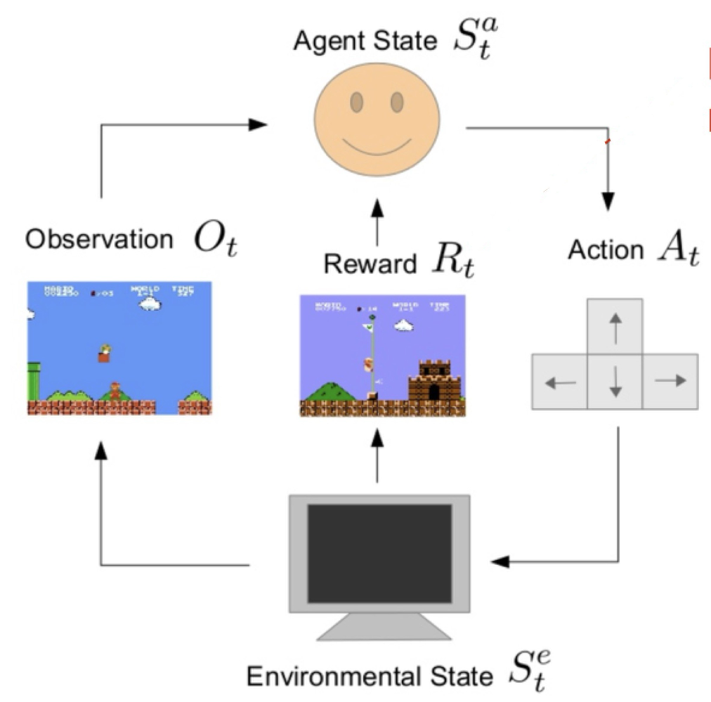
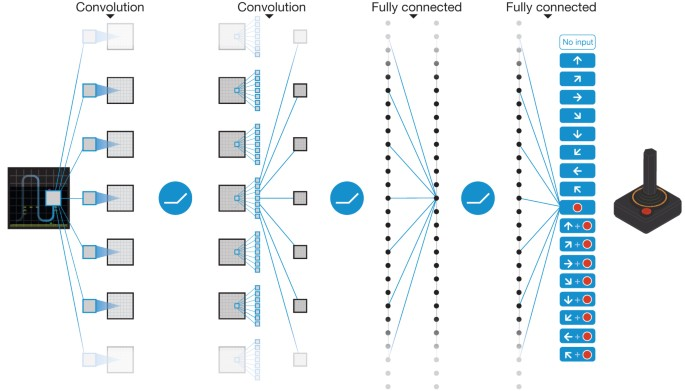

# Markov Decision Process

Reinforcement learning (RL) provides a computational approach for agents to learn optimal behaviors through interactions with their environment, aiming to maximize cumulative rewards. 
The Markov Decision Process (MDP) offers a formal mathematical structure to represent and analyze reinforcement learning scenarios.

An MDP consists of these essential elements:

- **State and observation**: A state $s$ represents a complete description of the environment at a given moment, containing all relevant information. In contrast, an observation $o$ provides only partial information about the current state. The collection of all possible states forms the state space, denoted as $\mathcal{S}$, which can be either discrete (like a chess configuration) or continuous (such as a robot's position and velocity).
- **Action**: An action $a$ represents a choice the agent makes that can be observed. The collection of all possible actions constitutes the action space, denoted as $\mathcal{A}$. This space may be discrete (such as directional movements) or continuous (like velocity vectors in a physical system).
- **Transition probability**: The transition probability $P(s'|s,a)$ defines the likelihood of reaching state $s'$ after executing action $a$ in state $s$. For continuous state spaces, this becomes a probability density function.
- **Reward function**: The reward function $R(s,a)$ specifies the immediate reward value that the agent receives after performing action $a$ in state $s$.




As the agent interacts with the environment within an MDP framework, we observe a sequence of states and actions $(s_0, a_0, s_1, a_1, \cdots, s_t, a_t)$.

<!-- 
### OpenAI Gym

OpenAI Gym is a toolkit for developing and comparing reinforcement learning algorithms. It provides a standard API for interacting with environments, and a suite of pre-implemented environments for testing and training reinforcement learning algorithms.

Initializing environments is very easy in Gym and can be done via:

```python
import gym
env = gym.make("LunarLander-v3", render_mode="human")
```

Here `render_mode="human"` will render the environment in a window.

We can initialize the environment and reset it via:

```python
state, info = env.reset()
```

The `state` is the initial state (observation) of the environment. You can have access to the observation space via `env.observation_space` and action space via `env.action_space`.

```python
print(env.observation_space)
# Box([-2.5, -2.5, -10., -10., -6.2831855, -10., -0., -0.], [2.5, 2.5, 10., 10., 6.2831855, 10., 1., 1.], (8,), float32):
# This is a continuous observation space with 8 dimensions.
print(env.action_space)
# Discrete(4): This is a discrete action space with 4 actions.
```

You can randomly sample an action from the action space via:

```python
action = env.action_space.sample()
```

Then you can take an action in the environment via:

```python
next_state, reward, terminated, truncated, info = env.step(action)
```

Here `terminated` and `truncated` are boolean variables that indicate if the episode is terminated or truncated.


## Policy

A policy is a rule used by an agent to decide what actions to take. 

A deterministic policy $\pi: \mathcal{S} \rightarrow \mathcal{A}$ is a mapping from states to actions. It represents the agent's behavior.

A stochastic policy $\pi(a|s)$ is a conditional probability distribution over actions given states. That means, given a state $s$, the policy $\pi$ will take action $a$ with probability $\pi(a|s)$. When the action space is continuous, the policy is a probability density function.

In deep RL, we deal with parameterized policies: 

$$
a_t \sim \pi_{\theta}(a|s_t) \text{ or } a_t = \pi_{\theta}(s_t)
$$

where $\theta$ is usually a neural network. In this course, we focus on the continuous state and action space with stochastic policy. In the following of this chapter, unless otherwise specified, we will presume the state and action spaces are continuous and $\pi(\cdot|s)$ is a density over action space.

Given a stochastic policy $\pi_{\theta}(a|s)$, the MDP trajectory $\tau = (s_0, a_0, r_0, s_1, a_1, r_1, \cdots, s_t, a_t, r_t)$ is generated by

$$
a_t \sim \pi_{\theta}(a|s_t) \\
s_{t+1} \sim P(s_{t+1}|s_t, a_t)\\
r_t = R(s_t, a_t)
$$

**PyTorch Implementation**

The following code shows the complete implementation of a stochastic policy in PyTorch.

```python
import gym

def sample_trajectory(env, policy, max_steps=200):
    state, _ = env.reset()
    trajectory = []
    
    for _ in range(max_steps):
        action = policy(state)  # Choose action using provided policy function
        next_state, reward, terminated, truncated, info = env.step(action)
        done = terminated or truncated
        trajectory.append((state, action, reward, next_state, done))
        state = next_state
        if done:
            break
            
    return trajectory

# For demonstration, here's an example using CartPole-v1.
env = gym.make('CartPole-v1')
# Example policy: A random policy that returns a random valid action.
def random_policy(state):
    return env.action_space.sample()
# Sample a trajectory using the random policy.
traj = sample_trajectory(env, random_policy)
for state, action, reward, next_state, done in traj:
    env.render() # visualize the current state of the environment
```

You can visualize the current state of the environment via: -->


## Value Function

In reinforcement learning, our objective is to find a policy $\pi_{\theta}$ that maximizes the expected cumulative reward

$$
J(\theta) = \mathbb{E}_{\tau \sim \pi_{\theta}} \left[R(\tau)\right], \text{ where } R(\tau) = \sum_{t=0}^{\infty} \gamma^t r_t
$$

where $\gamma$ represents the discount factor. We usually use neural networks to parameterize the policy $\pi_{\theta}$ which is called a **policy network**.



There are four key functions that are fundamental to reinforcement learning:

- **On-Policy Value Function** ($V^{\pi}(s)$): This function calculates the expected return when starting in state $s$ and following policy $\pi$ thereafter:

$$
V^{\pi}(s) = \mathbb{E}_{\tau \sim \pi}[R(\tau)| s_0 = s]
$$

- **On-Policy Action-Value Function** ($Q^{\pi}(s,a)$): This function calculates the expected return when starting in state $s$, taking action $a$ (which might not be according to the policy), and then following policy $\pi$ afterward:

$$
Q^{\pi}(s,a) = \mathbb{E}_{\tau \sim \pi}[R(\tau)| s_0 = s, a_0 = a]
$$

- **Optimal Value Function** ($V^*(s)$): This function calculates the expected return when starting in state $s$ and following the optimal policy in the environment:

$$
V^*(s) = \max_{\pi} \mathbb{E}_{\tau \sim \pi}[R(\tau)| s_0 = s]
$$

- **Optimal Action-Value Function** ($Q^*(s,a)$): This function calculates the expected return when starting in state $s$, taking action $a$, and then following the optimal policy in the environment:

$$
Q^*(s,a) = \max_{\pi} \mathbb{E}_{\tau \sim \pi}[R(\tau)| s_0 = s, a_0 = a]
$$

### Advantage Functions

In reinforcement learning, we often need to measure how much better one action is compared to the average action in a given state. This is captured by the advantage function:

$$
A^{\pi}(s,a) = Q^{\pi}(s,a) - V^{\pi}(s)
$$

The advantage function $A^{\pi}(s,a)$ quantifies the relative benefit of taking a specific action $a$ in state $s$, compared to selecting an action randomly according to policy $\pi(·|s)$, assuming you follow policy $\pi$ thereafter.

## Bellman Equation

All four value functions satisfy recursive self-consistency equations known as **Bellman equations**.

For the on-policy value functions, the Bellman equations are:

$$
\begin{align*}
V^{\pi}(s) &= \mathbb{E}_{a' \sim \pi, s'\sim P}[r(s,a') + \gamma V^{\pi}(s')], \\
Q^{\pi}(s,a) & = \mathbb{E}_{s'\sim P, a'\sim \pi}[r(s,a) + \gamma V^{\pi}(s')] = \mathbb{E}_{s'\sim P, a'\sim \pi}[r(s,a) + \gamma Q^{\pi}(s',a')],
\end{align*}
$$

For the optimal value functions, the Bellman equations are:

$$
\begin{align*}
V^*(s) &= \max_{a} \mathbb{E}_{s'\sim P}[r(s,a) + \gamma V^*(s')], \\
Q^*(s,a) &= \mathbb{E}_{s'\sim P}[r(s,a) + \gamma \max_{a'} Q^*(s',a')],
\end{align*}
$$

These equations are essentially applications of [dynamic programming](../chapter_algorithms/dynamic_programming.md) principles that we covered earlier.

### Temporal Difference

The Bellman equation provides a recursive relationship that allows us to compute value functions iteratively. Given a trajectory $\tau = (s_0, a_0, r_0, s_1, a_1, r_1, \cdots, s_t, a_t, r_t)$, and using the Bellman equation $V^{\pi}(s_t) = \mathbb{E}[r_t + \gamma V^{\pi}(s_{t+1})]$, we define the temporal difference (TD) error as:

$$
\delta_t = r_t + \gamma V^{\pi}(s_{t+1}) - V^{\pi}(s_t)
$$


### Value Function Estimation

To estimate $V^{\pi}$, we often use a neural network $V^{\pi}_{\phi}$ to approximate, typically called a value network. There are two main methods to learn the value network.

- **Monte Carlo Sampling**: Let $\hat{R}_t = \sum_{l=t}^{T} \gamma^{l-t} r_{l}$ be the return of the trajectory since time step $t$, also called **reward-to-go**. We directly use the definition of the value function $V^{\pi}(s_t) = \mathbb{E}[\hat{R}_t| s_t]$ to compute the value function.

$$
\mathcal{L}_{\text{MC}}(\phi) = \sum_{t=0}^{T} \left( V^{\pi}_{\phi}(s_t) - \hat{R}_t \right)^2,
$$

Notice that the reward-to-go $\hat{R}_t$ can only be computed by sampling the trajectory from $s_t$ using the policy $\pi$.

You can also estimate the $Q$ function by Monte Carlo sampling.

$$
\mathcal{L}_{\text{MC}}(\varphi) = \sum_{t=0}^{T} \left( Q^{\pi}_{\varphi}(s_t, a_t) - \hat{R}_t \right)^2,
$$


- **Temporal Difference**: We use the Bellman equation and the temporal difference error to learn the value network.


$$
\mathcal{L}_{\text{TD}}(\phi) = \sum_{t=0}^{T} \left( V^{\pi}_{\phi}(s_t) - \left( r_t + \gamma V^{\pi}_{\phi}(s_{t+1}) \right) \right)^2,
$$

Similarly, you can estimate the $Q^\pi$ function by temporal difference.

$$
\mathcal{L}_{\text{TD}}(\varphi) = \sum_{t=0}^{T} \left( Q^{\pi}_{\varphi}(s_t, a_t) - \left( r_t + \gamma \max_{a'} Q^{\pi}_{\varphi}(s_{t+1}, a_{t+1}) \right) \right)^2,
$$

You can even estimate the optimal $Q^*$ function by temporal difference.

$$
\mathcal{L}_{\text{TD}}(\psi) = \sum_{t=0}^{T} \left( Q_{\psi}^{*}(s_t, a_t) - \left( r_t + \gamma \max_{a'} Q_{\psi}^{*}(s_{t+1}, a') \right) \right)^2,
$$


