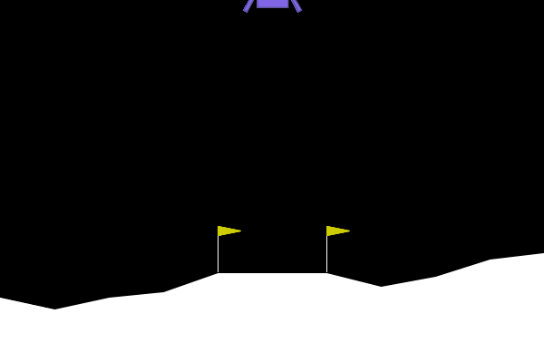

# Policy Gradient

In reinforcement learning, our goal is to find a policy $\pi_{\theta}$ that maximizes the expected total reward over time. We can express this mathematically as:

$$
J(\theta) = \mathbb{E}_{\tau \sim \pi_{\theta}} \left[R(\tau)\right], \text{ where } R(\tau) = \sum_{t=0}^{\infty} \gamma^t r_t
$$

From our study of [optimization](../chapter_optimization/gradient_descent.md), we know we can maximize this objective using gradient ascent:

$$
\theta_{k+1} = \theta_k + \alpha \nabla J(\theta_k)
$$

The key challenge is computing $\nabla J(\theta_t)$, known as the **policy gradient**. Here's how we derive it:

$$
\begin{align*}
\nabla_{\theta} J(\pi_{\theta}) &= \nabla_{\theta} \mathbb{E}_{\tau \sim \pi_{\theta}} \left[R(\tau)\right] & \\
&= \nabla_{\theta} \int_{\tau} P(\tau|\theta) R(\tau) & \text{Expand expectation} \\
&= \int_{\tau} \nabla_{\theta} P(\tau|\theta) R(\tau) & \text{Bring gradient under integral} \\
&= \int_{\tau} P(\tau|\theta) \nabla_{\theta} \log P(\tau|\theta) R(\tau) & \text{Log-derivative trick} \\
&= \mathbb{E}_{\tau \sim \pi_{\theta}} \left[\nabla_{\theta} \log P(\tau|\theta) R(\tau)\right] & \text{Return to expectation form} \\
\therefore \nabla_{\theta} J(\pi_{\theta}) &= \mathbb{E}_{\tau \sim \pi_{\theta}} \left[\sum_{t=0}^{T} \nabla_{\theta} \log \pi_{\theta}(a_t |s_t) R(\tau)\right] & \text{Final expression}
\end{align*}
$$

This shows we can estimate the policy gradient through sampling. Given a dataset $\mathcal{D} = \{\tau_1, \tau_2, \cdots, \tau_n\}$ of trajectories from policy $\pi_{\theta}$, where each trajectory $\tau_i = (s_0^i, a_0^i, s_1^i, a_1^i, \cdots, s_T^i, a_T^i)$ (we'll drop the superscript $i$ for simplicity), we can estimate the gradient as:

$$
\hat{g}(\theta) = \frac{1}{|\mathcal{D}|} \sum_{\tau \in \mathcal{D}} \sum_{t=0}^{T} \nabla_{\theta} \log \pi_{\theta}(a_t |s_t) R(\tau),
$$

This leads to the **vanilla policy gradient** update:

$$
\theta_{k+1} = \theta_k + \alpha \hat{g}(\theta_k)
$$

**Note**: In practice, instead of directly computing the policy gradient, we often evaluate the policy gradient loss function:

$$
\mathcal{L}(\theta) = -\frac{1}{|\mathcal{D}|} \sum_{\tau \in \mathcal{D}} \sum_{t=0}^{T}  \log \pi_{\theta}(a_t |s_t) R(\tau),
$$

and then can use different optimization methods to minimize the loss function. We will no longer mention this in the rest of the lecture when we say compute the policy gradient.


## Vanilla Policy Gradient Algorithm

Here's the step-by-step process for implementing the vanilla policy gradient:

!!! abstract "Vanilla Policy Gradient Algorithm"
    - Start with randomly initialized policy parameters $\theta$
    - For k = 1, 2, ... do:
        - Generate trajectories $\mathcal{D}_k = \{\tau_i\}$ using current policy $\pi_{\theta_k}$
        - Calculate returns $R(\tau)$ for each trajectory
        - Estimate policy gradient: $\hat{g}(\theta_k) = \frac{1}{|\mathcal{D}|} \sum_{\tau \in \mathcal{D}} \sum_{t=0}^{T} \nabla_{\theta} \log \pi_{\theta_k}(a_t |s_t) R(\tau)$
        - Update policy: $\theta_{k+1} = \theta_k + \alpha \hat{g}(\theta_k)$


This algorithm is **on-policy**, meaning it requires interaction with the environment using the current policy. While this approach works, it can be inefficient in practice. There are alternative **off-policy** methods that we won't cover in this course.

## Variance Reduction

The vanilla policy gradient method often suffers from high variance in its estimates, leading to unstable training. Let's explore ways to reduce this variance while keeping our estimates unbiased.

Looking at our policy gradient expression:

$$
\nabla_{\theta} J(\pi_{\theta}) = \mathbb{E}_{\tau \sim \pi_{\theta}} \left[\sum_{t=0}^{T} \nabla_{\theta} \log \pi_{\theta}(a_t |s_t) R(\tau)\right].
$$

This formulation has a problem: it assigns credit to all actions based on the total reward $R(\tau)$, even for actions that occurred before the reward was received. This doesn't make sense - actions should only be reinforced based on their future consequences.

We can improve this by using the "reward-to-go" formulation:

$$
\nabla_{\theta} J(\pi_{\theta}) = \mathbb{E}_{\tau \sim \pi_{\theta}} \left[\sum_{t=0}^{T} \nabla_{\theta} \log \pi_{\theta}(a_t |s_t) \sum_{t'=t}^T R(s_{t'}, a_{t'})\right].
$$

Here, $\hat{R}_t = \sum_{t'=t}^T R(s_{t'}, a_{t'})$ represents the future rewards from time $t$ onward.

In general, the policy gradient can be written as:

$$
\nabla_{\theta} J(\pi_{\theta}) = \mathbb{E}_{\tau \sim \pi_{\theta}} \left[\sum_{t=0}^{T} \nabla_{\theta} \log \pi_{\theta}(a_t |s_t) \Phi_t\right],
$$

where $\Phi_t$ can be:

- Total reward: $\Phi_t = R(\tau)$
- Reward-to-go: $\Phi_t = \hat{R}_t$
- Baseline-adjusted: $\Phi_t = \hat{R}_t - b(s_t)$
- Action-value: $\Phi_t = Q^{\pi_{\theta}}(s_t, a_t)$
- Advantage: $\Phi_t = A^{\pi_{\theta}}(s_t, a_t) = Q^{\pi_{\theta}}(s_t, a_t) - V^{\pi_{\theta}}(s_t)$

### Estimating the Advantage Function

The most common approach uses the **advantage function** 

$$
A_t = A^{\pi}(s_t, a_t) = Q^{\pi}(s_t, a_t) - V^{\pi}(s_t)
$$

We can estimate it in several ways:

- Monte Carlo Sampling: $A_t = \hat{R}_t - V(s_t)$
- Temporal Difference (TD(0)): $A_t = r_t + \gamma V(s_{t+1}) - V(s_t)$
- k-step Advantage: $A_t = \sum_{l=0}^{k-1} \gamma^l r_{t+l} + \gamma^k V(s_{t+k}) - V(s_t)$
- Generalized Advantage Estimation (GAE): $A_t = \sum_{l=0}^{\infty} \left(\gamma \lambda\right)^l \delta_{t+l}$ where $\delta_{t+l} = r_{t+l} + \gamma V(s_{t+l+1}) - V(s_{t+l})$ is the TD error.


Here's the complete algorithm with advantage estimation:

!!! abstract "Policy Gradient with Advantage Estimation"
    - Initialize policy parameters $\theta$ randomly
    - For k = 1, 2, ... do:
        - Generate trajectories $\mathcal{D}_k = \{\tau_i\}$ using policy $\pi_{\theta_k}$
        - Calculate reward-to-go $\hat{R}_t$ for each trajectory
        - Compute advantage $A_t$ using one of the methods above
        - Estimate gradient: $\hat{g}(\theta_k) = \frac{1}{|\mathcal{D}|} \sum_{\tau \in \mathcal{D}} \sum_{t=0}^{T} \nabla_{\theta} \log \pi_{\theta_k}(a_t |s_t) A_t$
        - Update policy: $\theta_{k+1} = \theta_k + \alpha \hat{g}(\theta_k)$
        - Update value function: $\phi_k = \arg \min_{\phi} \sum_{\tau \in \mathcal{D}_k} \sum_{t=0}^{T} \left( V_{\phi}(s_t) - \hat{R}_t \right)^2$

## Policy Gradient in PyTorch

Let's implement a simple policy network using PyTorch. We'll use a neural network with one hidden layer for our policy $\pi_{\theta}(a|s)$:

```python
import torch.nn as nn

class Policy(nn.Module):
    def __init__(self, state_dim, action_dim, hidden_size=128):
        super().__init__()
        self.fc1 = nn.Linear(state_dim, hidden_size)
        self.fc2 = nn.Linear(hidden_size, action_dim)
        
    def forward(self, x):
        x = torch.relu(self.fc1(x))
        action_probs = torch.softmax(self.fc2(x), dim=-1)
        return action_probs
```

You can use the `torch.distributions.Categorical` to sample actions from the policy and compute the log probability of the action.

```python
import torch
from torch.distributions import Categorical
policy = Policy(10, 4)
state_tensor = torch.randn(10)
action_probs = policy(state_tensor)
m = Categorical(action_probs)
action = m.sample() # sample an action from the policy.
log_prob = m.log_prob(action) # compute the log probability of the action.
```

### OpenAI Gym

OpenAI Gym is a toolkit for developing and comparing reinforcement learning algorithms. It provides a standard API for interacting with environments, and a suite of pre-implemented environments for testing and training reinforcement learning algorithms.

Initializing environments is very easy in Gym and can be done via:

```python
import gym
env = gym.make("LunarLander-v2", render_mode="human")
```
Here `render_mode="human"` will render the environment in a window.

We can initialize the environment and reset it via:

```python
state, info = env.reset()
```

The `state` is the initial state (observation) of the environment. You can have access to the observation space via `env.observation_space` and action space via `env.action_space`.

```python
print(env.observation_space)
# Box([-2.5, -2.5, -10., -10., -6.2831855, -10., -0., -0.], [2.5, 2.5, 10., 10., 6.2831855, 10., 1., 1.], (8,), float32):
# This is a continuous observation space with 8 dimensions.
print(env.action_space)
# Discrete(4): This is a discrete action space with 4 actions.
```

The following code shows how to simulate the environment for $(s_0, a_0, r_0, s_1)$:

```python
from torch.distributions import Categorical
import numpy as np
env = gym.make("LunarLander-v2", render_mode="human")
state, _ = env.reset()
# Convert the state to tensor.
state_tensor = torch.FloatTensor(state)
# Get the action probabilities from the policy.
action_probs = policy(state_tensor)
                
# Sample an action from the probability distribution.
action = Categorical(action_probs).sample()
# Compute the log probability of the action.
log_prob = Categorical(action_probs).log_prob(action)
                
# Take the action in the environment.
next_state, reward, done, truncated = env.step(action.item())
```
Here `done` and `truncated` are boolean variables that indicate if the episode is terminated or truncated.

We can write a function to Monte Carlo sample the trajectory $\tau = (s_0, a_0, r_0, s_1, a_1, r_1, \cdots, s_T, a_T, r_T)$:

```python
def run_episode(env, policy, gamma=0.99, render=False):
    """
    Run a single episode using the current policy.
    
    Parameters:
      env: The Gym environment.
      policy: The policy network.
      gamma: Discount factor (not directly used in this function, but kept for compatibility).
      render (bool): If True, render the environment at each step.
      
    Returns:
      episode_rewards (list): Rewards collected during the episode.
      episode_log_probs (list): Log probabilities for the actions taken.
    """
    state = env.reset()
    episode_rewards = []
    episode_log_probs = []
    done = False

    while not done:
        if render:
            env.render()
            time.sleep(0.02)
        
        # Convert state to a tensor.
        state_tensor = torch.FloatTensor(state)
        
        # Get action probabilities and sample an action.
        action_probs = policy(state_tensor)
        m = Categorical(action_probs)
        action = m.sample()
        log_prob = m.log_prob(action)
        
        # Step the environment.
        next_state, reward, done, _ = env.step(action.item())
        
        # Record the reward and log probability.
        episode_rewards.append(reward)
        episode_log_probs.append(log_prob)
        
        state = next_state

    return episode_rewards, episode_log_probs
```

You can use `env.render()` to visualize the current environment.



### Policy Gradient Loss

Recall we can convert the policy gradient into a loss function:

$$
\mathcal{L}(\theta) = -\frac{1}{|\mathcal{D}|} \sum_{\tau \in \mathcal{D}} \sum_{t=0}^{T}  \log \pi_{\theta}(a_t |s_t) R(\tau),
$$

Combining with the above `run_episode` function, we can implement the policy gradient loss in PyTorch as follows:

```python
def policy_gradient_loss(env, policy, batch_size=10, gamma=0.99):
    total_loss = 0.0
    
    # Iterate over the batch to sample episodes and aggregate loss.
    for _ in range(batch_size):
        episode_rewards, episode_log_probs = run_episode(env, policy, gamma)
        
        # Compute the discounted return R for the episode.
        R = 0.0
        for t, r in enumerate(episode_rewards):
            R += (gamma ** t) * r
        
        # For each action taken, add the corresponding contribution to the loss.
        for log_prob in episode_log_probs:
            total_loss += -log_prob * R  # Negative sign for gradient ascent.
    
    # Return the averaged loss over the batch.
    return total_loss / batch_size
```


Then we can assemble the training loop of vanilla policy gradient as follows:

```python
env = gym.make("LunarLander-v2")
state_dim = env.observation_space.shape[0]  # e.g., 8 for LunarLander-v2.
action_dim = env.action_space.n             # e.g., 4 discrete actions.
    
# Initialize the policy network and optimizer.
policy = Policy(state_dim, action_dim)
optimizer = optim.Adam(policy.parameters(), lr=learning_rate)
    
for epoch in range(num_epochs):
    # Compute the combined loss over a batch.
    loss = policy_gradient_loss(env, policy, batch_size, gamma)
        
    optimizer.zero_grad()
    loss.backward()
    optimizer.step()
```


