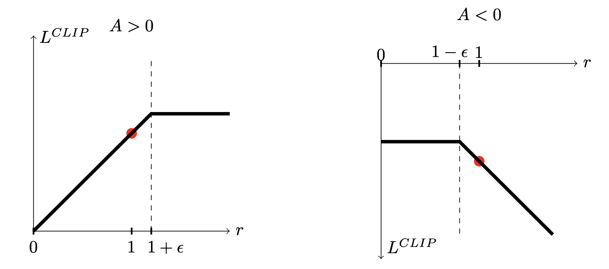

# Proximal Policy Optimization

Proximal Policy Optimization (PPO) addresses a fundamental challenge in reinforcement learning: how can we maximize policy improvement using our current data while preventing catastrophic performance degradation from overly aggressive updates?

Unlike vanilla policy gradient methods that maintain proximity between policies in parameter space, PPO recognizes that small parameter changes can sometimes lead to dramatic performance differences. This sensitivity makes large step sizes risky in traditional policy gradient approaches, limiting their sample efficiency. PPO introduces mechanisms to prevent harmful policy updates, allowing for larger improvement steps while maintaining stability, which typically results in faster and more reliable performance gains.

Like the [proximal gradient descent](../chapter_optimization/proximal_gradient_descent.md), PPO aims to find a loss function that is an approximation of policy gradient loss 

$$
L(\theta) = \mathbb{E}_{s, a \sim \pi_{\theta_k}} \left[ \log \pi_{\theta}(a|s)  A_t \right]
$$

 at the current policy $\pi_{\theta_k}$ and update it by: 

$$
\theta_{k+1} =  \arg \min_{\theta} \mathbb{E}_{s, a \sim \pi_{\theta_k}} \left[ L(s,a,\theta_k,\theta) \right],
$$

where $L(s,a,\theta_k,\theta)$ is an approximation of $L(\theta)$ at the current policy $\pi_{\theta_k}$.

## PPO Objective

PPO uses the following objective function:

$$
L(s,a,\theta_k,\theta) = \min\left(
\frac{\pi_{\theta}(a|s)}{\pi_{\theta_k}(a|s)}  A^{\pi_{\theta_k}}(s,a), \;\;
g(\epsilon, A^{\pi_{\theta_k}}(s,a))
\right),
$$
where

$$
g(\epsilon, A) = \left\{
    \begin{array}{ll}
    (1 + \epsilon) A & A \geq 0 \\
    (1 - \epsilon) A & A < 0.
    \end{array}
    \right.
$$

Let $r$ be the density ratio $\frac{\pi_{\theta}(a|s)}{\pi_{\theta_k}(a|s)}$. The above figure shows PPO loss.

To figure out what intuition to take away from this, let's look at a single state-action pair $(s,a)$, and think of cases.

- **Advantage is positive**: Suppose the advantage for that state-action pair is positive, in which case its contribution to the objective reduces to

$$L(s,a,\theta_k,\theta) = \min\left(
\frac{\pi_{\theta}(a|s)}{\pi_{\theta_k}(a|s)}, (1 + \epsilon)
\right)  A^{\pi_{\theta_k}}(s,a).$$

Because the advantage is positive, the objective will increase if the action becomes more likely—that is, if $\pi_{\theta}(a|s)$ increases. But the min in this term puts a limit to how much the objective can increase. Once $\pi_{\theta}(a|s) > (1+\epsilon) \pi_{\theta_k}(a|s)$, the min kicks in and this term hits a ceiling of $(1+\epsilon) A^{\pi_{\theta_k}}(s,a)$. Thus: the new policy does not benefit by going far away from the old policy.

- **Advantage is negative**: Suppose the advantage for that state-action pair is negative, in which case its contribution to the objective reduces to

$$L(s,a,\theta_k,\theta) = \max\left(
\frac{\pi_{\theta}(a|s)}{\pi_{\theta_k}(a|s)}, (1 - \epsilon)
\right)  A^{\pi_{\theta_k}}(s,a).$$

Because the advantage is negative, the objective will increase if the action becomes less likely—that is, if $\pi_{\theta}(a|s)$ decreases. But the max in this term puts a limit to how much the objective can increase. Once $\pi_{\theta}(a|s) < (1-\epsilon) \pi_{\theta_k}(a|s)$, the max kicks in and this term hits a ceiling of $(1-\epsilon) A^{\pi_{\theta_k}}(s,a)$. Thus, again: the new policy does not benefit by going far away from the old policy.