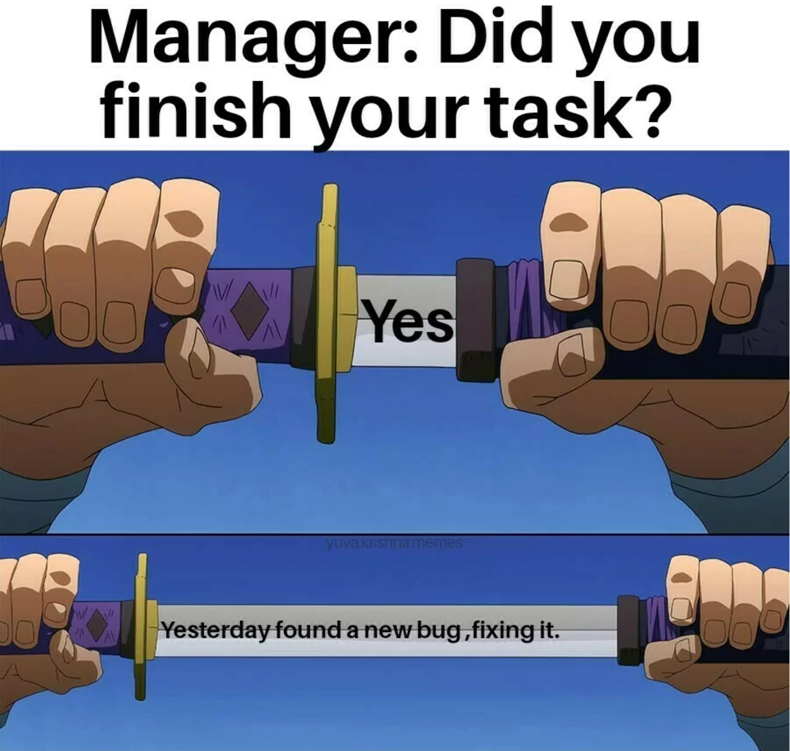

# Course Syllabus

## Evaluation

- Participation:  20%  
- Assignments: 40%  
- Midterm Project:  20%  
- Final Project:  20%  

## Late Assignment Policy

All assignments are due at 12:00pm on the day listed. Each student gets 7 late days which can be used to turn in homework late without penalty. These 7 late days are for the entire semester. 

One late day is measured as a 24 hour period after the supposed deadline. It is the student's responsibility to submit his/her homework online. If late days are used, please write at the head of your homework in the formate: XX late days used for this homework, and XX days remained. 

Once you run out of late days, late submissions are penalized 25% per day. (For example, a homework turned in two days late will receive only 50% credit.) More importantly, we will not grant additional late days once you have used up all 7 late days.

No matter the late days are run out or not, submission more than five days late receive a grade of 0, but they must still be completed and turned in regardless. If a student ends the semester not having handed in a homework assignment, he/she is in risk of receiving a final grade of D or F for the semester regardless of their performance on other components of the course. 

If you commit multiple versions, we will only grade the last commit on Github within the 5 days maximum extension and take your late days based the time stamp of the last submission as well.
It is your own responsibility to keep track of how many late days you used. But we will follow the time stamp on Github  as the criteria. 

## Class Participation

Class participation will be graded based on three parts:

- Classroom discussions and questions asked in the courses.
- The approved commits in the course project repository. 
- Discussions and questions asked in the Github Classroom.
- One-minute summary on the Github Discussion. You need to summarize the content and confusions in each class, which is submitted via the Github Discussion. The summary just goes in the textbox once you begin the assignment. 

Students are expected to behave professionally at all times, with courtesy towards other students, the TAs, and the instructor.  

## Group Work

During class, we will have __breakout groups__ for homework and project through the semester. In principle, each group should have 3 students but you can choose the group size or even work on your own. The group work is designed to:

- Learning to code alone is frustrating.
- Learn from each other.
- Learn how to work in a team.

## Generative AI Tools Policy
We allow and encourage you to use ChatGPT and other generative AI tools for the homework and project. In fact, this course is designed to help you understand how these tools work. However, you are required to append to your homework and project the output from the [GPTZero Detector](https://gptzero.me/). However, do not worry. Your grade is totally independent of the output from the output. 

## Github Classroom 
The homework and project will be assigned through Github Classroom. Refer to the [Appendix](../chapter_appendix/github.md) for more details.