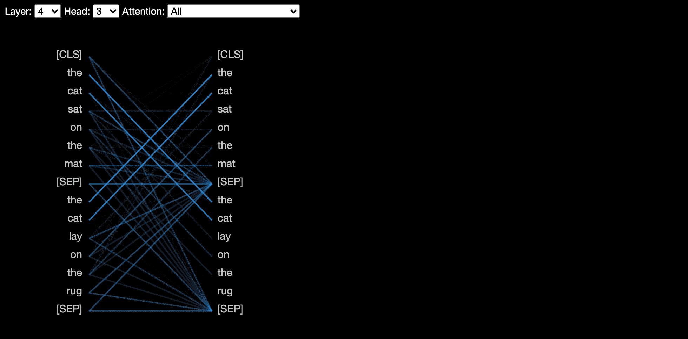

# Attention

## Kernel Regression

## Kernel Weighted Estimator

The Nadaraya-Watson estimator is a fundamental nonparametric regression technique that uses kernel functions to weight observations based on their proximity to the query point. This approach can be viewed as an early form of attention mechanism, where the model "attends" to training examples based on their relevance to the current query.

Given a dataset of input-output pairs $\{(\mathbf{x}_i, y_i)\}_{i=1}^n$, the Nadaraya-Watson estimator predicts the output at a new query point $\mathbf{q}$ as:

$$\hat{f}(\mathbf{q}) = \frac{\sum_{i=1}^n K(\mathbf{q}, \mathbf{x}_i) y_i}{\sum_{i=1}^n K(\mathbf{q}, \mathbf{x}_i)}$$

where $K(\mathbf{q}, \mathbf{x}_i)$ is a kernel function that measures the similarity between the query point $\mathbf{q}$ and the training point $\mathbf{x}_i$.

Some common kernels are

$$\begin{aligned}
\alpha(\mathbf{q}, \mathbf{k}) & = \exp\left(-\frac{1}{2} \|\mathbf{q} - \mathbf{k}\|^2 \right) && \textrm{Gaussian;} \\
\alpha(\mathbf{q}, \mathbf{k}) & = 1 \textrm{ if } \|\mathbf{q} - \mathbf{k}\| \leq 1 && \textrm{Boxcar;} \\
\alpha(\mathbf{q}, \mathbf{k}) & = \mathop{\mathrm{max}}\left(0, 1 - \|\mathbf{q} - \mathbf{k}\|\right) && \textrm{Epanechikov.}
\end{aligned}
$$

This can be rewritten in a form that highlights its connection to attention mechanisms:

$$\hat{f}(\mathbf{q}) = \sum_{i=1}^n \alpha(\mathbf{q}, \mathbf{x}_i) y_i$$

where the attention weights $\alpha(\mathbf{q}, \mathbf{x}_i)$ are defined as:

$$\alpha(\mathbf{q}, \mathbf{x}_i) = \frac{K(\mathbf{q}, \mathbf{x}_i)}{\sum_{j=1}^n K(\mathbf{q}, \mathbf{x}_j)}$$

These attention weights satisfy $\sum_{i=1}^n \alpha(\mathbf{q}, \mathbf{x}_i) = 1$, forming a probability distribution over the training points.

Let us consider the Gaussian kernel:

$$\alpha(\mathbf{q}, \mathbf{x}_i) = \frac{\exp\left(-\frac{1}{2} \|\mathbf{q} - \mathbf{x}_i\|^2 \right)}{\sum_{j=1}^n \exp\left(-\frac{1}{2} \|\mathbf{q} - \mathbf{x}_j\|^2 \right)}$$

Then we have the kernel weighted estimator is weighted softmax:

$$\hat{f}(\mathbf{q}) = \sum_{i=1}^n \text{softmax}(-\|\mathbf{q} - \mathbf{x}_i\|^2/2) y_i$$

This means that if a key $\mathbf{x}_i$ is close to the query $\mathbf{q}$, then we will assign more weight $\alpha(\mathbf{q}, \mathbf{x}_i)$ to $y_i$, i.e., the output $y_i$ will have more **attention** on the prediction.

We can generalize the above Gaussian kernel to a more general case:

$$
a(\mathbf{q}, \mathbf{k}_i) = \text{softmax}(a(\mathbf{q}, \mathbf{k}_i)) = \frac{\exp(a(\mathbf{q}, \mathbf{k}_i))}{\sum_{j=1}^n \exp(a(\mathbf{q}, \mathbf{k}_j))}
$$

where $a(\mathbf{q}, \mathbf{k}_i)$ is a similarity function between the query $\mathbf{q}$ and the key $\mathbf{k}_i$. One of the most common choices is the dot product:

$$
a(\mathbf{q}, \mathbf{k}) = \mathbf{q}^\top \mathbf{k}
$$

This leads to the attention mechanism.

## Attention Pooling

Given an input $X$ matrix, there are three weight matrices $W_q, W_k, W_v$ to learn such that 

$$
\begin{align*}
Q = X W_q = [\mathbf{q}_1, \mathbf{q}_2, \ldots, \mathbf{q}_n], \\
K = X W_k = [\mathbf{k}_1, \mathbf{k}_2, \ldots, \mathbf{k}_n], \\
V = X W_v = [\mathbf{v}_1, \mathbf{v}_2, \ldots, \mathbf{v}_n]
\end{align*}
$$

So the attention mechanism is:

$$
\text{Attention}(Q, K, V) = \text{softmax}\left(\frac{Q K^\top}{\sqrt{d}}\right) V = \sum_{i=1}^n \alpha(\mathbf{q}, \mathbf{k}_i) \mathbf{v}_i,
$$

where $\alpha(\mathbf{q}, \mathbf{k}_i) = \frac{\exp(\mathbf{q}^\top \mathbf{k}_i)}{\sum_{j=1}^n \exp(\mathbf{q}^\top \mathbf{k}_j)}$ is the attention weight.

In attention, the query matches all keys softly,
to a weight between 0 and 1. The keys’ values
are multiplied by the weights and summed.

So to summarize the self-attention mechanism with the input $X$, we have the following steps:

1. Project the input $X$ to three matrices $Q, K, V$ with weight matrices $W_q, W_k, W_v$.
2. Compute the attention weights $\alpha(\mathbf{q}, \mathbf{k}_i) = \frac{\exp(\mathbf{q}^\top \mathbf{k}_i)}{\sum_{j=1}^n \exp(\mathbf{q}^\top \mathbf{k}_j)}$ for each query $\mathbf{q}$ and each key $\mathbf{k}_i$.
3. Multiply the values $\mathbf{v}_i$ by the attention weights and sum them up to get the output.

In summary, we have

$$
\text{Attention}(X;W) = \text{softmax}\left(\frac{X W_q (X W_k)^\top}{\sqrt{d}}\right) X W_v 
$$

## Multi-Head Attention

Attention treats each word’s representation as a query to access and
incorporate information from a set of values. Attention is parallelizable, and solves bottleneck issues.

Multi-head attention extends the basic attention mechanism by allowing the model to jointly attend to information from different representation subspaces at different positions. Instead of performing a single attention function with $d$-dimensional keys, values, and queries, multi-head attention performs the attention function in parallel $h$ times, with different, learned linear projections to $d_k$, $d_k$, and $d_v$ dimensions. These parallel attention outputs, or "heads," are then concatenated and linearly transformed to produce the final output. This approach enables the model to capture different aspects of the input sequence simultaneously, such as syntactic and semantic relationships, leading to richer representations and improved performance on complex language tasks.

