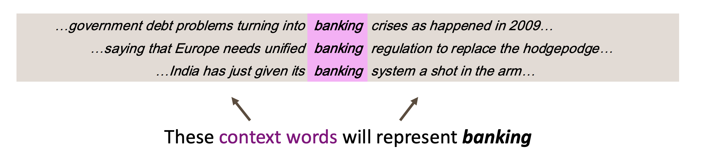
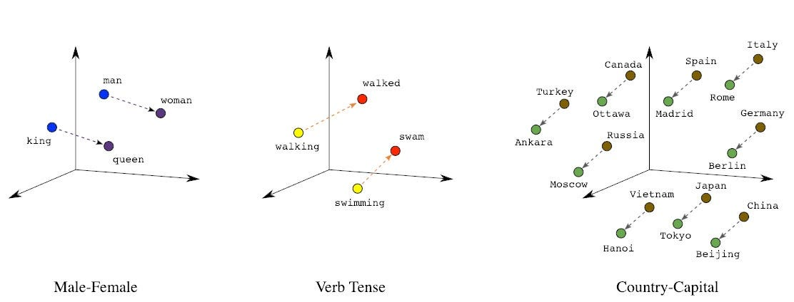

# Word Vectors

Word vectors, also known as word embeddings, are dense vector representations of words in a continuous vector space where semantically similar words are mapped to nearby points. Unlike traditional one-hot encoding where each word is represented as a sparse vector with a single non-zero element, word embeddings capture the semantic relationships between words by encoding their meanings in a lower-dimensional space. This approach allows mathematical operations on words that reflect their semantic relationships - for example, "king" - "man" + "woman" ≈ "queen". Popular word embedding techniques include Word2Vec, GloVe, and FastText, which learn these representations by analyzing word co-occurrence patterns in large text corpora. Word vectors serve as fundamental building blocks for many natural language processing tasks, providing a way to convert text into numerical form that machine learning models can process while preserving semantic meaning.

Such symbols for words can be represented by **one-hot vectors** (means one 1, the rest 0s):

$$
\begin{align*}
\text{motel} = [0 0 0 0 0 0 0 0 0 0 1 0 0 0 0] \\
\text{hotel} = [0 0 0 0 0 0 0 1 0 0 0 0 0 0 0]
\end{align*}
$$

## Word vectors 

A word’s meaning is given by the words that frequently appear close-by.

Using this intuition, we can represent a word by the words that appear close-by.

