# Git and GitHub

!!! abstract "Learning Objectives"
    - Understand why version control is essential for reproducible research
    - Learn basic Git commands and workflows
    - Learn how to collaborate using GitHub
    - Develop best practices for version control in scientific computing

## Why Version Control?

Version control is essential for:

1. **Tracking Changes**: Keep a complete history of your project
2. **Collaboration**: Work effectively with others
3. **Backup**: Never lose your work
4. **Reproducibility**: Return to any previous state of your project
5. **Documentation**: Understand why changes were made

## Git Basics

If you are using VS Code, you can check the tutorial [here](https://code.visualstudio.com/docs/sourcecontrol/intro-to-git).

### Setting Up Git

First time setup:
```bash
git config --global user.name "Your Name"
git config --global user.email "your.email@example.com"
```

Initialize a repository only when you create a project
```bash
git init 
```


### Basic Git Workflow


1. **Check Status**
```bash
git status
```

3. **Stage Changes**
```bash
git add filename     # Stage specific file
git add .           # Stage all changes
```

4. **Commit Changes**
```bash

git commit -m "Descriptive message about changes"
```

5. **View History**
```bash
git log             # View commit history
git diff            # View unstaged changes
```

### Best Practices for Commits

1. **Commit Often**: Make small, logical commits
2. **Avoid Half-Done Work**: Only commit logically completed tasks. Use `git commit --amend --no-edit` to quickly add forgotten changes to your last commit, but only if you haven't shared that commit with others.
3. **Commit Related Changes**: Group related changes into one commit
4. **Write Clear Messages**: Use descriptive commit messages
      ```bash
      # Bad commit message
      git commit -m "Update"
      # Good commit message
      git commit -m "Add bootstrap confidence intervals to regression analysis"
      ```
5. **One Change Per Commit**: Each commit should represent one logical change
6. **Test Before Committing**: Ideally the code in `main` branch should always work. Ensure code works before committing


## GitHub

You can read the [Github official documentation](https://docs.github.com/en/get-started/using-github/github-flow) for the suggested workflow for using GitHub for collaboration. 
There are tools like [Github Desktop](https://desktop.github.com/) and [VS Code Github](https://code.visualstudio.com/docs/sourcecontrol/github) that can help you manage your repositories more conveniently. You can also create your own workflows using tools like [GNU Make](make.md) with [GitHub command-line tool `gh`](https://cli.github.com/).

!!! tip "GitHub beyond repository"

    GitHub is not just a place to host your code. It is also a social network for developers. You can follow others, see what they are working on, star their repositories, and collaborate with them.

    GitHub is also your resume, it will help you get a job. Imagine the employer goes to your GitHub and sees all the 1k-star projects you have worked on.

### Setting Up GitHub

1. Create a GitHub account at [github.com](https://github.com)
2. Set up SSH keys for secure authentication:
    ```bash
    ssh-keygen -t ed25519 -C "your.email@example.com"
    ```
3. [Add the public key to your GitHub account](https://docs.github.com/en/authentication/connecting-to-github-with-ssh/adding-a-new-ssh-key-to-your-github-account)
4. (Optional) Install [GitHub gh](https://cli.github.com/)
    ```bash
    brew install gh # MacOS
    ```

### GitHub Collaboration Workflow

You can follow the VS Code tutorial [here](https://code.visualstudio.com/docs/sourcecontrol/github) for the Github collaboration workflow on VS Code. We suggest the following workflow for software development on GitHub. You may use [Make](make.md) to automate your workflow instead of memorizing all the commands.

Here are the visualization of the workflow on the commit status of the remote Github, local git, and local disk. You can cross reference to the text instructions below for better understanding.

=== "<1>"
    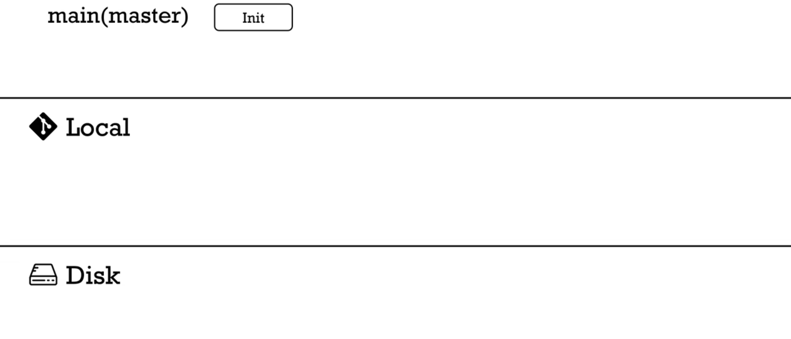

=== "<2>"
    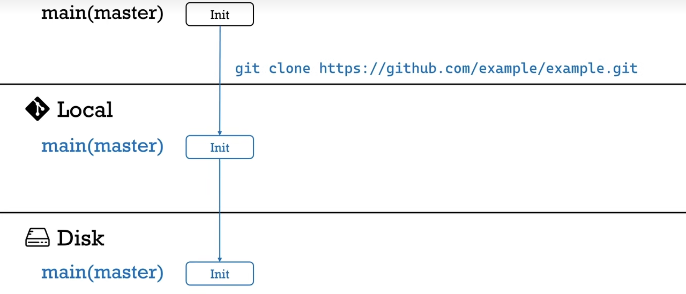

=== "<3>"
    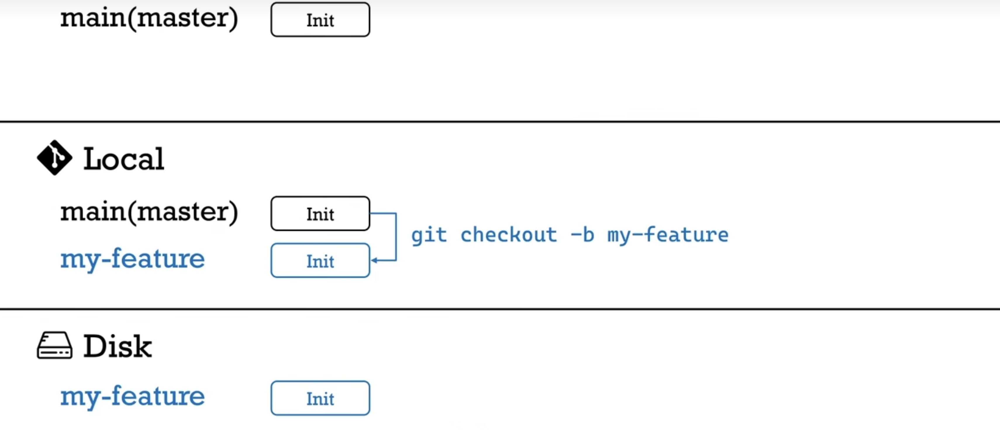

=== "<4>"
    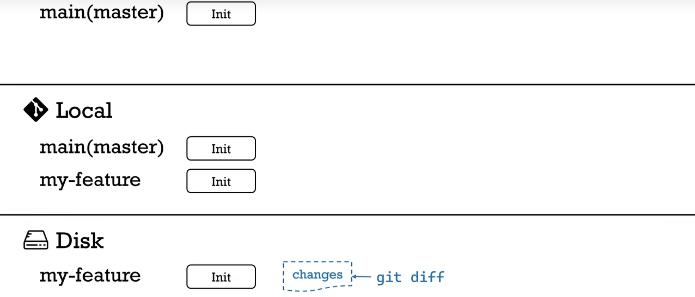

=== "<5>"
    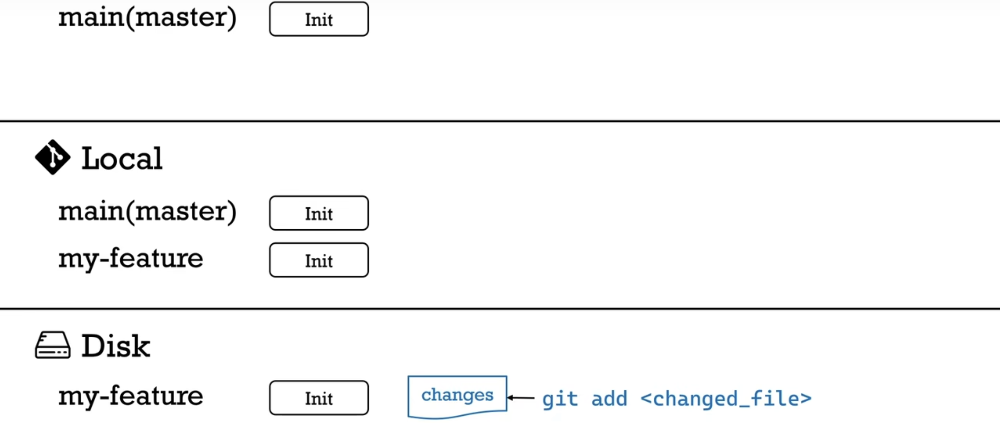

=== "<6>"
    

=== "<7>"
    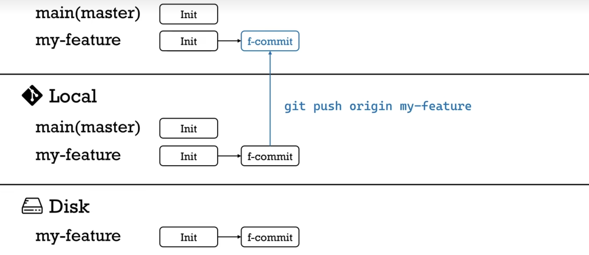

=== "<8>"
    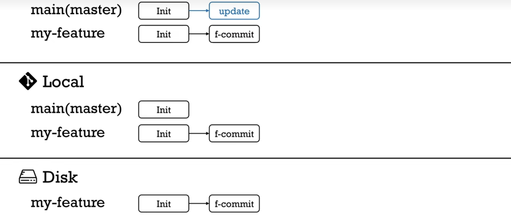

=== "<9>"
    

=== "<10>"
    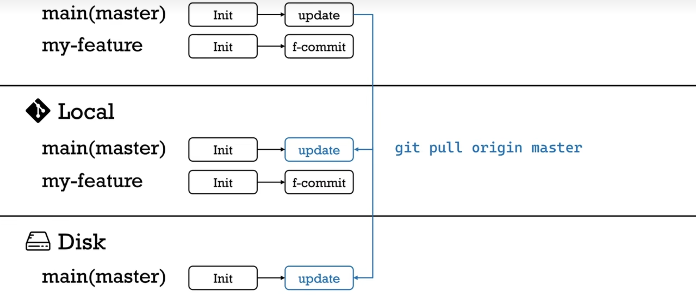

=== "<11>"
    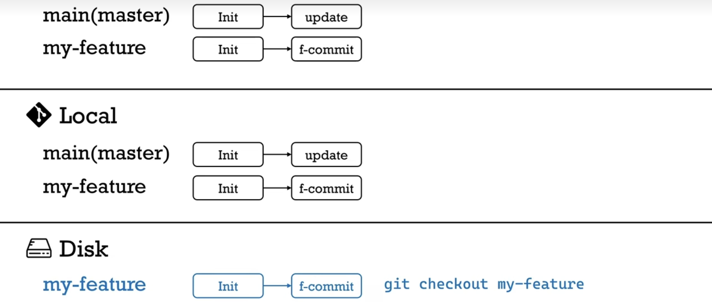

=== "<12>"
    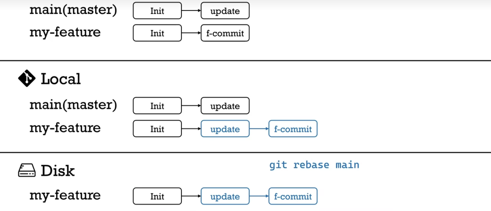

=== "<13>"
    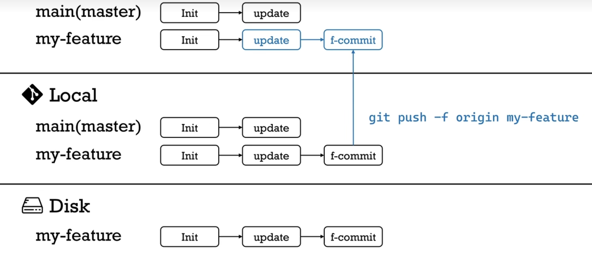

=== "<14>"
    

=== "<15>"
    

=== "<16>"
    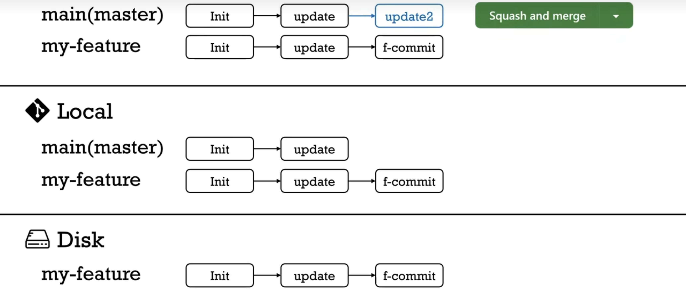

**Initial Repository Setup and Branch Creation**

1. **Clone the Repository**
      - Use `git clone` to download the remote repository to your local machine

2. **Create a New Working Branch**
      - Every new feature should be developed in a new branch
      - Execute `git checkout -b my_feature` to create and switch to a new branch named 'my_feature'
      - This effectively creates a local copy of the repository on a separate branch

**Code Development and Local Changes**

1. **Modify Local Code**
      - Make necessary changes or additions to source files on your local hard drive

2. **Review Code Changes**
      - Use `git diff` to inspect modifications made to the codebase

3. **Commit Local Changes**
      - Use `git commit -a -m "Descriptive message about changes"` to update staged code to the local Git repository

4. **Push Branch to Remote Repository**
      - Execute `git push origin my_feature` to upload the local `my_feature` branch to GitHub

**Handling Remote Repository Updates**

1. **Switch to Main Branch**
      - Use `git checkout main` to return to the primary branch
      - **Warning**: Commit your branch before switching to main branch, or you will lose all your changes.

2. **Pull Latest Changes**
      - Execute `git pull origin master/main` to update local repository with remote modifications

3. **Return to Working Branch**
      - Switch back to `my_feature` branch using `git checkout my_feature`

4. **Rebase Working Branch**
      - Use `git rebase main` to integrate main branch updates into your working branch
      - Note: Potential merge conflicts may require manual code selection
      - Understand the difference between `git pull` and `git rebase` [here](https://www.atlassian.com/git/tutorials/merging-vs-rebasing).

5. **Force Push Updated Branch**
      - Execute `git push -f origin my_feature` to update remote repository with rebased changes

6. **Pull Request**
      - After finish adding all the new features in the branch, create a pull request on GitHub

7. **Merge Request**
      - Project owner can use "squash and merge" in Github pull request to consolidate commits


!!! tip "Tip: Always rebase"

    - Always rebase your branch on the main branch before creating a pull request.
    - This will make your pull request history cleaner and easier to review.
    - You can simply use `git pull origin my_feature --rebase` to rebase your branch on the github main branch.


## Advanced Git Usage

### Resolving Merge Conflicts

We recommend using VS Code to resolve conflicts. Here is the tutorial [here](https://code.visualstudio.com/docs/editor/versioncontrol#_merge-conflicts). You can also watch this [video tutorial](https://www.youtube.com/watch?v=lz5OuKzvadQ).

### Undoing Changes

1. **Discard Unstaged Changes**
```bash
git restore filename
```

2. **Unstage Changes**
```bash
git restore --staged filename
```

3. **Undo Last Commit**
```bash
git reset --soft HEAD~1
```


### .gitignore

Create a `.gitignore` file to exclude:
- Large data files
- Sensitive information
- Generated files
- System files

Example `.gitignore`:
```plaintext
# Data files
*.csv
*.xlsx
data/

# Generated files
*.pdf
results/

# System files
.DS_Store
.Rhistory
```


