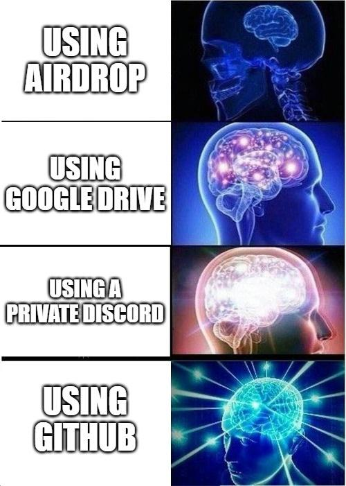

# Overview

Design the best practices for workflows in scientific computing will make your research more efficient and reliable. We aim to design the workflow that is:

1. **Reproducible**: Future you and other researchers can reproduce your results
2. **Automated**: Reduces time spent on repetitive tasks
3. **Maintainable**: Code remains functional and understandable over time

This chapter covers essential tools and practices for reproducible research:

## Lectures

- [Scientific Computing Workflow](computing_workflow.md): Suggested workflows and project management strategies for scientific computing projects
- [Git and GitHub](git.md): Version control for tracking changes, collaboration, and best practices in scientific computing
- [Make](make.md): Automation and documentation of workflows, including dependency management and reproducibility
- [Virtual Environment](venv.md): Python environment and dependency management for isolation and reproducibility
- [Reproducible R](R.md): R package and environment management using `here` and `renv` for consistent file paths and reproducible environments
- [Docker](docker.md): Complete environment containerization for cross-platform compatibility and system-level dependencies

