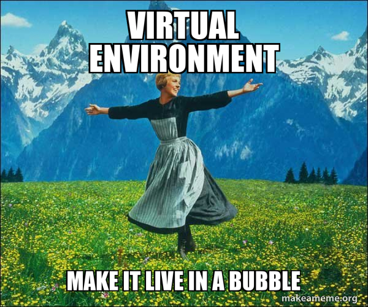

# Python Virtual Environments

!!! abstract "Learning Objectives"
    - Understand why virtual environments are crucial for reproducible research
    - Learn how to create and manage Python virtual environments
    - Master dependency management with requirements.txt
    - Develop best practices for environment management in scientific projects

## Why Virtual Environments?

Virtual environments solve several critical problems:

1. **Isolation**: Keep project dependencies separate
2. **Reproducibility**: Ensure consistent package versions across different machines
3. **Conflict Prevention**: Avoid package version conflicts between projects
4. **Clean Management**: Easy to create, delete, and recreate environments



## Virtual Environment Tools


We will introduce two types of virtual environments tools for python: the built-in method and the modern tool [`uv`](https://docs.astral.sh/uv/). We first introduce the built-in method to show the concepts. However, we recommend you to use modern `uv` as it is much faster and easier to use. There are other tools for python virtual environment management, such as `conda`, `pyenv`, `pipenv`, `poetry`, etc. You can explore them on your own.

### venv (Built-in)
Python's built-in solution, simple and lightweight:
```bash
# Create virtual environment
python -m venv myenv

# Activate virtual environment
# On Unix/macOS:
source myenv/bin/activate
# On Windows:
myenv\Scripts\activate

# Deactivate
deactivate
```


## Managing Dependencies

### pip Requirements

1. **Generate requirements.txt**:
    ```bash
    # Manual: List all installed packages
    pip freeze > requirements.txt
    ```

2. **Install from requirements.txt**:
    ```bash
    pip install -r requirements.txt
    ```


## Modern Virtual Environment Tool: uv

We will introduce the modern tool `uv` to manage your virtual environments. It is a modern tool that is much faster and easier to use than the built-in method. We recommend you use this tool for your real implementation of python virtual environments.

### Installation

You can install `uv` using the following command:
```bash
curl -LsSf https://astral.sh/uv/install.sh | sh
```

### Workflow for uv

uv manages project dependencies and environments, with support for lockfiles, workspaces, and more, similar to the built-in method introduced above.

**Initialize a project**: Initialize a virtual environment at your project directory.
```bash
uv init --python 3.10
```
Here you can specify the python version to use for the project.

Notice that `uv init` will create a `pyproject.toml` file in the current directory. This file is used to manage the project dependencies. 


**Add a package**: Add the package, e.g., `numpy`, to the project.

```bash
uv add numpy
```

It is claimed that uv can install packages much faster than the built-in methods so you can use it for your real implementation. Another advantage of uv is that it will not add all dependencies to `requirements.txt` when you run `pip freeze`. It will only add the minimum dependencies in `pyproject.toml` that are actually used in the project.


**Activate the virtual environment**: 

To run a python script, e.g., `hello.py`, by uv, you do not need to activate the virtual environment. You can just run the following command:
```bash
uv run hello.py
```

The command `uv run` will automatically activate the virtual environment and run the command in the virtual environment.

Of course, you can still activate the virtual environment by the standard built-in methods:
```bash
source .venv/bin/activate
python hello.py
```

**Collaboration Workflow**:

You can simply share the `pyproject.toml` file with your collaborators. They can then use the following command to create the virtual environment:
```bash
uv sync
```


## Resources

Please check the following resources for more details:

- [Python venv documentation](https://docs.python.org/3/library/venv.html)
- [uv tutorial](https://docs.astral.sh/uv/concepts/projects/)
